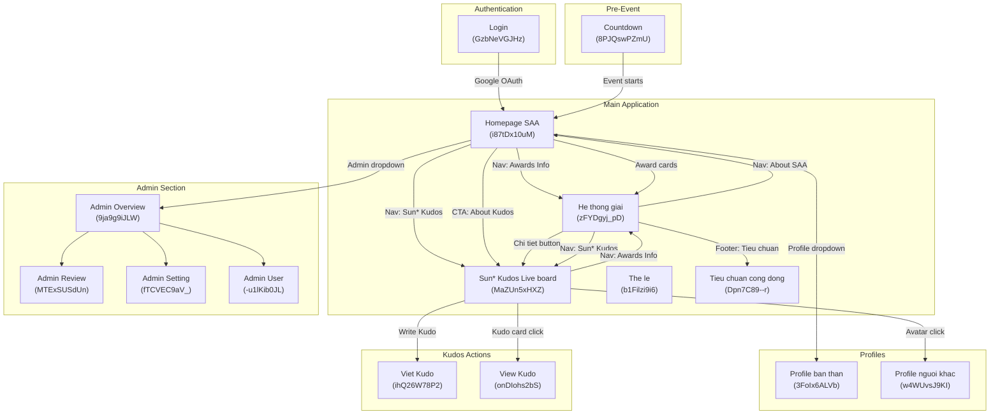

# Screen Flow - SSA 2025 EX

## Project Info
- **Project Name**: SSA 2025 EX (Sun* Annual Awards 2025)
- **Figma File Key**: 9ypp4enmFmdK3YAFJLIu6C
- **Figma URL**: https://www.figma.com/design/9ypp4enmFmdK3YAFJLIu6C
- **Created**: 2026-01-30
- **Last Updated**: 2026-04-17

---

## Discovery Progress

| Metric | Count |
|--------|-------|
| Total Screens (Main + Admin + Overlays + Secret Box) | 30 |
| Discovered | 30 |
| Remaining | 0 |
| Completion | 100% |

---

## Screens Overview

### Main Pages

| Screen | Screen ID | Status | Description |
|--------|-----------|--------|-------------|
| Login | GzbNeVGJHz | design | Google OAuth login page |
| Countdown - Prelaunch page | 8PJQswPZmU | design | Pre-event countdown landing page |
| Homepage SAA | i87tDx10uM | design | Main homepage with hero, awards, and Kudos sections |
| He thong giai (Awards Information) | zFYDgyj_pD | design | Award categories detail page with prize system overview |
| Sun* Kudos - Live board | MaZUn5xHXZ | design | Sun* Kudos live board with kudos feed |
| Profile ban than | 3FoIx6ALVb | design | User's own profile page |
| Profile nguoi khac | w4WUvsJ9KI | design | Other user's profile page |
| Viet Kudo | ihQ26W78P2 | design | Write/send a Kudo message |
| Tieu chuan cong dong | Dpn7C89--r | design | Community standards page |
| The le (Rules) | b1Filzi9i6 | design | SAA 2025 rules and regulations page |
| Tat ca thong bao | 6-1LRz3vqr | design | All notifications page |
| Error page - 403 | T3e_iS9PCL | design | Access denied page |
| Error page - 404 | p0yJ89B-9_ | design | Page not found |

### Admin Pages

| Screen | Screen ID | Status | Description |
|--------|-----------|--------|-------------|
| Admin - Overview | 9ja9g9iJLW | design | Admin dashboard overview |
| Admin - Review content | MTExSUSdUn | design | Content review/moderation |
| Admin - Review content - Search | kO5qYafrMh | design | Content search in review |
| Admin - Setting | fTCVEC9aV_ | design | Admin settings management |
| Admin - Setting - add Campaign | cb7kD3-Xr6 | design | Add campaign to settings |
| Admin - Setting - add new Campaign | FVA7A5f8z8 | design | Create new campaign |
| Admin - Setting - Edit Campaign | htgRaDTO2f | design | Edit existing campaign |
| Admin - User | -u1lKib0JL | design | User management |

### Overlays / Dropdowns / Modals

| Screen | Screen ID | Status | Description |
|--------|-----------|--------|-------------|
| Dropdown-profile | z4sCl3_Qtk | design | User profile dropdown menu |
| Dropdown-profile Admin | 54rekaCHG1 | design | Admin profile dropdown menu |
| Dropdown-ngon ngu | hUyaaugye2 | design | Language switcher dropdown |
| Notification | D_jgDqvIc8 | design | Notification panel |
| Floating Action Button | _hphd32jN2 | design | Widget quick action expanded |
| Floating Action Button 2 | Sv7DFwBw1h | design | Widget quick action variant |
| Alert Overlay | ZUofoTelpc | design | Alert/confirmation dialog |
| Gui loi chuc Kudos | JsTvi8KVQA | design | Send Kudos modal |
| View Kudo | onDIohs2bS | design | View Kudo detail |
| Hover Avatar info user | Bf5XiTE7AO | design | User avatar hover tooltip |

### Secret Box Flow

| Screen | Screen ID | Status | Description |
|--------|-----------|--------|-------------|
| Open secret box - chua mo | J3-4YFIpMM | design | Secret box initial (unopened) state |
| Open secret box - action bam mo | K-LuEblC08 | design | Secret box opening action |
| Open secret box - Standby | iJqdwTEiDj | design | Secret box post-open standby |

---

## Navigation Flow

### Login (GzbNeVGJHz)

| Element | Action | Target Screen | Screen ID |
|---------|--------|---------------|-----------|
| Google OAuth Button | Click | Homepage SAA (via callback) | i87tDx10uM |

### Countdown - Prelaunch (8PJQswPZmU)

| Element | Action | Target Screen | Screen ID |
|---------|--------|---------------|-----------|
| Event starts | Auto-redirect | Homepage SAA | i87tDx10uM |

### Homepage SAA (i87tDx10uM)

| Element | Action | Target Screen | Screen ID |
|---------|--------|---------------|-----------|
| Logo (Header) | Click | Homepage SAA (scroll top) | i87tDx10uM |
| Nav: "About SAA 2025" | Click | Homepage SAA (scroll top, selected state) | i87tDx10uM |
| Nav: "Awards Information" | Click | He thong giai | zFYDgyj_pD |
| Nav: "Sun* Kudos" | Click | Sun* Kudos - Live board | MaZUn5xHXZ |
| Notification Bell | Click | Notification panel (overlay) | D_jgDqvIc8 |
| Language Selector | Click | Language dropdown | hUyaaugye2 |
| User Avatar | Click | Dropdown-profile | z4sCl3_Qtk |
| User Avatar (Admin) | Click | Dropdown-profile Admin | 54rekaCHG1 |
| CTA: "ABOUT AWARDS" | Click | He thong giai | zFYDgyj_pD |
| CTA: "ABOUT KUDOS" | Click | Sun* Kudos - Live board | MaZUn5xHXZ |
| Award Card: Top Talent | Click | He thong giai #top-talent | zFYDgyj_pD |
| Award Card: Top Project | Click | He thong giai #top-project | zFYDgyj_pD |
| Award Card: Top Project Leader | Click | He thong giai #top-project-leader | zFYDgyj_pD |
| Award Card: Best Manager | Click | He thong giai #best-manager | zFYDgyj_pD |
| Award Card: Signature 2025 | Click | He thong giai #signature-2025-creator | zFYDgyj_pD |
| Award Card: MVP | Click | He thong giai #mvp | zFYDgyj_pD |
| Kudos "Chi tiet" | Click | Sun* Kudos - Live board | MaZUn5xHXZ |
| Widget Button | Click | Floating Action Button | _hphd32jN2 |
| Footer Logo | Click | Homepage SAA (scroll top) | i87tDx10uM |
| Footer: "About SAA 2025" | Click | Homepage SAA (scroll top) | i87tDx10uM |
| Footer: "Awards Information" | Click | He thong giai | zFYDgyj_pD |
| Footer: "Sun* Kudos" | Click | Sun* Kudos - Live board | MaZUn5xHXZ |
| Footer: "Tieu chuan chung" | Click | Tieu chuan cong dong | Dpn7C89--r |

### Profile Dropdown (z4sCl3_Qtk)

| Element | Action | Target Screen | Screen ID |
|---------|--------|---------------|-----------|
| Profile | Click | Profile ban than | 3FoIx6ALVb |
| Sign out | Click | Login | GzbNeVGJHz |

### Profile Dropdown Admin (54rekaCHG1)

| Element | Action | Target Screen | Screen ID |
|---------|--------|---------------|-----------|
| Profile | Click | Profile ban than | 3FoIx6ALVb |
| Admin Dashboard | Click | Admin - Overview | 9ja9g9iJLW |
| Sign out | Click | Login | GzbNeVGJHz |

### He thong giai / Awards Information (zFYDgyj_pD)

| Element | Action | Target Screen | Screen ID |
|---------|--------|---------------|-----------|
| Logo (Header) | Click | Homepage SAA | i87tDx10uM |
| Nav: "About SAA 2025" | Click | Homepage SAA | i87tDx10uM |
| Nav: "Awards Information" | Click | He thong giai (current, scroll top) | zFYDgyj_pD |
| Nav: "Sun* Kudos" | Click | Sun* Kudos - Live board | MaZUn5xHXZ |
| Notification Bell (Header) | Click | Notification panel (overlay) | D_jgDqvIc8 |
| Language Selector (Header) | Click | Language dropdown | hUyaaugye2 |
| User Avatar (Header) | Click | Dropdown-profile | z4sCl3_Qtk |
| Menu: "Top Talent" (C.1) | Click | Scroll to D.1_Top Talent section | - (in-page anchor) |
| Menu: "Top Project" (C.2) | Click | Scroll to D.2_Top Project section | - (in-page anchor) |
| Menu: "Top Project Leader" (C.3) | Click | Scroll to D.3_Top Project Leader section | - (in-page anchor) |
| Menu: "Best Manager" (C.4) | Click | Scroll to D.4_Best Manager section | - (in-page anchor) |
| Menu: "Signature 2025 - Creator" (C.5) | Click | Scroll to D.5_Signature 2025 section | - (in-page anchor) |
| Menu: "MVP" (C.6) | Click | Scroll to D.6_MVP section | - (in-page anchor) |
| Sun* Kudos "Chi tiet" Button (D2.1) | Click | Sun* Kudos - Live board | MaZUn5xHXZ |
| Footer Logo | Click | Homepage SAA | i87tDx10uM |
| Footer: "About SAA 2025" | Click | Homepage SAA | i87tDx10uM |
| Footer: "Awards Information" | Click | He thong giai (scroll top) | zFYDgyj_pD |
| Footer: "Sun* Kudos" | Click | Sun* Kudos - Live board | MaZUn5xHXZ |
| Footer: "Tieu chuan chung" | Click | Tieu chuan cong dong | Dpn7C89--r |

### Sun* Kudos - Live board (MaZUn5xHXZ)

| Element | Action | Target Screen | Screen ID |
|---------|--------|---------------|-----------|
| Header nav links | Click | Same as Homepage nav | - |
| Write Kudo button | Click | Viet Kudo | ihQ26W78P2 |
| Kudo card | Click | View Kudo | onDIohs2bS |
| User avatar hover | Hover | Hover Avatar info | Bf5XiTE7AO |
| User avatar click | Click | Profile nguoi khac | w4WUvsJ9KI |

---

## Screen Relationship Diagram

```
                              ┌──────────┐
                              │  Login   │
                              │GzbNeVGJHz│
                              └────┬─────┘
                                   │ (Google OAuth)
                                   ▼
                         ┌─────────────────┐
                         │  Homepage SAA   │
                         │   i87tDx10uM    │
                         └───┬───┬───┬─────┘
                             │   │   │
              ┌──────────────┘   │   └──────────────┐
              ▼                  ▼                   ▼
    ┌─────────────────┐  ┌──────────────┐  ┌────────────────┐
    │ Awards Info     │  │ Sun* Kudos   │  │ Profile        │
    │ (He thong giai) │  │ Live board   │  │ (ban than)     │
    │  zFYDgyj_pD     │  │ MaZUn5xHXZ  │  │ 3FoIx6ALVb    │
    └─────────────────┘  └──┬───┬───────┘  └────────────────┘
                            │   │
                   ┌────────┘   └────────┐
                   ▼                     ▼
          ┌──────────────┐      ┌──────────────┐
          │  Viet Kudo   │      │  View Kudo   │
          │ ihQ26W78P2   │      │ onDIohs2bS   │
          └──────────────┘      └──────────────┘

    ┌──────────────────────────────────────────┐
    │          Admin Section                    │
    │  ┌──────────┐  ┌─────────┐  ┌─────────┐ │
    │  │ Overview  │  │ Review  │  │ Setting │ │
    │  │9ja9g9iJLW│  │MTExSUSdUn│ │fTCVEC9aV_││
    │  └──────────┘  └─────────┘  └─────────┘ │
    │  ┌──────────┐                            │
    │  │  Users   │                            │
    │  │-u1lKib0JL│                            │
    │  └──────────┘                            │
    └──────────────────────────────────────────┘

    Overlays (accessible from any authenticated page):
    ┌────────────┐ ┌──────────────┐ ┌───────────────┐
    │ Notification│ │Language Drop │ │ Profile Drop  │
    │ D_jgDqvIc8 │ │ hUyaaugye2  │ │ z4sCl3_Qtk   │
    └────────────┘ └──────────────┘ └───────────────┘
    ┌────────────────┐ ┌──────────────┐
    │ Widget/FAB     │ │ Alert Overlay│
    │ _hphd32jN2     │ │ ZUofoTelpc  │
    └────────────────┘ └──────────────┘
```

---

## Navigation Summary

### Entry Points
- **Unauthenticated**: Login page (GzbNeVGJHz)
- **Pre-event**: Countdown page (8PJQswPZmU) → redirects to Homepage when event starts
- **Authenticated**: Homepage SAA (i87tDx10uM)

### Primary Navigation (Header + Footer)
All authenticated pages share the same header/footer with links to:
1. About SAA 2025 → Homepage SAA (i87tDx10uM)
2. Awards Information → He thong giai (zFYDgyj_pD)
3. Sun* Kudos → Sun* Kudos Live board (MaZUn5xHXZ)

### Secondary Navigation (Homepage-specific)
- CTA buttons in hero → Awards Information, Sun* Kudos
- Award cards → Awards Information with hash anchors
- Kudos section → Sun* Kudos Live board

### Utility Navigation (Header)
- Notification bell → Notification panel
- Language selector → VN/EN switch
- User avatar → Profile dropdown (Profile, Sign out, Admin Dashboard)

### Admin Flow
- Accessed via profile dropdown "Admin Dashboard" option (admin role only)
- Admin Overview → Review Content, Settings, Users

---

## Screen Groups

### Group: Authentication
| Screen | Purpose | Entry Points |
|--------|---------|--------------|
| Login (GzbNeVGJHz) | Google OAuth authentication | App launch, Sign out |

### Group: Pre-Event
| Screen | Purpose | Entry Points |
|--------|---------|--------------|
| Countdown - Prelaunch (8PJQswPZmU) | Countdown timer before event goes live | Direct URL before event date |

### Group: Main Application
| Screen | Purpose | Entry Points |
|--------|---------|--------------|
| Homepage SAA (i87tDx10uM) | Central hub, hero banner, award previews, Kudos teaser | After login, header logo, nav "About SAA 2025" |
| He thong giai (zFYDgyj_pD) | Full prize system with all 6 award categories | Nav "Awards Information", award cards on homepage |
| Sun* Kudos - Live board (MaZUn5xHXZ) | Real-time Kudos feed and community interactions | Nav "Sun* Kudos", CTA buttons, "Chi tiet" links |

### Group: User Profiles
| Screen | Purpose | Entry Points |
|--------|---------|--------------|
| Profile ban than (3FoIx6ALVb) | View own profile, badges, kudos history | Profile dropdown |
| Profile nguoi khac (w4WUvsJ9KI) | View another user's profile | Click user avatar in kudos feed |

### Group: Kudos Actions
| Screen | Purpose | Entry Points |
|--------|---------|--------------|
| Viet Kudo (ihQ26W78P2) | Compose and send a Kudo message | Write Kudo button on live board |
| View Kudo (onDIohs2bS) | Read a single Kudo in detail | Click kudo card on live board |
| Gui loi chuc Kudos (JsTvi8KVQA) | Send Kudos congratulation | FAB or Kudo action |

### Group: Admin
| Screen | Purpose | Entry Points |
|--------|---------|--------------|
| Admin - Overview (9ja9g9iJLW) | Dashboard with stats and quick actions | Admin dropdown link |
| Admin - Review content (MTExSUSdUn) | Moderate/review user-submitted content | Admin sidebar |
| Admin - Setting (fTCVEC9aV_) | Manage campaigns and system settings | Admin sidebar |
| Admin - User (-u1lKib0JL) | Manage user accounts and roles | Admin sidebar |

### Group: Utility / Overlays
| Screen | Purpose | Entry Points |
|--------|---------|--------------|
| Dropdown-profile (z4sCl3_Qtk) | User menu with profile/sign out | Header avatar click |
| Dropdown-ngon ngu (hUyaaugye2) | VN/EN language switch | Header language button |
| Notification (D_jgDqvIc8) | Notification panel | Header bell icon |
| Floating Action Button (_hphd32jN2) | Quick action widget | Widget button on pages |
| Alert Overlay (ZUofoTelpc) | Confirmation/alert dialogs | System-triggered |

---

## He thong giai (Prize System) - Detailed Screen Specification

**Screen ID**: zFYDgyj_pD
**Figma Link**: https://www.figma.com/design/9ypp4enmFmdK3YAFJLIu6C?node-id=313:8436
**Image**: https://momorph.ai/api/images/9ypp4enmFmdK3YAFJLIu6C/313:8436/bd17cac24871c9513f259333a5431530.png
**Status**: design (Spec Created)
**Role in Flow**: This is the primary Awards Information page. Users navigate here from the Homepage to learn about all 6 SAA 2025 award categories, their criteria, quantities, and prize values. It also promotes the Sun* Kudos initiative at the bottom.

### Component Hierarchy

```
He thong giai (FRAME - 313:8436)
|
+-- Cover (RECTANGLE - background)
|
+-- Header (INSTANCE - shared component)
|   +-- Logo (INSTANCE) - click -> Homepage
|   +-- Navigation Links
|   |   +-- Button-IC: "About SAA 2025" -> Homepage
|   |   +-- Button-IC: "Awards Information" -> current (active)
|   |   +-- Button-IC: "Sun* Kudos" -> Live board
|   +-- Language Selector (INSTANCE)
|   |   +-- Flag icon (VN/EN)
|   |   +-- Dropdown arrow
|   +-- Notification (INSTANCE)
|   |   +-- Bell icon
|   |   +-- Badge/Dot (unread indicator)
|   +-- User Avatar (INSTANCE)
|
+-- 3_Keyvisual (GROUP - hero banner)
|   +-- Background image (1200x871px)
|   Purpose: Decorative banner "ROOT FURTHER / Sun* Annual Award 2025"
|
+-- Bia (FRAME - main content wrapper)
|   |
|   +-- KV (FRAME)
|   |   +-- Root Further Logo
|   |
|   +-- A_Title he thong giai thuong (FRAME)
|   |   +-- "Sun* Annual Awards 2025" (subtitle text)
|   |   +-- Divider line
|   |   +-- "He thong giai thuong SAA 2025" (main title, gold)
|   |
|   +-- B_He thong giai thuong (FRAME - award system container)
|       |
|       +-- C_Menu list (FRAME - left sidebar navigation)
|       |   +-- C.1_Top talent (INSTANCE - active state, yellow + underline)
|       |   +-- C.2_Top project (INSTANCE)
|       |   +-- C.3_Top Project leader (INSTANCE)
|       |   +-- C.4_Best manager (INSTANCE)
|       |   +-- C.5_Signature 2025 (INSTANCE)
|       |   +-- C.6_MVP (INSTANCE)
|       |   Behavior: Click -> scroll to corresponding D.x section
|       |
|       +-- D_Danh sach giai thuong (FRAME - award cards list)
|           |
|           +-- D.1_Top talent (INSTANCE - award card)
|           |   +-- D.1.1_Picture-Award (336x336px award graphic)
|           |   +-- D.1.2_Content
|           |       +-- Title: "Top Talent"
|           |       +-- Description: criteria and significance
|           |       +-- Prize count: "10" "Ca nhan"
|           |       +-- Prize value: "7.000.000 VND" per award
|           |
|           +-- D.2_Top Project (INSTANCE - award card)
|           |   +-- Picture-Award
|           |   +-- Content
|           |       +-- Title: "Top Project"
|           |       +-- Prize count: "02" "Tap the"
|           |       +-- Prize value: "15.000.000 VND" per award
|           |
|           +-- D.3_Top Project Leader (INSTANCE - award card)
|           |   +-- Picture-Award
|           |   +-- Content
|           |       +-- Title: "Top Project Leader"
|           |       +-- Prize count: "03" "Ca nhan"
|           |       +-- Prize value: "7.000.000 VND" per award
|           |
|           +-- D.4_Best Manager (INSTANCE - award card)
|           |   +-- Picture-Award
|           |   +-- Content
|           |       +-- Title: "Best Manager"
|           |       +-- Prize count: "01" "Ca nhan"
|           |       +-- Prize value: "10.000.000 VND"
|           |
|           +-- D.5_Signature 2025 - Creator (FRAME - award card)
|           |   +-- Picture-Award
|           |   +-- Content
|           |       +-- Title: "Signature 2025 - Creator"
|           |       +-- Prize count: "01" "Ca nhan hoac tap the"
|           |       +-- Prize value: "5.000.000 VND" (individual)
|           |       +-- OR: "8.000.000 VND" (team)
|           |
|           +-- D.6_MVP (INSTANCE - award card)
|               +-- Picture-Award
|               +-- Content
|                   +-- Title: "MVP (Most Valuable Person)"
|                   +-- Prize count: "01"
|                   +-- Prize value: "15.000.000 VND"
|
+-- D1_Sunkudos (INSTANCE - Sun* Kudos promo block)
|   +-- Background (dark with graphic)
|   +-- D2_Content
|   |   +-- Label: "Phong trao ghi nhan"
|   |   +-- Title: "Sun* Kudos"
|   |   +-- Description: SAA 2025 new feature explanation
|   |   +-- D2.1_Button "Chi tiet" (CTA -> Sun* Kudos Live board)
|   +-- Kudos graphic illustration
|
+-- Footer (INSTANCE - shared component)
    +-- Logo -> Homepage
    +-- Navigation links (About SAA 2025, Awards Information, Sun* Kudos, Tieu chuan chung)
    +-- Copyright: "Ban quyen thuoc ve Sun* (c) 2025"
```

### Design Items Summary

| No | Name | Type | Kind | Description |
|----|------|------|------|-------------|
| 3 | Keyvisual | hero_banner | others | Decorative banner with campaign artwork |
| A | Title he thong giai thuong | label | label | Section title "He thong giai thuong SAA 2025" |
| B | He thong giai thuong | info_block | others | Main container with sidebar nav + award cards |
| C | Menu list | navigation | others | Left sidebar with 6 award category links |
| C.1 | Top talent | navigation_item | others | Nav item - scrolls to Top Talent section |
| C.2 | Top project | navigation_item | others | Nav item - scrolls to Top Project section |
| C.3 | Top Project leader | navigation_item | others | Nav item - scrolls to Top Project Leader section |
| C.4 | Best manager | navigation_item | others | Nav item - scrolls to Best Manager section |
| C.5 | Signature 2025 | navigation_item | others | Nav item - scrolls to Signature 2025 section |
| C.6 | MVP | navigation_item | others | Nav item - scrolls to MVP section |
| D.1 | Top talent | info_block | others | Award card: 10 individuals, 7M VND each |
| D.1.1 | Picture-Award | image | others | Award illustration (336x336px) |
| D.1.2 | Content | info_block | others | Text block with title, description, prize info |
| D.2 | Top Project | info_block | others | Award card: 02 teams, 15M VND each |
| D.3 | Top Project Leader | info_block | others | Award card: 03 individuals, 7M VND each |
| D.4 | Best Manager | info_block | others | Award card: 01 individual, 10M VND |
| D.5 | Signature 2025 - Creator | info_block | others | Award card: 01 ind/team, 5M/8M VND |
| D.6 | MVP | info_block | others | Award card: 01 individual, 15M VND |
| D1 | Sun* Kudos | info_block | others | Promo block with CTA to Kudos live board |
| D2 | Content (Kudos) | info_block | others | Text content for Kudos promo |
| D2.1 | Button "Chi tiet" | text_link | button | CTA navigating to Sun* Kudos live board |

### Award Categories Summary

| Award | Quantity | Unit | Prize Value |
|-------|----------|------|-------------|
| Top Talent | 10 | Individual | 7,000,000 VND each |
| Top Project | 02 | Team | 15,000,000 VND each |
| Top Project Leader | 03 | Individual | 7,000,000 VND each |
| Best Manager | 01 | Individual | 10,000,000 VND |
| Signature 2025 - Creator | 01 | Individual or Team | 5,000,000 VND (individual) / 8,000,000 VND (team) |
| MVP (Most Valuable Person) | 01 | Individual | 15,000,000 VND |

### Interactions & Behaviors

1. **Sidebar Menu (C_Menu list)**:
   - Click any menu item (C.1-C.6) to smooth-scroll to the corresponding award card (D.1-D.6)
   - Active state: yellow text with underline indicator
   - Hover: highlight effect on menu item

2. **Award Cards (D.1-D.6)**:
   - Static/read-only display
   - Each card shows: award graphic, title, description, prize count, prize value
   - Alternating layout: odd cards have image on left, even cards have image on right

3. **Sun* Kudos Promo (D1_Sunkudos)**:
   - "Chi tiet" button navigates to Sun* Kudos Live board (MaZUn5xHXZ)
   - Hover on button: subtle lift/highlight effect

4. **Header Navigation**:
   - Shared header component with Logo, nav links, language selector, notification, user avatar
   - "Awards Information" link is in active/selected state on this page

5. **Footer Navigation**:
   - Shared footer component with Logo, nav links, copyright

---

## Navigation Graph



---

## API Endpoints Summary (Predicted)

| Endpoint | Method | Screens Using | Purpose |
|----------|--------|---------------|---------|
| /auth/google | POST | Login | Google OAuth authentication |
| /awards | GET | He thong giai, Homepage | Fetch award categories and details |
| /awards/:id | GET | He thong giai | Fetch single award category detail |
| /kudos | GET | Sun* Kudos Live board | Fetch kudos feed |
| /kudos | POST | Viet Kudo | Send a new kudo |
| /kudos/:id | GET | View Kudo | Get single kudo detail |
| /users/me | GET | Profile ban than, Header | Get current user profile |
| /users/:id | GET | Profile nguoi khac | Get other user profile |
| /notifications | GET | Notification panel | Fetch user notifications |
| /admin/overview | GET | Admin Overview | Admin dashboard stats |
| /admin/content | GET | Admin Review content | Content moderation list |
| /admin/campaigns | GET/POST/PUT/DELETE | Admin Setting | Campaign management |
| /admin/users | GET | Admin User | User management list |

---

## Discovery Log

| Date | Action | Screens | Notes |
|------|--------|---------|-------|
| 2026-01-30 | Initial discovery | Login, Homepage, He thong giai, Kudos Live board | Core screens identified |
| 2026-03-11 | Update | The le, FAB buttons | Rules page and floating action widgets |
| 2026-03-23 | Bulk discovery | Admin screens, Overlays, Secret Box | Full admin and utility screens |
| 2026-04-06 | iOS screens added | iOS variants for mobile | Mobile-specific designs |
| 2026-04-17 | He thong giai detailed | He thong giai component hierarchy | Full component tree, design items, interactions documented |

---

## Next Steps

- [ ] Complete detailed specification for remaining main pages (Sun* Kudos Live board, Profile screens)
- [ ] Document iOS mobile screen variants and their navigation flows
- [ ] Map all API endpoints with request/response schemas
- [ ] Verify navigation paths with design team
- [ ] Add Secret Box flow detailed specification
