# Screen Flow - SSA 2025 EX

## Project Info
- **Project Name**: SSA 2025 EX (Sun* Annual Awards 2025)
- **Figma File Key**: 9ypp4enmFmdK3YAFJLIu6C
- **Figma URL**: https://www.figma.com/design/9ypp4enmFmdK3YAFJLIu6C
- **Created**: 2026-01-30
- **Last Updated**: 2026-04-20

---

## Discovery Progress

| Metric | Count |
|--------|-------|
| Total Screens (Main + Admin + Overlays + Secret Box) | 30 |
| Discovered | 30 |
| Remaining | 0 |
| Completion | 100% |

---

## Screens Overview

### Main Pages

| Screen | Screen ID | Status | Description |
|--------|-----------|--------|-------------|
| Login | GzbNeVGJHz | design | Google OAuth login page |
| Countdown - Prelaunch page | 8PJQswPZmU | design | Pre-event countdown landing page |
| Homepage SAA | i87tDx10uM | design | Main homepage with hero, awards, and Kudos sections |
| He thong giai (Awards Information) | zFYDgyj_pD | design | Award categories detail page with prize system overview |
| Sun* Kudos - Live board | MaZUn5xHXZ | design | Sun* Kudos live board with kudos feed |
| Profile ban than | 3FoIx6ALVb | design | User's own profile page |
| Profile nguoi khac | w4WUvsJ9KI | design | Other user's profile page |
| Viet Kudo | ihQ26W78P2 | design | Modal dialog for writing/sending kudos with recipient search, rich text editor, hashtags, image upload, and anonymous option |
| Tieu chuan cong dong | Dpn7C89--r | design | Community standards page |
| The le (Rules) | b1Filzi9i6 | design | SAA 2025 rules and regulations page |
| Tat ca thong bao | 6-1LRz3vqr | design | All notifications page |
| Error page - 403 | T3e_iS9PCL | design | Access denied page |
| Error page - 404 | p0yJ89B-9_ | design | Page not found |

### Admin Pages

| Screen | Screen ID | Status | Description |
|--------|-----------|--------|-------------|
| Admin - Overview | 9ja9g9iJLW | design | Admin dashboard overview |
| Admin - Review content | MTExSUSdUn | design | Content review/moderation |
| Admin - Review content - Search | kO5qYafrMh | design | Content search in review |
| Admin - Setting | fTCVEC9aV_ | design | Admin settings management |
| Admin - Setting - add Campaign | cb7kD3-Xr6 | design | Add campaign to settings |
| Admin - Setting - add new Campaign | FVA7A5f8z8 | design | Create new campaign |
| Admin - Setting - Edit Campaign | htgRaDTO2f | design | Edit existing campaign |
| Admin - User | -u1lKib0JL | design | User management |

### Overlays / Dropdowns / Modals

| Screen | Screen ID | Status | Description |
|--------|-----------|--------|-------------|
| Dropdown-profile | z4sCl3_Qtk | design | User profile dropdown menu |
| Dropdown-profile Admin | 54rekaCHG1 | design | Admin profile dropdown menu |
| Dropdown-ngon ngu | hUyaaugye2 | design | Language switcher dropdown |
| Notification | D_jgDqvIc8 | design | Notification panel |
| Floating Action Button | _hphd32jN2 | design | Widget quick action expanded |
| Floating Action Button 2 | Sv7DFwBw1h | design | Widget quick action variant |
| Alert Overlay | ZUofoTelpc | design | Alert/confirmation dialog |
| Gui loi chuc Kudos | JsTvi8KVQA | design | Send Kudos modal |
| View Kudo | onDIohs2bS | design | View Kudo detail |
| Hover Avatar info user | Bf5XiTE7AO | design | User avatar hover tooltip |

### Secret Box Flow

| Screen | Screen ID | Status | Description |
|--------|-----------|--------|-------------|
| Open secret box - chua mo | J3-4YFIpMM | design | Secret box initial (unopened) state |
| Open secret box - action bam mo | K-LuEblC08 | design | Secret box opening action |
| Open secret box - Standby | iJqdwTEiDj | design | Secret box post-open standby |

---

## Navigation Flow

### Login (GzbNeVGJHz)

| Element | Action | Target Screen | Screen ID |
|---------|--------|---------------|-----------|
| Google OAuth Button | Click | Homepage SAA (via callback) | i87tDx10uM |

### Countdown - Prelaunch (8PJQswPZmU)

| Element | Action | Target Screen | Screen ID |
|---------|--------|---------------|-----------|
| Event starts | Auto-redirect | Homepage SAA | i87tDx10uM |

### Homepage SAA (i87tDx10uM)

| Element | Action | Target Screen | Screen ID |
|---------|--------|---------------|-----------|
| Logo (Header) | Click | Homepage SAA (scroll top) | i87tDx10uM |
| Nav: "About SAA 2025" | Click | Homepage SAA (scroll top, selected state) | i87tDx10uM |
| Nav: "Awards Information" | Click | He thong giai | zFYDgyj_pD |
| Nav: "Sun* Kudos" | Click | Sun* Kudos - Live board | MaZUn5xHXZ |
| Notification Bell | Click | Notification panel (overlay) | D_jgDqvIc8 |
| Language Selector | Click | Language dropdown | hUyaaugye2 |
| User Avatar | Click | Dropdown-profile | z4sCl3_Qtk |
| User Avatar (Admin) | Click | Dropdown-profile Admin | 54rekaCHG1 |
| CTA: "ABOUT AWARDS" | Click | He thong giai | zFYDgyj_pD |
| CTA: "ABOUT KUDOS" | Click | Sun* Kudos - Live board | MaZUn5xHXZ |
| Award Card: Top Talent | Click | He thong giai #top-talent | zFYDgyj_pD |
| Award Card: Top Project | Click | He thong giai #top-project | zFYDgyj_pD |
| Award Card: Top Project Leader | Click | He thong giai #top-project-leader | zFYDgyj_pD |
| Award Card: Best Manager | Click | He thong giai #best-manager | zFYDgyj_pD |
| Award Card: Signature 2025 | Click | He thong giai #signature-2025-creator | zFYDgyj_pD |
| Award Card: MVP | Click | He thong giai #mvp | zFYDgyj_pD |
| Kudos "Chi tiet" | Click | Sun* Kudos - Live board | MaZUn5xHXZ |
| Widget Button | Click | Floating Action Button | _hphd32jN2 |
| Footer Logo | Click | Homepage SAA (scroll top) | i87tDx10uM |
| Footer: "About SAA 2025" | Click | Homepage SAA (scroll top) | i87tDx10uM |
| Footer: "Awards Information" | Click | He thong giai | zFYDgyj_pD |
| Footer: "Sun* Kudos" | Click | Sun* Kudos - Live board | MaZUn5xHXZ |
| Footer: "Tieu chuan chung" | Click | Tieu chuan cong dong | Dpn7C89--r |

### Profile Dropdown (z4sCl3_Qtk)

| Element | Action | Target Screen | Screen ID |
|---------|--------|---------------|-----------|
| Profile | Click | Profile ban than | 3FoIx6ALVb |
| Sign out | Click | Login | GzbNeVGJHz |

### Profile Dropdown Admin (54rekaCHG1)

| Element | Action | Target Screen | Screen ID |
|---------|--------|---------------|-----------|
| Profile | Click | Profile ban than | 3FoIx6ALVb |
| Admin Dashboard | Click | Admin - Overview | 9ja9g9iJLW |
| Sign out | Click | Login | GzbNeVGJHz |

### He thong giai / Awards Information (zFYDgyj_pD)

| Element | Action | Target Screen | Screen ID |
|---------|--------|---------------|-----------|
| Logo (Header) | Click | Homepage SAA | i87tDx10uM |
| Nav: "About SAA 2025" | Click | Homepage SAA | i87tDx10uM |
| Nav: "Awards Information" | Click | He thong giai (current, scroll top) | zFYDgyj_pD |
| Nav: "Sun* Kudos" | Click | Sun* Kudos - Live board | MaZUn5xHXZ |
| Notification Bell (Header) | Click | Notification panel (overlay) | D_jgDqvIc8 |
| Language Selector (Header) | Click | Language dropdown | hUyaaugye2 |
| User Avatar (Header) | Click | Dropdown-profile | z4sCl3_Qtk |
| Menu: "Top Talent" (C.1) | Click | Scroll to D.1_Top Talent section | - (in-page anchor) |
| Menu: "Top Project" (C.2) | Click | Scroll to D.2_Top Project section | - (in-page anchor) |
| Menu: "Top Project Leader" (C.3) | Click | Scroll to D.3_Top Project Leader section | - (in-page anchor) |
| Menu: "Best Manager" (C.4) | Click | Scroll to D.4_Best Manager section | - (in-page anchor) |
| Menu: "Signature 2025 - Creator" (C.5) | Click | Scroll to D.5_Signature 2025 section | - (in-page anchor) |
| Menu: "MVP" (C.6) | Click | Scroll to D.6_MVP section | - (in-page anchor) |
| Sun* Kudos "Chi tiet" Button (D2.1) | Click | Sun* Kudos - Live board | MaZUn5xHXZ |
| Footer Logo | Click | Homepage SAA | i87tDx10uM |
| Footer: "About SAA 2025" | Click | Homepage SAA | i87tDx10uM |
| Footer: "Awards Information" | Click | He thong giai (scroll top) | zFYDgyj_pD |
| Footer: "Sun* Kudos" | Click | Sun* Kudos - Live board | MaZUn5xHXZ |
| Footer: "Tieu chuan chung" | Click | Tieu chuan cong dong | Dpn7C89--r |

### Sun* Kudos - Live board (MaZUn5xHXZ)

| Element | Action | Target Screen | Screen ID |
|---------|--------|---------------|-----------|
| Logo (Header) | Click | Homepage SAA (scroll top) | i87tDx10uM |
| Nav: "About SAA 2025" | Click | Homepage SAA | i87tDx10uM |
| Nav: "Awards Information" | Click | He thong giai | zFYDgyj_pD |
| Nav: "Sun* Kudos" | Click | Sun* Kudos Live board (current, scroll top) | MaZUn5xHXZ |
| Notification Bell (Header) | Click | Notification panel (overlay) | D_jgDqvIc8 |
| Language Selector (Header) | Click | Language dropdown | hUyaaugye2 |
| User Avatar (Header) | Click | Dropdown-profile | z4sCl3_Qtk |
| A.1 - Button ghi nhan (text field) | Click | Viet Kudo (opens modal) | ihQ26W78P2 |
| B.7.3 - Tim kiem sunner (search bar) | Enter/Click | Search results / Profile lookup | - |
| B.1.1 - Hashtag filter button | Click | Dropdown list hashtag (overlay) | p9zO-c4a4x |
| B.1.2 - Phong ban filter button | Click | Dropdown Phong ban (overlay) | WXK5AYB_rG |
| B.2.1 - Carousel prev button | Click | Previous highlight slide (in-page) | - |
| B.2.2 - Carousel next button | Click | Next highlight slide (in-page) | - |
| B.5.1 - Pagination prev button | Click | Previous slide (in-page) | - |
| B.5.3 - Pagination next button | Click | Next slide (in-page) | - |
| B.3 - Highlight Kudo card | Click | View Kudo (detail) | onDIohs2bS |
| B.3.1 - Avatar nguoi gui (Highlight) | Hover | Hover Avatar info user | Bf5XiTE7AO |
| B.3.1 - Avatar nguoi gui (Highlight) | Click | Profile nguoi khac | w4WUvsJ9KI |
| B.3.5 - Avatar nguoi nhan (Highlight) | Hover | Hover Avatar info user | Bf5XiTE7AO |
| B.3.5 - Avatar nguoi nhan (Highlight) | Click | Profile nguoi khac | w4WUvsJ9KI |
| B.4.3 - Hashtag (Highlight card) | Click | Filters updated (in-page) | - |
| B.4.4 - Copy Link (Highlight card) | Click | Copy URL to clipboard, show toast | - |
| B.4.4 - Xem chi tiet (Highlight card) | Click | View Kudo (detail) | onDIohs2bS |
| B.4.4 - Heart (Highlight card) | Click | Toggle like (in-page) | - |
| B.7 - Spotlight board node | Click | View Kudo (detail) | onDIohs2bS |
| B.7 - Spotlight board node | Hover | Tooltip with name and time | - |
| B.7.2 - Pan/Zoom button | Click | Toggle pan/zoom mode (in-page) | - |
| C.3 - KUDO Post card | Click | View Kudo (detail) | onDIohs2bS |
| C.3.1 - Thong tin nguoi gui (All Kudos) | Hover | Hover Avatar info user | Bf5XiTE7AO |
| C.3.1 - Thong tin nguoi gui (All Kudos) | Click | Profile nguoi khac | w4WUvsJ9KI |
| C.3.3 - Thong tin nguoi nhan (All Kudos) | Hover | Hover Avatar info user | Bf5XiTE7AO |
| C.3.3 - Thong tin nguoi nhan (All Kudos) | Click | Profile nguoi khac | w4WUvsJ9KI |
| C.3.6 - Image dinh kem | Click | Full image viewer (overlay) | - |
| C.3.7 - Hashtag (All Kudos card) | Click | Filters updated (in-page) | - |
| C.4.1 - Heart button (All Kudos) | Click | Toggle like (in-page) | - |
| C.4.2 - Copy Link (All Kudos) | Click | Copy URL to clipboard, show toast | - |
| D.1.8 - Button mo qua (sidebar) | Click | Open secret box - chua mo (dialog) | J3-4YFIpMM |
| D.3.2 - Sunner nhan qua (sidebar) | Click | Profile nguoi khac | w4WUvsJ9KI |
| D.3.2 - Sunner nhan qua (sidebar) | Hover | Hover Avatar info user | Bf5XiTE7AO |
| Widget Button | Click | Floating Action Button | _hphd32jN2 |
| Footer Logo | Click | Homepage SAA (scroll top) | i87tDx10uM |
| Footer: "About SAA 2025" | Click | Homepage SAA | i87tDx10uM |
| Footer: "Awards Information" | Click | He thong giai | zFYDgyj_pD |
| Footer: "Sun* Kudos" | Click | Sun* Kudos Live board (scroll top) | MaZUn5xHXZ |
| Footer: "Tieu chuan chung" | Click | Tieu chuan cong dong | Dpn7C89--r |
| Infinity scroll (All Kudos) | Scroll | Load more Kudos (in-page) | - |

### Floating Action Button - Collapsed (_hphd32jN2)

| Element | Action | Target Screen | Screen ID |
|---------|--------|---------------|-----------|
| Widget Button (entire FAB) | Click | FAB Expanded State | Sv7DFwBw1h |

### Floating Action Button - Expanded (Sv7DFwBw1h)

| Element | Action | Target Screen | Screen ID |
|---------|--------|---------------|-----------|
| A: Thể lệ Button | Click | Thể lệ UPDATE | 3204:6051 |
| B: Viết KUDOS Button | Click | Viết Kudo | 520:11602 |
| C: Close (X) Button | Click | FAB Collapsed State | _hphd32jN2 |
| Outside click | Click | FAB Collapsed State | _hphd32jN2 |

### Viet Kudo (ihQ26W78P2)

| Element | Action | Target Screen | Screen ID |
|---------|--------|---------------|-----------|
| Recipient search dropdown | Click/Type | Dropdown list nguoi nhan | zJzaC9GgXt |
| Hashtag field dropdown | Click/Type | Dropdown list hashtag | p9zO-c4a4x |
| Cancel button (Huy) | Click | Sun* Kudos - Live board (closes modal) | MaZUn5xHXZ |
| Submit button (Gui) | Click | Sun* Kudos - Live board (on success, closes modal) | MaZUn5xHXZ |
| Submit with missing fields | Click | Viet KUDO - Loi chua dien du | 5c7PkAibyD |
| Close modal (X / overlay click) | Click | Previous screen (closes modal) | - |
| Anonymous checkbox | Toggle | Stays on current screen (toggles anonymous mode) | ihQ26W78P2 |
| Rich text toolbar (Bold, Italic, Strikethrough, Numbered list, Link, Quote) | Click | Stays on current screen (applies formatting) | ihQ26W78P2 |
| Link button in toolbar | Click | Addlink Box (overlay) | OyDLDuSGEa |
| Image upload | Click | File picker (OS native) | - |

---

## Screen Relationship Diagram

```
                              ┌──────────┐
                              │  Login   │
                              │GzbNeVGJHz│
                              └────┬─────┘
                                   │ (Google OAuth)
                                   ▼
                         ┌─────────────────┐
                         │  Homepage SAA   │
                         │   i87tDx10uM    │
                         └───┬───┬───┬─────┘
                             │   │   │
              ┌──────────────┘   │   └──────────────┐
              ▼                  ▼                   ▼
    ┌─────────────────┐  ┌──────────────┐  ┌────────────────┐
    │ Awards Info     │  │ Sun* Kudos   │  │ Profile        │
    │ (He thong giai) │  │ Live board   │  │ (ban than)     │
    │  zFYDgyj_pD     │  │ MaZUn5xHXZ  │  │ 3FoIx6ALVb    │
    └─────────────────┘  └──┬───┬───────┘  └────────────────┘
                            │   │
                   ┌────────┘   └────────┐
                   ▼                     ▼
          ┌──────────────┐      ┌──────────────┐
          │  Viet Kudo   │      │  View Kudo   │
          │ ihQ26W78P2   │      │ onDIohs2bS   │
          └──────────────┘      └──────────────┘

    ┌──────────────────────────────────────────┐
    │          Admin Section                    │
    │  ┌──────────┐  ┌─────────┐  ┌─────────┐ │
    │  │ Overview  │  │ Review  │  │ Setting │ │
    │  │9ja9g9iJLW│  │MTExSUSdUn│ │fTCVEC9aV_││
    │  └──────────┘  └─────────┘  └─────────┘ │
    │  ┌──────────┐                            │
    │  │  Users   │                            │
    │  │-u1lKib0JL│                            │
    │  └──────────┘                            │
    └──────────────────────────────────────────┘

    Overlays (accessible from any authenticated page):
    ┌────────────┐ ┌──────────────┐ ┌───────────────┐
    │ Notification│ │Language Drop │ │ Profile Drop  │
    │ D_jgDqvIc8 │ │ hUyaaugye2  │ │ z4sCl3_Qtk   │
    └────────────┘ └──────────────┘ └───────────────┘
    ┌────────────────┐ ┌──────────────┐
    │ Widget/FAB     │ │ Alert Overlay│
    │ _hphd32jN2     │ │ ZUofoTelpc  │
    └────────────────┘ └──────────────┘
```

---

## Navigation Summary

### Entry Points
- **Unauthenticated**: Login page (GzbNeVGJHz)
- **Pre-event**: Countdown page (8PJQswPZmU) → redirects to Homepage when event starts
- **Authenticated**: Homepage SAA (i87tDx10uM)

### Primary Navigation (Header + Footer)
All authenticated pages share the same header/footer with links to:
1. About SAA 2025 → Homepage SAA (i87tDx10uM)
2. Awards Information → He thong giai (zFYDgyj_pD)
3. Sun* Kudos → Sun* Kudos Live board (MaZUn5xHXZ)

### Secondary Navigation (Homepage-specific)
- CTA buttons in hero → Awards Information, Sun* Kudos
- Award cards → Awards Information with hash anchors
- Kudos section → Sun* Kudos Live board

### Utility Navigation (Header)
- Notification bell → Notification panel
- Language selector → VN/EN switch
- User avatar → Profile dropdown (Profile, Sign out, Admin Dashboard)

### Admin Flow
- Accessed via profile dropdown "Admin Dashboard" option (admin role only)
- Admin Overview → Review Content, Settings, Users

---

## Screen Groups

### Group: Authentication
| Screen | Purpose | Entry Points |
|--------|---------|--------------|
| Login (GzbNeVGJHz) | Google OAuth authentication | App launch, Sign out |

### Group: Pre-Event
| Screen | Purpose | Entry Points |
|--------|---------|--------------|
| Countdown - Prelaunch (8PJQswPZmU) | Countdown timer before event goes live | Direct URL before event date |

### Group: Main Application
| Screen | Purpose | Entry Points |
|--------|---------|--------------|
| Homepage SAA (i87tDx10uM) | Central hub, hero banner, award previews, Kudos teaser | After login, header logo, nav "About SAA 2025" |
| He thong giai (zFYDgyj_pD) | Full prize system with all 6 award categories | Nav "Awards Information", award cards on homepage |
| Sun* Kudos - Live board (MaZUn5xHXZ) | Real-time Kudos feed and community interactions | Nav "Sun* Kudos", CTA buttons, "Chi tiet" links |

### Group: User Profiles
| Screen | Purpose | Entry Points |
|--------|---------|--------------|
| Profile ban than (3FoIx6ALVb) | View own profile, badges, kudos history | Profile dropdown |
| Profile nguoi khac (w4WUvsJ9KI) | View another user's profile | Click user avatar in kudos feed |

### Group: Kudos Actions
| Screen | Purpose | Entry Points |
|--------|---------|--------------|
| Viet Kudo (ihQ26W78P2) | Compose and send a Kudo message | Write Kudo button on live board |
| View Kudo (onDIohs2bS) | Read a single Kudo in detail | Click kudo card on live board |
| Gui loi chuc Kudos (JsTvi8KVQA) | Send Kudos congratulation | FAB or Kudo action |

### Group: Admin
| Screen | Purpose | Entry Points |
|--------|---------|--------------|
| Admin - Overview (9ja9g9iJLW) | Dashboard with stats and quick actions | Admin dropdown link |
| Admin - Review content (MTExSUSdUn) | Moderate/review user-submitted content | Admin sidebar |
| Admin - Setting (fTCVEC9aV_) | Manage campaigns and system settings | Admin sidebar |
| Admin - User (-u1lKib0JL) | Manage user accounts and roles | Admin sidebar |

### Group: Utility / Overlays
| Screen | Purpose | Entry Points |
|--------|---------|--------------|
| Dropdown-profile (z4sCl3_Qtk) | User menu with profile/sign out | Header avatar click |
| Dropdown-ngon ngu (hUyaaugye2) | VN/EN language switch | Header language button |
| Notification (D_jgDqvIc8) | Notification panel | Header bell icon |
| Floating Action Button (_hphd32jN2) | Quick action widget | Widget button on pages |
| Alert Overlay (ZUofoTelpc) | Confirmation/alert dialogs | System-triggered |

---

## He thong giai (Prize System) - Detailed Screen Specification

**Screen ID**: zFYDgyj_pD
**Figma Link**: https://www.figma.com/design/9ypp4enmFmdK3YAFJLIu6C?node-id=313:8436
**Image**: https://momorph.ai/api/images/9ypp4enmFmdK3YAFJLIu6C/313:8436/bd17cac24871c9513f259333a5431530.png
**Status**: design (Spec Created)
**Role in Flow**: This is the primary Awards Information page. Users navigate here from the Homepage to learn about all 6 SAA 2025 award categories, their criteria, quantities, and prize values. It also promotes the Sun* Kudos initiative at the bottom.

### Component Hierarchy

```
He thong giai (FRAME - 313:8436)
|
+-- Cover (RECTANGLE - background)
|
+-- Header (INSTANCE - shared component)
|   +-- Logo (INSTANCE) - click -> Homepage
|   +-- Navigation Links
|   |   +-- Button-IC: "About SAA 2025" -> Homepage
|   |   +-- Button-IC: "Awards Information" -> current (active)
|   |   +-- Button-IC: "Sun* Kudos" -> Live board
|   +-- Language Selector (INSTANCE)
|   |   +-- Flag icon (VN/EN)
|   |   +-- Dropdown arrow
|   +-- Notification (INSTANCE)
|   |   +-- Bell icon
|   |   +-- Badge/Dot (unread indicator)
|   +-- User Avatar (INSTANCE)
|
+-- 3_Keyvisual (GROUP - hero banner)
|   +-- Background image (1200x871px)
|   Purpose: Decorative banner "ROOT FURTHER / Sun* Annual Award 2025"
|
+-- Bia (FRAME - main content wrapper)
|   |
|   +-- KV (FRAME)
|   |   +-- Root Further Logo
|   |
|   +-- A_Title he thong giai thuong (FRAME)
|   |   +-- "Sun* Annual Awards 2025" (subtitle text)
|   |   +-- Divider line
|   |   +-- "He thong giai thuong SAA 2025" (main title, gold)
|   |
|   +-- B_He thong giai thuong (FRAME - award system container)
|       |
|       +-- C_Menu list (FRAME - left sidebar navigation)
|       |   +-- C.1_Top talent (INSTANCE - active state, yellow + underline)
|       |   +-- C.2_Top project (INSTANCE)
|       |   +-- C.3_Top Project leader (INSTANCE)
|       |   +-- C.4_Best manager (INSTANCE)
|       |   +-- C.5_Signature 2025 (INSTANCE)
|       |   +-- C.6_MVP (INSTANCE)
|       |   Behavior: Click -> scroll to corresponding D.x section
|       |
|       +-- D_Danh sach giai thuong (FRAME - award cards list)
|           |
|           +-- D.1_Top talent (INSTANCE - award card)
|           |   +-- D.1.1_Picture-Award (336x336px award graphic)
|           |   +-- D.1.2_Content
|           |       +-- Title: "Top Talent"
|           |       +-- Description: criteria and significance
|           |       +-- Prize count: "10" "Ca nhan"
|           |       +-- Prize value: "7.000.000 VND" per award
|           |
|           +-- D.2_Top Project (INSTANCE - award card)
|           |   +-- Picture-Award
|           |   +-- Content
|           |       +-- Title: "Top Project"
|           |       +-- Prize count: "02" "Tap the"
|           |       +-- Prize value: "15.000.000 VND" per award
|           |
|           +-- D.3_Top Project Leader (INSTANCE - award card)
|           |   +-- Picture-Award
|           |   +-- Content
|           |       +-- Title: "Top Project Leader"
|           |       +-- Prize count: "03" "Ca nhan"
|           |       +-- Prize value: "7.000.000 VND" per award
|           |
|           +-- D.4_Best Manager (INSTANCE - award card)
|           |   +-- Picture-Award
|           |   +-- Content
|           |       +-- Title: "Best Manager"
|           |       +-- Prize count: "01" "Ca nhan"
|           |       +-- Prize value: "10.000.000 VND"
|           |
|           +-- D.5_Signature 2025 - Creator (FRAME - award card)
|           |   +-- Picture-Award
|           |   +-- Content
|           |       +-- Title: "Signature 2025 - Creator"
|           |       +-- Prize count: "01" "Ca nhan hoac tap the"
|           |       +-- Prize value: "5.000.000 VND" (individual)
|           |       +-- OR: "8.000.000 VND" (team)
|           |
|           +-- D.6_MVP (INSTANCE - award card)
|               +-- Picture-Award
|               +-- Content
|                   +-- Title: "MVP (Most Valuable Person)"
|                   +-- Prize count: "01"
|                   +-- Prize value: "15.000.000 VND"
|
+-- D1_Sunkudos (INSTANCE - Sun* Kudos promo block)
|   +-- Background (dark with graphic)
|   +-- D2_Content
|   |   +-- Label: "Phong trao ghi nhan"
|   |   +-- Title: "Sun* Kudos"
|   |   +-- Description: SAA 2025 new feature explanation
|   |   +-- D2.1_Button "Chi tiet" (CTA -> Sun* Kudos Live board)
|   +-- Kudos graphic illustration
|
+-- Footer (INSTANCE - shared component)
    +-- Logo -> Homepage
    +-- Navigation links (About SAA 2025, Awards Information, Sun* Kudos, Tieu chuan chung)
    +-- Copyright: "Ban quyen thuoc ve Sun* (c) 2025"
```

### Design Items Summary

| No | Name | Type | Kind | Description |
|----|------|------|------|-------------|
| 3 | Keyvisual | hero_banner | others | Decorative banner with campaign artwork |
| A | Title he thong giai thuong | label | label | Section title "He thong giai thuong SAA 2025" |
| B | He thong giai thuong | info_block | others | Main container with sidebar nav + award cards |
| C | Menu list | navigation | others | Left sidebar with 6 award category links |
| C.1 | Top talent | navigation_item | others | Nav item - scrolls to Top Talent section |
| C.2 | Top project | navigation_item | others | Nav item - scrolls to Top Project section |
| C.3 | Top Project leader | navigation_item | others | Nav item - scrolls to Top Project Leader section |
| C.4 | Best manager | navigation_item | others | Nav item - scrolls to Best Manager section |
| C.5 | Signature 2025 | navigation_item | others | Nav item - scrolls to Signature 2025 section |
| C.6 | MVP | navigation_item | others | Nav item - scrolls to MVP section |
| D.1 | Top talent | info_block | others | Award card: 10 individuals, 7M VND each |
| D.1.1 | Picture-Award | image | others | Award illustration (336x336px) |
| D.1.2 | Content | info_block | others | Text block with title, description, prize info |
| D.2 | Top Project | info_block | others | Award card: 02 teams, 15M VND each |
| D.3 | Top Project Leader | info_block | others | Award card: 03 individuals, 7M VND each |
| D.4 | Best Manager | info_block | others | Award card: 01 individual, 10M VND |
| D.5 | Signature 2025 - Creator | info_block | others | Award card: 01 ind/team, 5M/8M VND |
| D.6 | MVP | info_block | others | Award card: 01 individual, 15M VND |
| D1 | Sun* Kudos | info_block | others | Promo block with CTA to Kudos live board |
| D2 | Content (Kudos) | info_block | others | Text content for Kudos promo |
| D2.1 | Button "Chi tiet" | text_link | button | CTA navigating to Sun* Kudos live board |

### Award Categories Summary

| Award | Quantity | Unit | Prize Value |
|-------|----------|------|-------------|
| Top Talent | 10 | Individual | 7,000,000 VND each |
| Top Project | 02 | Team | 15,000,000 VND each |
| Top Project Leader | 03 | Individual | 7,000,000 VND each |
| Best Manager | 01 | Individual | 10,000,000 VND |
| Signature 2025 - Creator | 01 | Individual or Team | 5,000,000 VND (individual) / 8,000,000 VND (team) |
| MVP (Most Valuable Person) | 01 | Individual | 15,000,000 VND |

### Interactions & Behaviors

1. **Sidebar Menu (C_Menu list)**:
   - Click any menu item (C.1-C.6) to smooth-scroll to the corresponding award card (D.1-D.6)
   - Active state: yellow text with underline indicator
   - Hover: highlight effect on menu item

2. **Award Cards (D.1-D.6)**:
   - Static/read-only display
   - Each card shows: award graphic, title, description, prize count, prize value
   - Alternating layout: odd cards have image on left, even cards have image on right

3. **Sun* Kudos Promo (D1_Sunkudos)**:
   - "Chi tiet" button navigates to Sun* Kudos Live board (MaZUn5xHXZ)
   - Hover on button: subtle lift/highlight effect

4. **Header Navigation**:
   - Shared header component with Logo, nav links, language selector, notification, user avatar
   - "Awards Information" link is in active/selected state on this page

5. **Footer Navigation**:
   - Shared footer component with Logo, nav links, copyright

---

## Viet Kudo (Write Kudo) - Detailed Screen Specification

**Screen ID**: ihQ26W78P2
**Figma File Key**: 9ypp4enmFmdK3YAFJLIu6C
**MoMorph URL**: https://momorph.ai/files/9ypp4enmFmdK3YAFJLIu6C/screens/ihQ26W78P2
**Status**: design (Spec Created)
**Role in Flow**: This is a modal dialog for writing and sending kudos (appreciation messages) to teammates. It is accessed from the Sun* Kudos Live board via the "Write Kudo" button or from the Floating Action Button. After successful submission, the user returns to the Kudos Live board with the new kudo visible in the feed.

### Component Hierarchy

```
Viet Kudo (FRAME - ihQ26W78P2)
|
+-- Modal Overlay (dark background)
|
+-- Modal Container (centered dialog)
    |
    +-- Header
    |   +-- Title: "Gui loi cam on va ghi nhan den dong doi"
    |   +-- Close button (X icon)
    |
    +-- Form Body
    |   |
    |   +-- Recipient Field (required)
    |   |   +-- Label: "Nguoi nhan" / Recipient
    |   |   +-- Search dropdown input
    |   |   +-- Dropdown list (search results with user avatar, name, department)
    |   |   +-- Selected recipient chip(s)
    |   |
    |   +-- Title/Danh hieu Field (required)
    |   |   +-- Label: "Danh hieu" / Title
    |   |   +-- Text input field
    |   |
    |   +-- Rich Text Editor
    |   |   +-- Toolbar
    |   |   |   +-- Bold (B)
    |   |   |   +-- Italic (I)
    |   |   |   +-- Strikethrough (S)
    |   |   |   +-- Numbered list
    |   |   |   +-- Link
    |   |   |   +-- Quote (blockquote)
    |   |   +-- Text area (content input)
    |   |
    |   +-- Hashtag Field (required, max 5)
    |   |   +-- Label: "Hashtag"
    |   |   +-- Tag input with dropdown suggestions
    |   |   +-- Selected hashtag chips (max 5)
    |   |
    |   +-- Image Upload (optional, max 5)
    |   |   +-- Upload area / button
    |   |   +-- Image preview thumbnails
    |   |   +-- Remove image button (per thumbnail)
    |   |
    |   +-- Anonymous Checkbox
    |       +-- Checkbox: "Gui an danh" (Send anonymously)
    |       +-- Description text explaining anonymous mode
    |
    +-- Footer / Actions
        +-- Cancel button: "Huy"
        +-- Submit button: "Gui" (primary)
```

### Design Items Summary

| No | Name | Type | Kind | Required | Description |
|----|------|------|------|----------|-------------|
| 1 | Modal Title | label | label | - | "Gui loi cam on va ghi nhan den dong doi" |
| 2 | Close Button (X) | button | icon_text | - | Closes the modal without submitting |
| 3 | Recipient Field | dropdown | text_form | Yes | Search dropdown to select kudo recipient(s) |
| 4 | Danh hieu Field | text_form | text_form | Yes | Text input for the kudo title/designation |
| 5 | Rich Text Editor | textarea | textarea | No | Content area with formatting toolbar |
| 5.1 | Bold Button | button | icon_text | - | Applies bold formatting |
| 5.2 | Italic Button | button | icon_text | - | Applies italic formatting |
| 5.3 | Strikethrough Button | button | icon_text | - | Applies strikethrough formatting |
| 5.4 | Numbered List Button | button | icon_text | - | Inserts numbered list |
| 5.5 | Link Button | button | icon_text | - | Opens add-link dialog (OyDLDuSGEa) |
| 5.6 | Quote Button | button | icon_text | - | Applies blockquote formatting |
| 6 | Hashtag Field | text_form | text_form | Yes | Tag input with dropdown, max 5 hashtags |
| 7 | Image Upload | file_or_image | file_or_image | No | Upload images, max 5 files |
| 8 | Anonymous Checkbox | checkbox | checkbox | No | Toggle anonymous sending mode |
| 9 | Cancel Button | button | text_link | - | Closes modal without submitting |
| 10 | Submit Button | button | text_link | - | Validates and submits the kudo |

### Validation Rules

| Field | Rule | Error Behavior |
|-------|------|----------------|
| Recipient | Required, at least 1 user selected | Highlights field, shows error on submit (5c7PkAibyD) |
| Danh hieu (Title) | Required, non-empty | Highlights field, shows error on submit |
| Hashtag | Required, at least 1, max 5 | Highlights field, shows error on submit |
| Image Upload | Optional, max 5 files | Prevents adding beyond limit |
| Rich Text Content | Optional | No validation |

### Interactions & Behaviors

1. **Modal Open/Close**:
   - Opens as overlay on top of the current page (Sun* Kudos Live board)
   - Close via X button, Cancel button, or clicking outside the modal
   - Closing discards unsaved content (may show confirmation alert ZUofoTelpc)

2. **Recipient Search Dropdown**:
   - Type to search for users by name
   - Dropdown shows matching users with avatar, name, and department
   - Select a user to add as recipient chip
   - Links to dropdown list screen (zJzaC9GgXt)

3. **Rich Text Editor**:
   - Toolbar buttons toggle formatting on selected text or at cursor position
   - Link button opens the Addlink Box overlay (OyDLDuSGEa)
   - Supports: Bold, Italic, Strikethrough, Numbered list, Link, Blockquote

4. **Hashtag Field**:
   - Type to search/filter available hashtags
   - Dropdown shows matching hashtag suggestions (p9zO-c4a4x)
   - Selected hashtags appear as removable chips
   - Maximum 5 hashtags enforced

5. **Image Upload**:
   - Click to open OS file picker
   - Supports multiple image files (max 5 total)
   - Shows preview thumbnails with individual remove buttons
   - File type/size validation applied

6. **Anonymous Checkbox**:
   - When checked, the kudo is sent without revealing the sender's identity
   - The sender name is hidden from the recipient and public feed

7. **Form Submission**:
   - Submit button validates all required fields
   - If validation fails, shows error state (5c7PkAibyD - Loi chua dien du thong tin)
   - On success, closes modal and returns to Sun* Kudos Live board (MaZUn5xHXZ)
   - New kudo appears in the live feed

### Related Screens

| Screen | Screen ID | Relationship |
|--------|-----------|-------------|
| Sun* Kudos - Live board | MaZUn5xHXZ | Parent screen (opens this modal) |
| Dropdown list nguoi nhan | zJzaC9GgXt | Recipient search dropdown |
| Dropdown list hashtag | p9zO-c4a4x | Hashtag suggestions dropdown |
| Addlink Box | OyDLDuSGEa | Link insertion dialog |
| Viet KUDO - Loi chua dien du | 5c7PkAibyD | Validation error state |
| An danh | p9vFVBE_tc | Anonymous mode reference |
| Alert Overlay | ZUofoTelpc | Confirmation dialogs |
| Floating Action Button | _hphd32jN2 | Alternative entry point |

---

## Sun* Kudos - Live board - Detailed Screen Specification

**Screen ID**: MaZUn5xHXZ
**Figma File Key**: 9ypp4enmFmdK3YAFJLIu6C
**MoMorph URL**: https://momorph.ai/files/9ypp4enmFmdK3YAFJLIu6C/screens/MaZUn5xHXZ
**Status**: design (Spec Created)
**Role in Flow**: This is the main Sun* Kudos live board page. It serves as the central hub for viewing, interacting with, and creating kudos (appreciation messages). Users navigate here from the Homepage, Awards Information page, or via the primary navigation bar. The page features a highlight carousel of top kudos, an interactive Spotlight board (word cloud), a full feed of all kudos with infinite scroll, and a sidebar with personal statistics and leaderboards.

### Component Hierarchy

```
Sun* Kudos - Live board (FRAME - MaZUn5xHXZ)
|
+-- Header (INSTANCE - shared component)
|   +-- Logo (INSTANCE) - click -> Homepage
|   +-- Navigation Links
|   |   +-- Button-IC: "About SAA 2025" -> Homepage
|   |   +-- Button-IC: "Awards Information" -> He thong giai
|   |   +-- Button-IC: "Sun* Kudos" -> current (active)
|   +-- Language Selector (INSTANCE)
|   +-- Notification (INSTANCE)
|   +-- User Avatar (INSTANCE)
|
+-- A_KV Kudos (FRAME - hero banner)
|   +-- Title: "He thong ghi nhan va cam on"
|   +-- KUDOS logo
|   +-- A.1_Button ghi nhan (INSTANCE - text field pill)
|       +-- Placeholder: "Hom nay, ban muon gui loi cam on va ghi nhan den ai?"
|       +-- Click -> Opens Viet Kudo modal (ihQ26W78P2)
|   +-- B.7.3_Tim kiem sunner (INSTANCE - search bar)
|       +-- Placeholder: "Tim kiem profile Sunner"
|       +-- Max 100 characters
|
+-- B_Highlight (FRAME - Highlight Kudos section)
|   |
|   +-- B.1_header (FRAME - section header + filters)
|   |   +-- Subtitle: "Sun* Annual Awards 2025"
|   |   +-- Title: "HIGHLIGHT KUDOS"
|   |   +-- B.1.1_ButtonHashtag (INSTANCE - dropdown filter)
|   |   |   +-- Click -> Dropdown list hashtag (p9zO-c4a4x)
|   |   +-- B.1.2_Button Phong ban (INSTANCE - dropdown filter)
|   |       +-- Click -> Dropdown Phong ban (WXK5AYB_rG)
|   |
|   +-- B.2_HIGHLIGHT KUDOS (GROUP - carousel)
|   |   +-- B.2.1_Button lui (INSTANCE - prev arrow)
|   |   +-- B.2.3_content Highlight KUDO (FRAME - carousel content)
|   |   +-- B.2.2_Button tien (INSTANCE - next arrow)
|   |
|   +-- B.3_KUDO - Highlight (INSTANCE - highlight card, repeated for each slide)
|   |   +-- B.3.1_Avatar nguoi gui (ELLIPSE - sender avatar)
|   |   |   +-- Click -> Profile nguoi khac (w4WUvsJ9KI)
|   |   |   +-- Hover -> Hover Avatar info (Bf5XiTE7AO)
|   |   +-- B.3.2_Thong tin nguoi gui (FRAME - sender name + dept + stars)
|   |   +-- B.3.4_Icon mui ten (FRAME - arrow icon, non-interactive)
|   |   +-- B.3.5_Avatar nguoi nhan (ELLIPSE - recipient avatar)
|   |   |   +-- Click -> Profile nguoi khac (w4WUvsJ9KI)
|   |   |   +-- Hover -> Hover Avatar info (Bf5XiTE7AO)
|   |   +-- B.3.6_Thong tin nguoi nhan (FRAME - recipient name + dept + stars)
|   |   +-- B.4_Noi dung loi cam on (FRAME - content area)
|   |   |   +-- B.4.1_Thoi gian dang (TEXT - timestamp "HH:mm - MM/DD/YYYY")
|   |   |   +-- B.4.2_Noi dung (FRAME - kudos text, max 3 lines with "...")
|   |   |   +-- B.4.3_Hashtag (FRAME - hashtag chips, max 5 per line)
|   |   +-- B.4.4_Action (FRAME - action bar)
|   |       +-- Heart icon + count (toggle like)
|   |       +-- "Copy Link" button
|   |       +-- "Xem chi tiet" button -> View Kudo detail
|   |
|   +-- B.5_slide (FRAME - pagination controls)
|       +-- B.5.1_Button lui (INSTANCE - prev)
|       +-- B.5.2_so trang (TEXT - "2/5" page indicator)
|       +-- B.5.3_Button tien (INSTANCE - next)
|
+-- B.6_Header Giai thuong (FRAME - Spotlight section header)
|   +-- Subtitle: "Sun* Annual Awards 2025"
|   +-- Title: "SPOTLIGHT BOARD"
|
+-- B.7_Spotlight (FRAME - interactive word cloud board)
|   +-- B.7.1_388 KUDOS (TEXT - total kudos count from DB)
|   +-- B.7.2_Pan zoom (FRAME - pan/zoom toggle button)
|   +-- B.7.3_Tim kiem sunner (INSTANCE - search bar)
|   +-- Canvas: interactive node diagram with user names
|       +-- Hover node -> tooltip (name + time)
|       +-- Click node -> View Kudo detail
|
+-- C_All kudos (FRAME - All Kudos section)
|   |
|   +-- C.1_Header Giai thuong (FRAME - section header)
|   |   +-- Subtitle: "Sun* Annual Awards 2025"
|   |   +-- Title: "ALL KUDOS"
|   |
|   +-- C.2_Danh sach loi cam on (FRAME - kudos feed list)
|       +-- C.3_KUDO Post (INSTANCE - kudo card, repeated)
|       |   +-- C.3.1_Thong tin nguoi gui (INSTANCE - sender info block)
|       |   |   +-- Avatar, name, stars, title
|       |   |   +-- Click -> Profile nguoi khac (w4WUvsJ9KI)
|       |   |   +-- Hover -> Hover Avatar info (Bf5XiTE7AO)
|       |   +-- C.3.2_Icon sent (FRAME - sent icon, non-interactive)
|       |   +-- C.3.3_Thong tin nguoi nhan (INSTANCE - recipient info block)
|       |   |   +-- Avatar, name, stars, title
|       |   |   +-- Click -> Profile nguoi khac (w4WUvsJ9KI)
|       |   |   +-- Hover -> Hover Avatar info (Bf5XiTE7AO)
|       |   +-- C.3.4_Time (TEXT - timestamp "HH:mm - MM/DD/YYYY")
|       |   +-- D.4_hashtag (FRAME - tag label, e.g. "IDOL GIOI TRE")
|       |   +-- C.3.5_Content (FRAME - kudos text, max 5 lines with "...")
|       |   +-- C.3.6_Image dinh kem (FRAME - attached images, max 5 thumbnails)
|       |   |   +-- Click image -> full image viewer
|       |   +-- C.3.7_Hashtag (FRAME - hashtag chips list)
|       |   +-- C.4_Button (FRAME - action bar)
|       |       +-- C.4.1_Hearts (FRAME - heart toggle + count)
|       |       +-- C.4.2_Copy link button (INSTANCE - "Copy Link")
|       +-- C.5_KUDOpost, C.6_KUDOpost, C.7_KUDOpost (INSTANCES - same as C.3)
|       +-- Infinite scroll loads more cards
|
+-- D_Thong menu phai (FRAME - right sidebar)
|   |
|   +-- D.1_Thong ke tong quat (FRAME - statistics overview)
|   |   +-- D.1.2_So kudos nhan duoc (INSTANCE - "So Kudos ban nhan duoc: 25")
|   |   +-- D.1.3_So kudos da gui (INSTANCE - "So Kudos ban da gui: 25")
|   |   +-- D.1.4_So tim (FRAME - "So tim ban nhan duoc: 25")
|   |   +-- D.1.5_phan cach noi dung (RECTANGLE - divider)
|   |   +-- D.1.6_So secret box da mo (INSTANCE - "So Secret Box ban da mo: 25")
|   |   +-- D.1.7_So secret box chua mo (INSTANCE - "So Secret Box chua mo: 25")
|   |   +-- D.1.8_Button mo qua (INSTANCE - "Mo Secret Box" button)
|   |       +-- Click -> Open secret box - chua mo (J3-4YFIpMM)
|   |
|   +-- D.3_10 SUNNER nhan qua (FRAME - leaderboard)
|       +-- D.3.1_title (TEXT - "10 SUNNER NHAN QUA MOI NHAT")
|       +-- D.3.2-D.3.6_Thong tin Sunner nhan qua (INSTANCES - user list items)
|           +-- Avatar (circle) + Name + Gift description
|           +-- Click name/avatar -> Profile nguoi khac (w4WUvsJ9KI)
|           +-- Hover name/avatar -> Hover Avatar info (Bf5XiTE7AO)
|
+-- Footer (INSTANCE - shared component)
    +-- Logo -> Homepage
    +-- Navigation links (About SAA 2025, Awards Information, Sun* Kudos, Tieu chuan chung)
    +-- Copyright: "Ban quyen thuoc ve Sun* (c) 2025"
```

### Design Items Summary

| No | Name | Type | Kind | Description |
|----|------|------|------|-------------|
| A | KV Kudos | FRAME | others (hero) | Hero banner with title "He thong ghi nhan loi cam on" and KUDOS logo |
| A.1 | Button ghi nhan | INSTANCE | text_form | Pill-shaped input field to open the Write Kudo modal |
| B | Highlight | FRAME | others (carousel) | Highlight Kudos section with filters and carousel of top kudos |
| B.1 | header | FRAME | others (section_header) | Section title "HIGHLIGHT KUDOS" with Hashtag and Phong ban filter dropdowns |
| B.1.1 | ButtonHashtag | INSTANCE | button (icon_text) | Opens hashtag filter dropdown -> Dropdown list hashtag (p9zO-c4a4x) |
| B.1.2 | Button Phong ban | INSTANCE | button (icon_text) | Opens department filter dropdown -> Dropdown Phong ban (WXK5AYB_rG) |
| B.2 | HIGHLIGHT KUDOS | GROUP | others (carousel) | Carousel container showing top 5 kudos by heart count |
| B.2.1 | Button lui | INSTANCE | button (icon_text) | Prev carousel navigation, disabled at first card |
| B.2.2 | Button tien | INSTANCE | button (icon_text) | Next carousel navigation, disabled at last card |
| B.2.3 | content Highlight KUDO | FRAME | others (carousel) | Carousel content area for highlight cards |
| B.3 | KUDO - Highlight | INSTANCE | others (card) | Highlight kudo card with sender, recipient, content, hashtags, actions |
| B.3.1 | Avatar nguoi gui | ELLIPSE | others (avatar) | Sender avatar; click -> profile, hover -> avatar info |
| B.3.2 | Thong tin nguoi gui | FRAME | label | Sender name, department, star count |
| B.3.4 | Icon mui ten | FRAME | others (icon) | Arrow icon indicating "sent to", non-interactive |
| B.3.5 | Avatar nguoi nhan | ELLIPSE | others (avatar) | Recipient avatar; click -> profile, hover -> avatar info |
| B.3.6 | Thong tin nguoi nhan | FRAME | label | Recipient name, department, star count |
| B.4 | Noi dung loi cam on | FRAME | others (card) | Kudos content area: timestamp, text (max 3 lines), hashtags |
| B.4.1 | Thoi gian dang | TEXT | label | Post timestamp in "HH:mm - MM/DD/YYYY" format |
| B.4.2 | Noi dung | FRAME | others (card_text) | Kudos text content, truncated at 3 lines with "..." |
| B.4.3 | Hashtag | FRAME | label | Hashtag chips, max 5 per line; click filters view |
| B.4.4 | Action | FRAME | others (action_bar) | Heart + count, Copy Link, Xem chi tiet buttons |
| B.5 | slide | FRAME | others (navigation) | Carousel pagination: prev, "2/5" indicator, next |
| B.5.1 | Button lui | INSTANCE | button (icon_text) | Pagination prev, disabled at page 1 |
| B.5.2 | so trang | TEXT | label | Page indicator "2/5" |
| B.5.3 | Button tien | INSTANCE | button (icon_text) | Pagination next, disabled at last page |
| B.6 | Header Giai thuong | FRAME | others (info_block) | Spotlight section header: "Sun* Annual Awards 2025 - SPOTLIGHT BOARD" |
| B.7 | Spotlight | FRAME | others (info_block) | Interactive word cloud/diagram board showing kudos recipients |
| B.7.1 | 388 KUDOS | TEXT | label | Total kudos count header, queried from DB |
| B.7.2 | Pan zoom | FRAME | button (icon_text) | Toggle pan/zoom mode on Spotlight canvas |
| B.7.3 | Tim kiem sunner | INSTANCE | text_form | Search bar for finding Sunner profiles, max 100 chars |
| C | All kudos | FRAME | others (list) | Full kudos feed with sidebar, infinite scroll |
| C.1 | Header Giai thuong | FRAME | others (section_header) | Section header: "Sun* Annual Awards 2025 - ALL KUDOS" |
| C.2 | Danh sach loi cam on | FRAME | others (list) | List of kudo post cards |
| C.3 | KUDO Post | INSTANCE | others (card) | Kudo card: sender/recipient info, content, images, hashtags, actions |
| C.3.1 | Thong tin nguoi gui | INSTANCE | others (info_block) | Sender info with avatar, name, stars; click -> profile, hover -> preview |
| C.3.2 | Icon sent | FRAME | others (icon) | "Sent" status icon, non-interactive |
| C.3.3 | Thong tin nguoi nhan | INSTANCE | others (info_block) | Recipient info with avatar, name, stars; click -> profile, hover -> preview |
| C.3.4 | Time | TEXT | label | Timestamp "HH:mm - MM/DD/YYYY" |
| C.3.5 | Content | FRAME | others (card) | Kudos text, max 5 lines with "..." truncation |
| C.3.6 | Image dinh kem | FRAME | others (attachment_images) | Attached images, max 5 thumbnails; click -> full image |
| C.3.7 | Hashtag | FRAME | label | Hashtag chips list; click tag -> filter content |
| C.4 | Button | FRAME | button (icon_text) | Action bar: heart + count, Copy Link |
| C.4.1 | Hearts | FRAME | button (icon_text) | Heart toggle with like count. Special rules: 1 like per user per kudo, sender cannot like own kudo, special days give 2 hearts |
| C.4.2 | Copy link button | INSTANCE | button (text_link) | Copies kudo URL, shows toast "Link copied -- ready to share!" |
| D | Thong menu phai | FRAME | others (info_block) | Right sidebar: stats + leaderboards |
| D.1 | Thong ke tong quat | FRAME | others (info_block) | Personal statistics: kudos received/sent, hearts, Secret Boxes |
| D.1.2 | So kudos nhan duoc | INSTANCE | others (info_block) | "So Kudos ban nhan duoc: 25" |
| D.1.3 | So kudos da gui | INSTANCE | others (info_block) | "So Kudos ban da gui: 25" |
| D.1.4 | So tim | FRAME | label | "So tim ban nhan duoc: 25" |
| D.1.5 | phan cach noi dung | RECTANGLE | others (divider) | Horizontal divider line |
| D.1.6 | So secret box da mo | INSTANCE | others (info_block) | "So Secret Box ban da mo: 25" |
| D.1.7 | So secret box chua mo | INSTANCE | others (info_block) | "So Secret Box chua mo: 25" |
| D.1.8 | Button mo qua | INSTANCE | button (icon_text) | "Mo Secret Box" -> Open secret box dialog (J3-4YFIpMM) |
| D.3 | 10 SUNNER nhan qua | FRAME | others (list_item) | Leaderboard: 10 most recent gift recipients |
| D.3.1 | title | TEXT | label | "10 SUNNER NHAN QUA MOI NHAT" |
| D.3.2-D.3.6 | Thong tin Sunner nhan qua | INSTANCES | others (list_item) | User row: avatar + name + gift desc; click -> profile |
| D.4 | hashtag | FRAME | button (icon_text) | Tag label (e.g., "IDOL GIOI TRE"); click -> filter by tag |

### Star Rating Logic (Hoa thi / Asterisk System)

Stars displayed next to user names indicate their kudos recognition level:
- **1 star**: Sunner has received 10 Kudos - beginning to spread warm energy
- **2 stars**: Sunner has received 20 Kudos - proven positive influence through daily actions
- **3 stars**: Sunner has received 50 Kudos - a role model of recognition, sharing, and Sun* spirit

### Heart (Like) Business Rules

- Each user can give exactly **1 heart** per kudo
- **Sender cannot heart their own kudo** (button is disabled)
- Each heart on a kudo adds **1 heart** to the kudo sender's account
- On **special days** (configured by admin), each heart gives the sender **2 hearts** instead of 1
- Users can **remove their heart**; the corresponding 1 or 2 hearts are revoked from the sender's account

### Interactions & Behaviors

1. **Hero Banner (A_KV Kudos)**:
   - A.1 "Button ghi nhan" is a pill-shaped text field; clicking opens the Viet Kudo modal (ihQ26W78P2)
   - Search bar (B.7.3) allows searching for Sunner profiles

2. **Highlight Kudos Carousel (B_Highlight)**:
   - Displays top 5 kudos with the most hearts across the event
   - Center slide is prominent; slides on either side are dimmed
   - Arrow buttons and pagination ("2/5") control navigation
   - Arrows disabled at boundary slides
   - Filters (Hashtag, Phong ban) affect both Highlight and All Kudos sections simultaneously
   - Selecting a filter resets carousel pagination to page 1

3. **Spotlight Board (B.7_Spotlight)**:
   - Interactive word cloud / node diagram displaying kudos recipients
   - Header shows total kudos count (e.g., "388 KUDOS") from the database
   - Pan/Zoom toggle button for canvas navigation
   - Hover on node: tooltip with name and kudos receipt time
   - Click on node: opens corresponding kudo detail
   - States: loading, empty ("Khong co du lieu"), interactive

4. **All Kudos Feed (C_All kudos)**:
   - Vertical feed of kudo post cards with infinite scroll
   - Each card shows: sender info, recipient info, timestamp, tag label, content (max 5 lines), attached images (max 5), hashtag chips, heart button + count, Copy Link button
   - Click on avatar/name -> opens profile
   - Hover on avatar/name -> shows avatar info preview
   - Click on image thumbnail -> opens full image viewer
   - Click on hashtag -> filters both Highlight and All Kudos by that tag
   - Empty state: "Hien tai chua co Kudos nao."

5. **Right Sidebar (D_Thong menu phai)**:
   - **Statistics block** (D.1): Shows personal metrics (Kudos received, Kudos sent, Hearts received, Secret Boxes opened/remaining)
   - **"Mo qua" button** (D.1.8): Opens the Secret Box dialog (J3-4YFIpMM)
   - **Leaderboard** (D.3): "10 SUNNER NHAN QUA MOI NHAT" - list of recent gift recipients
   - Click avatar/name in leaderboard -> profile
   - Hover avatar/name -> preview
   - Sidebar scrolls independently
   - Empty leaderboard state: "Chua co du lieu"

6. **Shared Header Navigation**:
   - "Sun* Kudos" nav link is in active/selected state
   - All standard header interactions (logo, nav links, notification, language, profile dropdown)

7. **Shared Footer Navigation**:
   - Standard footer with logo, nav links, and "Tieu chuan chung" link

### Related Screens

| Screen | Screen ID | Relationship |
|--------|-----------|-------------|
| Homepage SAA | i87tDx10uM | Primary navigation (header/footer) |
| He thong giai | zFYDgyj_pD | Primary navigation (header/footer) |
| Viet Kudo | ihQ26W78P2 | Opens as modal when clicking "Button ghi nhan" |
| View Kudo | onDIohs2bS | Opens when clicking kudo card or "Xem chi tiet" |
| Dropdown list hashtag | p9zO-c4a4x | Overlay for hashtag filter |
| Dropdown Phong ban | WXK5AYB_rG | Overlay for department filter |
| Profile nguoi khac | w4WUvsJ9KI | Opens when clicking user avatar/name |
| Hover Avatar info user | Bf5XiTE7AO | Shows on hover over any user avatar/name |
| Open secret box - chua mo | J3-4YFIpMM | Dialog for opening Secret Box |
| Dropdown-profile | z4sCl3_Qtk | User profile dropdown (header) |
| Dropdown-ngon ngu | hUyaaugye2 | Language switcher (header) |
| Notification | D_jgDqvIc8 | Notification panel (header) |
| Tieu chuan cong dong | Dpn7C89--r | Community standards (footer) |
| Floating Action Button | _hphd32jN2 | Quick action widget |

---

## Navigation Graph

```mermaid
flowchart TD
    subgraph Auth["Authentication"]
        Login["Login\n(GzbNeVGJHz)"]
    end

    subgraph PreEvent["Pre-Event"]
        Countdown["Countdown\n(8PJQswPZmU)"]
    end

    subgraph Main["Main Application"]
        Homepage["Homepage SAA\n(i87tDx10uM)"]
        PrizeSystem["He thong giai\n(zFYDgyj_pD)"]
        KudosBoard["Sun* Kudos Live board\n(MaZUn5xHXZ)"]
        TheLe["The le\n(b1Filzi9i6)"]
        TieuChuan["Tieu chuan cong dong\n(Dpn7C89--r)"]
    end

    subgraph Profile["Profiles"]
        MyProfile["Profile ban than\n(3FoIx6ALVb)"]
        OtherProfile["Profile nguoi khac\n(w4WUvsJ9KI)"]
    end

    subgraph Kudos["Kudos Actions"]
        WriteKudo["Viet Kudo\n(ihQ26W78P2)"]
        ViewKudo["View Kudo\n(onDIohs2bS)"]
        WriteKudoError["Viet Kudo - Loi\n(5c7PkAibyD)"]
    end

    subgraph SecretBox["Secret Box"]
        SecretBoxClosed["Open secret box\nchua mo\n(J3-4YFIpMM)"]
    end

    subgraph Overlays["Overlays / Dropdowns"]
        HashtagDropdown["Dropdown list\nhashtag\n(p9zO-c4a4x)"]
        DeptDropdown["Dropdown\nPhong ban\n(WXK5AYB_rG)"]
        AvatarHover["Hover Avatar\ninfo user\n(Bf5XiTE7AO)"]
    end

    subgraph Admin["Admin Section"]
        AdminOverview["Admin Overview\n(9ja9g9iJLW)"]
        AdminReview["Admin Review\n(MTExSUSdUn)"]
        AdminSetting["Admin Setting\n(fTCVEC9aV_)"]
        AdminUser["Admin User\n(-u1lKib0JL)"]
    end

    Login -->|Google OAuth| Homepage
    Countdown -->|Event starts| Homepage
    Homepage -->|Nav: Awards Info| PrizeSystem
    Homepage -->|Nav: Sun* Kudos| KudosBoard
    Homepage -->|Award cards| PrizeSystem
    Homepage -->|CTA: About Kudos| KudosBoard
    PrizeSystem -->|Chi tiet button| KudosBoard
    PrizeSystem -->|Nav: About SAA| Homepage
    PrizeSystem -->|Nav: Sun* Kudos| KudosBoard
    PrizeSystem -->|Footer: Tieu chuan| TieuChuan
    KudosBoard -->|Button ghi nhan| WriteKudo
    KudosBoard -->|Highlight card / Xem chi tiet| ViewKudo
    KudosBoard -->|Kudo post card click| ViewKudo
    KudosBoard -->|Spotlight node click| ViewKudo
    KudosBoard -->|Avatar/name click| OtherProfile
    KudosBoard -->|Avatar/name hover| AvatarHover
    KudosBoard -->|Hashtag filter| HashtagDropdown
    KudosBoard -->|Phong ban filter| DeptDropdown
    KudosBoard -->|Mo qua button| SecretBoxClosed
    KudosBoard -->|Nav: About SAA| Homepage
    KudosBoard -->|Nav: Awards Info| PrizeSystem
    KudosBoard -->|Footer: Tieu chuan| TieuChuan
    WriteKudo -->|Submit success| KudosBoard
    WriteKudo -->|Cancel / Close| KudosBoard
    WriteKudo -->|Validation fail| WriteKudoError
    WriteKudoError -->|Fix & resubmit| WriteKudo
    Homepage -->|Profile dropdown| MyProfile
    Homepage -->|Admin dropdown| AdminOverview
    AdminOverview --> AdminReview
    AdminOverview --> AdminSetting
    AdminOverview --> AdminUser
```



---

## API Endpoints Summary (Predicted)

| Endpoint | Method | Screens Using | Purpose |
|----------|--------|---------------|---------|
| /auth/google | POST | Login | Google OAuth authentication |
| /awards | GET | He thong giai, Homepage | Fetch award categories and details |
| /awards/:id | GET | He thong giai | Fetch single award category detail |
| /kudos | GET | Sun* Kudos Live board | Fetch kudos feed |
| /kudos | POST | Viet Kudo | Send a new kudo |
| /kudos/:id | GET | View Kudo | Get single kudo detail |
| /users/me | GET | Profile ban than, Header | Get current user profile |
| /users/:id | GET | Profile nguoi khac | Get other user profile |
| /notifications | GET | Notification panel | Fetch user notifications |
| /admin/overview | GET | Admin Overview | Admin dashboard stats |
| /admin/content | GET | Admin Review content | Content moderation list |
| /admin/campaigns | GET/POST/PUT/DELETE | Admin Setting | Campaign management |
| /admin/users | GET | Admin User | User management list |

---

## Discovery Log

| Date | Action | Screens | Notes |
|------|--------|---------|-------|
| 2026-01-30 | Initial discovery | Login, Homepage, He thong giai, Kudos Live board | Core screens identified |
| 2026-03-11 | Update | The le, FAB buttons | Rules page and floating action widgets |
| 2026-03-23 | Bulk discovery | Admin screens, Overlays, Secret Box | Full admin and utility screens |
| 2026-04-06 | iOS screens added | iOS variants for mobile | Mobile-specific designs |
| 2026-04-17 | He thong giai detailed | He thong giai component hierarchy | Full component tree, design items, interactions documented |
| 2026-04-20 | Viet Kudo detailed | Viet Kudo component hierarchy | Full component tree, design items, validation rules, interactions, related screens documented |
| 2026-04-20 | FAB detailed | FAB Collapsed (_hphd32jN2) + FAB Expanded (Sv7DFwBw1h) | Full specs: collapsed pill state, expanded action menu with Thể lệ/Viết KUDOS/Close buttons, navigation flows added |
| 2026-04-20 | Sun* Kudos Live board detailed | Sun* Kudos - Live board (MaZUn5xHXZ) | Full component hierarchy, 60+ design items, navigation flows (Hashtag/Phong ban filters, Spotlight board, carousel, All Kudos feed, sidebar stats/leaderboard, Secret Box), heart business rules, star rating system |

---

## Next Steps

- [x] Complete detailed specification for Sun* Kudos Live board
- [ ] Complete detailed specification for remaining main pages (Profile screens)
- [ ] Document iOS mobile screen variants and their navigation flows
- [ ] Map all API endpoints with request/response schemas
- [ ] Verify navigation paths with design team
- [ ] Add Secret Box flow detailed specification
