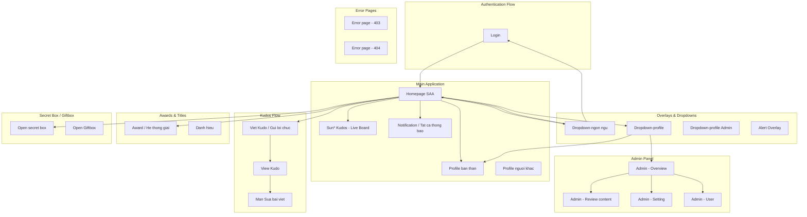
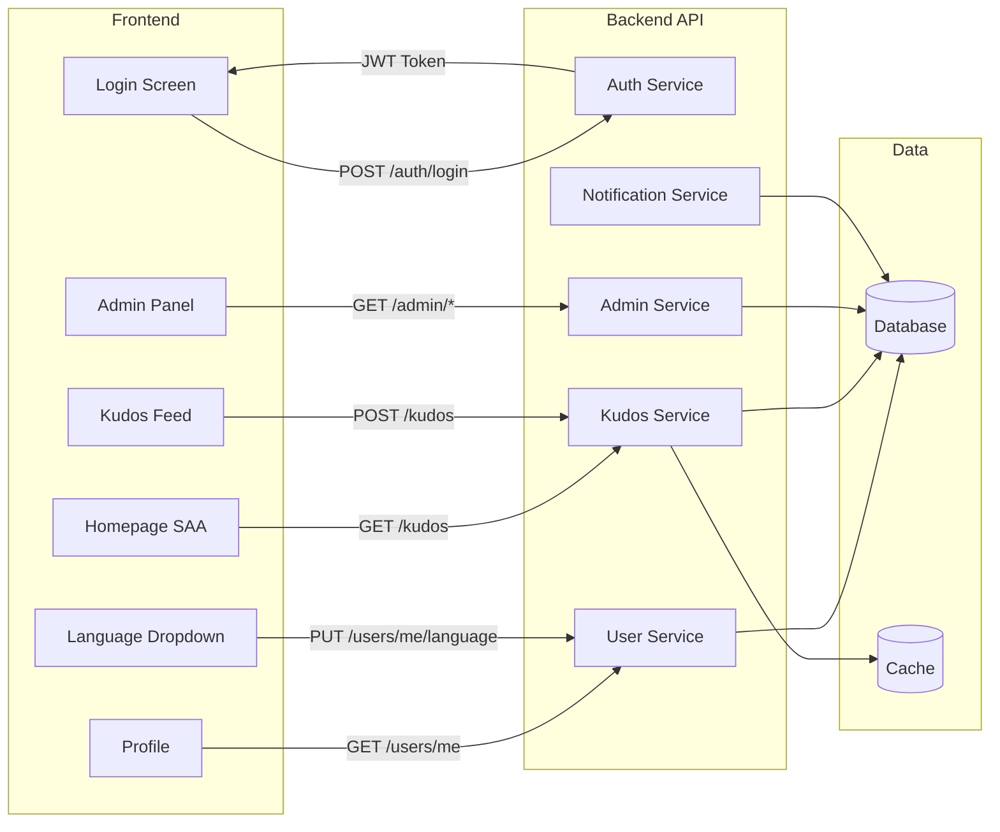

# Screen Flow Overview

## Project Info
- **Project Name**: Sun*Kudos (Sun Asterisk Awards)
- **Figma File Key**: 9ypp4enmFmdK3YAFJLIu6C
- **Figma URL**: https://www.figma.com/design/9ypp4enmFmdK3YAFJLIu6C
- **Created**: 2026-04-17
- **Last Updated**: 2026-04-17

---

## Discovery Progress

| Metric | Count |
|--------|-------|
| Total Screens | 140 |
| Discovered | 1 |
| Remaining | 139 |
| Completion | 1% |

---

## Screens

| # | Screen Name | Frame ID | Figma Link | Status | Detail File | Predicted APIs | Navigations To |
|---|-------------|----------|------------|--------|-------------|----------------|----------------|
| 1 | 1_Header | u-nF4z3tAC | [link](https://momorph.ai/files/9ypp4enmFmdK3YAFJLIu6C/screens/u-nF4z3tAC) | pending | - | - | - |
| 2 | Action - Campaign | Nj4PY0mUJJ | [link](https://momorph.ai/files/9ypp4enmFmdK3YAFJLIu6C/screens/Nj4PY0mUJJ) | pending | - | - | - |
| 3 | Action - Public | HvTGgQhpzx | [link](https://momorph.ai/files/9ypp4enmFmdK3YAFJLIu6C/screens/HvTGgQhpzx) | pending | - | - | - |
| 4 | Action - Spam | bdfLU1n1Tt | [link](https://momorph.ai/files/9ypp4enmFmdK3YAFJLIu6C/screens/bdfLU1n1Tt) | pending | - | - | - |
| 5 | Addlink Box | OyDLDuSGEa | [link](https://momorph.ai/files/9ypp4enmFmdK3YAFJLIu6C/screens/OyDLDuSGEa) | pending | - | - | - |
| 6 | Admin - Overview | 9ja9g9iJLW | [link](https://momorph.ai/files/9ypp4enmFmdK3YAFJLIu6C/screens/9ja9g9iJLW) | pending | - | GET /admin/overview | - |
| 7 | Admin - Review content | MTExSUSdUn | [link](https://momorph.ai/files/9ypp4enmFmdK3YAFJLIu6C/screens/MTExSUSdUn) | pending | - | GET /admin/reviews | - |
| 8 | Admin - Review content - Search | kO5qYafrMh | [link](https://momorph.ai/files/9ypp4enmFmdK3YAFJLIu6C/screens/kO5qYafrMh) | pending | - | GET /admin/reviews?search= | - |
| 9 | Admin - Setting | fTCVEC9aV_ | [link](https://momorph.ai/files/9ypp4enmFmdK3YAFJLIu6C/screens/fTCVEC9aV_) | pending | - | GET /admin/settings | - |
| 10 | Admin - Setting - add Campaign | cb7kD3-Xr6 | [link](https://momorph.ai/files/9ypp4enmFmdK3YAFJLIu6C/screens/cb7kD3-Xr6) | pending | - | POST /campaigns | - |
| 11 | Admin - Setting - add new Campaign | FVA7A5f8z8 | [link](https://momorph.ai/files/9ypp4enmFmdK3YAFJLIu6C/screens/FVA7A5f8z8) | pending | - | POST /campaigns | - |
| 12 | Admin - Setting - Edit Campaign | htgRaDTO2f | [link](https://momorph.ai/files/9ypp4enmFmdK3YAFJLIu6C/screens/htgRaDTO2f) | pending | - | GET+PUT /campaigns/:id | - |
| 13 | Admin - User | -u1lKib0JL | [link](https://momorph.ai/files/9ypp4enmFmdK3YAFJLIu6C/screens/-u1lKib0JL) | pending | - | GET /admin/users | - |
| 14 | Alert Overlay | ZUofoTelpc | [link](https://momorph.ai/files/9ypp4enmFmdK3YAFJLIu6C/screens/ZUofoTelpc) | pending | - | - | - |
| 15 | An danh | p9vFVBE_tc | [link](https://momorph.ai/files/9ypp4enmFmdK3YAFJLIu6C/screens/p9vFVBE_tc) | pending | - | - | - |
| 16 | Award | TfCh7y1S-D | [link](https://momorph.ai/files/9ypp4enmFmdK3YAFJLIu6C/screens/TfCh7y1S-D) | pending | - | GET /awards | - |
| 17 | Awards-Name | uD4Z8gOjEk | [link](https://momorph.ai/files/9ypp4enmFmdK3YAFJLIu6C/screens/uD4Z8gOjEk) | pending | - | - | - |
| 18 | Button | I-QWxvneuY | [link](https://momorph.ai/files/9ypp4enmFmdK3YAFJLIu6C/screens/I-QWxvneuY) | pending | - | - | - |
| 19 | Button | 1wjEyOVU4v | [link](https://momorph.ai/files/9ypp4enmFmdK3YAFJLIu6C/screens/1wjEyOVU4v) | pending | - | - | - |
| 20 | C_Filter | 7zur22HAsh | [link](https://momorph.ai/files/9ypp4enmFmdK3YAFJLIu6C/screens/7zur22HAsh) | pending | - | - | - |
| 21 | Chi so thong ke | M2bL2UntAl | [link](https://momorph.ai/files/9ypp4enmFmdK3YAFJLIu6C/screens/M2bL2UntAl) | pending | - | GET /statistics | - |
| 22 | Chuc mung | SOzErYSp_S | [link](https://momorph.ai/files/9ypp4enmFmdK3YAFJLIu6C/screens/SOzErYSp_S) | pending | - | - | - |
| 23 | Color | B-HozgdIJd | [link](https://momorph.ai/files/9ypp4enmFmdK3YAFJLIu6C/screens/B-HozgdIJd) | pending | - | - | - |
| 24 | Component | dSQdI_iZpt | [link](https://momorph.ai/files/9ypp4enmFmdK3YAFJLIu6C/screens/dSQdI_iZpt) | pending | - | - | - |
| 25 | Countdown - Prelaunch page | 8PJQswPZmU | [link](https://momorph.ai/files/9ypp4enmFmdK3YAFJLIu6C/screens/8PJQswPZmU) | pending | - | GET /prelaunch | - |
| 26 | D1_Sunkudos | QJd9jB9PDt | [link](https://momorph.ai/files/9ypp4enmFmdK3YAFJLIu6C/screens/QJd9jB9PDt) | pending | - | GET /kudos | - |
| 27 | danh hieu (1) | BLR_P77oPR | [link](https://momorph.ai/files/9ypp4enmFmdK3YAFJLIu6C/screens/BLR_P77oPR) | pending | - | GET /titles | - |
| 28 | danh hieu (2) | Khd2HTCDip | [link](https://momorph.ai/files/9ypp4enmFmdK3YAFJLIu6C/screens/Khd2HTCDip) | pending | - | - | - |
| 29 | Danh hieu (3) | DS7D7-HrIY | [link](https://momorph.ai/files/9ypp4enmFmdK3YAFJLIu6C/screens/DS7D7-HrIY) | pending | - | - | - |
| 30 | Danh hieu (4) | L5eRr-5xla | [link](https://momorph.ai/files/9ypp4enmFmdK3YAFJLIu6C/screens/L5eRr-5xla) | pending | - | - | - |
| 31 | Danh hieu (5) | 0usTIbYmUm | [link](https://momorph.ai/files/9ypp4enmFmdK3YAFJLIu6C/screens/0usTIbYmUm) | pending | - | - | - |
| 32 | date picker | uTv7uXESrg | [link](https://momorph.ai/files/9ypp4enmFmdK3YAFJLIu6C/screens/uTv7uXESrg) | pending | - | - | - |
| 33 | Details | AyMaiSOBqz | [link](https://momorph.ai/files/9ypp4enmFmdK3YAFJLIu6C/screens/AyMaiSOBqz) | pending | - | GET /kudos/:id | - |
| 34 | Dropdown chon thoi gian | lJj0-WlUn5 | [link](https://momorph.ai/files/9ypp4enmFmdK3YAFJLIu6C/screens/lJj0-WlUn5) | pending | - | - | - |
| 35 | Dropdown-filter da nhan/gui | rQqxNoXoii | [link](https://momorph.ai/files/9ypp4enmFmdK3YAFJLIu6C/screens/rQqxNoXoii) | pending | - | - | - |
| 36 | Dropdown Hashtag filter | JWpsISMAaM | [link](https://momorph.ai/files/9ypp4enmFmdK3YAFJLIu6C/screens/JWpsISMAaM) | pending | - | GET /hashtags | - |
| 37 | Dropdown level | hb4kPwSKkk | [link](https://momorph.ai/files/9ypp4enmFmdK3YAFJLIu6C/screens/hb4kPwSKkk) | pending | - | - | - |
| 38 | Dropdown-List | MWNZNCBr8_ | [link](https://momorph.ai/files/9ypp4enmFmdK3YAFJLIu6C/screens/MWNZNCBr8_) | pending | - | - | - |
| 39 | Dropdown list hashtag | p9zO-c4a4x | [link](https://momorph.ai/files/9ypp4enmFmdK3YAFJLIu6C/screens/p9zO-c4a4x) | pending | - | GET /hashtags | - |
| 40 | Dropdown list nguoi da gui | neIUcD-nc- | [link](https://momorph.ai/files/9ypp4enmFmdK3YAFJLIu6C/screens/neIUcD-nc-) | pending | - | GET /users | - |
| 41 | Dropdown list nguoi nhan | zJzaC9GgXt | [link](https://momorph.ai/files/9ypp4enmFmdK3YAFJLIu6C/screens/zJzaC9GgXt) | pending | - | GET /users | - |
| 42 | Dropdown list nguoi nhan muon gui loi chuc | QIMJNgFb8K | [link](https://momorph.ai/files/9ypp4enmFmdK3YAFJLIu6C/screens/QIMJNgFb8K) | pending | - | GET /users | - |
| 43 | Dropdown list phong ban | eFStQCJZaQ | [link](https://momorph.ai/files/9ypp4enmFmdK3YAFJLIu6C/screens/eFStQCJZaQ) | pending | - | GET /departments | - |
| 44 | Dropdown list status | UBeTfWM-AP | [link](https://momorph.ai/files/9ypp4enmFmdK3YAFJLIu6C/screens/UBeTfWM-AP) | pending | - | - | - |
| 45 | **Dropdown-ngon ngu** | hUyaaugye2 | [link](https://momorph.ai/files/9ypp4enmFmdK3YAFJLIu6C/screens/hUyaaugye2) | **discovered** | [dropdown_ngon_ngu.md](screen_specs/dropdown_ngon_ngu.md) | PUT /users/me/language | Homepage SAA, Login |
| 46 | Dropdown Phong ban | WXK5AYB_rG | [link](https://momorph.ai/files/9ypp4enmFmdK3YAFJLIu6C/screens/WXK5AYB_rG) | pending | - | GET /departments | - |
| 47 | Dropdown-profile | z4sCl3_Qtk | [link](https://momorph.ai/files/9ypp4enmFmdK3YAFJLIu6C/screens/z4sCl3_Qtk) | pending | - | GET /users/me | - |
| 48 | Dropdown-profile Admin | 54rekaCHG1 | [link](https://momorph.ai/files/9ypp4enmFmdK3YAFJLIu6C/screens/54rekaCHG1) | pending | - | GET /users/me | - |
| 49 | Dropdown Role | GLgos3fOmz | [link](https://momorph.ai/files/9ypp4enmFmdK3YAFJLIu6C/screens/GLgos3fOmz) | pending | - | GET /roles | - |
| 50 | Dropdown search user admin | BFf3J-wRPk | [link](https://momorph.ai/files/9ypp4enmFmdK3YAFJLIu6C/screens/BFf3J-wRPk) | pending | - | GET /users?search= | - |
| 51 | Error page - 403 | T3e_iS9PCL | [link](https://momorph.ai/files/9ypp4enmFmdK3YAFJLIu6C/screens/T3e_iS9PCL) | pending | - | - | - |
| 52 | Error page - 404 | p0yJ89B-9_ | [link](https://momorph.ai/files/9ypp4enmFmdK3YAFJLIu6C/screens/p0yJ89B-9_) | pending | - | - | - |
| 53 | Floating Action Button | _hphd32jN2 | [link](https://momorph.ai/files/9ypp4enmFmdK3YAFJLIu6C/screens/_hphd32jN2) | pending | - | - | - |
| 54 | Floating Action Button 2 | Sv7DFwBw1h | [link](https://momorph.ai/files/9ypp4enmFmdK3YAFJLIu6C/screens/Sv7DFwBw1h) | pending | - | - | - |
| 55 | Gui loi chuc Kudos (1) | JsTvi8KVQA | [link](https://momorph.ai/files/9ypp4enmFmdK3YAFJLIu6C/screens/JsTvi8KVQA) | pending | - | POST /kudos | - |
| 56 | Gui loi chuc Kudos (2) | RO7O6QOhfJ | [link](https://momorph.ai/files/9ypp4enmFmdK3YAFJLIu6C/screens/RO7O6QOhfJ) | pending | - | POST /kudos | - |
| 57 | Hastag group | zOkcd82aJ4 | [link](https://momorph.ai/files/9ypp4enmFmdK3YAFJLIu6C/screens/zOkcd82aJ4) | pending | - | GET /hashtags | - |
| 58 | He thong giai | zFYDgyj_pD | [link](https://momorph.ai/files/9ypp4enmFmdK3YAFJLIu6C/screens/zFYDgyj_pD) | pending | - | GET /awards/system | - |
| 59 | Homepage SAA | i87tDx10uM | [link](https://momorph.ai/files/9ypp4enmFmdK3YAFJLIu6C/screens/i87tDx10uM) | pending | - | GET /homepage, GET /kudos | - |
| 60 | Hover Avatar info user | Bf5XiTE7AO | [link](https://momorph.ai/files/9ypp4enmFmdK3YAFJLIu6C/screens/Bf5XiTE7AO) | pending | - | GET /users/:id | - |
| 61 | Hover campain | gI07KYVJWE | [link](https://momorph.ai/files/9ypp4enmFmdK3YAFJLIu6C/screens/gI07KYVJWE) | pending | - | - | - |
| 62 | Hover danh hieu Legend Hero | XI0QKVv1qZ | [link](https://momorph.ai/files/9ypp4enmFmdK3YAFJLIu6C/screens/XI0QKVv1qZ) | pending | - | - | - |
| 63 | Hover danh hieu New Hero | twC9br89ra | [link](https://momorph.ai/files/9ypp4enmFmdK3YAFJLIu6C/screens/twC9br89ra) | pending | - | - | - |
| 64 | Hover danh hieu Rising Hero | IjeDnHmzou | [link](https://momorph.ai/files/9ypp4enmFmdK3YAFJLIu6C/screens/IjeDnHmzou) | pending | - | - | - |
| 65 | Hover danh hieu Super Hero | d6zEZ9ccoX | [link](https://momorph.ai/files/9ypp4enmFmdK3YAFJLIu6C/screens/d6zEZ9ccoX) | pending | - | - | - |
| 66 | Huy hieu | RVezwrwx02 | [link](https://momorph.ai/files/9ypp4enmFmdK3YAFJLIu6C/screens/RVezwrwx02) | pending | - | GET /badges | - |
| 67 | IC | k46zqLhIK5 | [link](https://momorph.ai/files/9ypp4enmFmdK3YAFJLIu6C/screens/k46zqLhIK5) | pending | - | - | - |
| 68 | Icon | rCAXfPH2gn | [link](https://momorph.ai/files/9ypp4enmFmdK3YAFJLIu6C/screens/rCAXfPH2gn) | pending | - | - | - |
| 69 | Image | lZRNrgb04V | [link](https://momorph.ai/files/9ypp4enmFmdK3YAFJLIu6C/screens/lZRNrgb04V) | pending | - | - | - |
| 70 | Infor | c9oN8CW9aa | [link](https://momorph.ai/files/9ypp4enmFmdK3YAFJLIu6C/screens/c9oN8CW9aa) | pending | - | - | - |
| 71 | Infor - HoverAvatar (1) | XERzyqz7lT | [link](https://momorph.ai/files/9ypp4enmFmdK3YAFJLIu6C/screens/XERzyqz7lT) | pending | - | - | - |
| 72 | Infor - HoverAvatar (2) | Avr4N77jbF | [link](https://momorph.ai/files/9ypp4enmFmdK3YAFJLIu6C/screens/Avr4N77jbF) | pending | - | - | - |
| 73 | [iOS] Access denied | k-7zJk2B7s | [link](https://momorph.ai/files/9ypp4enmFmdK3YAFJLIu6C/screens/k-7zJk2B7s) | pending | - | - | - |
| 74 | [iOS] Award_Best Manager | 7y195PPTxQ | [link](https://momorph.ai/files/9ypp4enmFmdK3YAFJLIu6C/screens/7y195PPTxQ) | pending | - | GET /awards/:id | - |
| 75 | [iOS] Award_MVP | b2BuS8HYIt | [link](https://momorph.ai/files/9ypp4enmFmdK3YAFJLIu6C/screens/b2BuS8HYIt) | pending | - | GET /awards/:id | - |
| 76 | [iOS] Award_Signature 2025 - Creator | O98TwiHaJe | [link](https://momorph.ai/files/9ypp4enmFmdK3YAFJLIu6C/screens/O98TwiHaJe) | pending | - | GET /awards/:id | - |
| 77 | [iOS] Award_Top project | FQoJZLkG_d | [link](https://momorph.ai/files/9ypp4enmFmdK3YAFJLIu6C/screens/FQoJZLkG_d) | pending | - | GET /awards/:id | - |
| 78 | [iOS] Award_Top project leader | QQvsfK3yaK | [link](https://momorph.ai/files/9ypp4enmFmdK3YAFJLIu6C/screens/QQvsfK3yaK) | pending | - | GET /awards/:id | - |
| 79 | [iOS] Award_Top talent | c-QM3_zjkG | [link](https://momorph.ai/files/9ypp4enmFmdK3YAFJLIu6C/screens/c-QM3_zjkG) | pending | - | GET /awards/:id | - |
| 80 | [iOS] Home | OuH1BUTYT0 | [link](https://momorph.ai/files/9ypp4enmFmdK3YAFJLIu6C/screens/OuH1BUTYT0) | pending | - | GET /homepage | - |
| 81 | [iOS] Language dropdown | uUvW6Qm1ve | [link](https://momorph.ai/files/9ypp4enmFmdK3YAFJLIu6C/screens/uUvW6Qm1ve) | pending | - | PUT /users/me/language | - |
| 82 | [iOS] Login | 8HGlvYGJWq | [link](https://momorph.ai/files/9ypp4enmFmdK3YAFJLIu6C/screens/8HGlvYGJWq) | pending | - | POST /auth/login | - |
| 83 | [iOS] Not Found | sn2mdavs1a | [link](https://momorph.ai/files/9ypp4enmFmdK3YAFJLIu6C/screens/sn2mdavs1a) | pending | - | - | - |
| 84 | [iOS] Notifications | _b68CBWKl5 | [link](https://momorph.ai/files/9ypp4enmFmdK3YAFJLIu6C/screens/_b68CBWKl5) | pending | - | GET /notifications | - |
| 85 | [iOS] Open secret box | kQk65hSYF2 | [link](https://momorph.ai/files/9ypp4enmFmdK3YAFJLIu6C/screens/kQk65hSYF2) | pending | - | POST /secret-box/open | - |
| 86 | [iOS] Open secret box - action bam mo | KUmv414uC9 | [link](https://momorph.ai/files/9ypp4enmFmdK3YAFJLIu6C/screens/KUmv414uC9) | pending | - | POST /secret-box/open | - |
| 87 | [iOS] Open secret box - standby (1) | -LIblaeusT | [link](https://momorph.ai/files/9ypp4enmFmdK3YAFJLIu6C/screens/-LIblaeusT) | pending | - | - | - |
| 88 | [iOS] Open secret box - standby (2) | IXpGakYRm5 | [link](https://momorph.ai/files/9ypp4enmFmdK3YAFJLIu6C/screens/IXpGakYRm5) | pending | - | - | - |
| 89 | [iOS] Open secret box - standby (3) | _cWAEarZPi | [link](https://momorph.ai/files/9ypp4enmFmdK3YAFJLIu6C/screens/_cWAEarZPi) | pending | - | - | - |
| 90 | [iOS] Open secret box - standby (4) | scvV-OQCAJ | [link](https://momorph.ai/files/9ypp4enmFmdK3YAFJLIu6C/screens/scvV-OQCAJ) | pending | - | - | - |
| 91 | [iOS] Open secret box - standby (5) | wsI6gaO_yc | [link](https://momorph.ai/files/9ypp4enmFmdK3YAFJLIu6C/screens/wsI6gaO_yc) | pending | - | - | - |
| 92 | [iOS] Open secret box - standby (6) | FvTOS7oCPU | [link](https://momorph.ai/files/9ypp4enmFmdK3YAFJLIu6C/screens/FvTOS7oCPU) | pending | - | - | - |
| 93 | [iOS] Open secret box - standby (7) | xptNUunBS_ | [link](https://momorph.ai/files/9ypp4enmFmdK3YAFJLIu6C/screens/xptNUunBS_) | pending | - | - | - |
| 94 | [iOS] Profile ban than | hSH7L8doXB | [link](https://momorph.ai/files/9ypp4enmFmdK3YAFJLIu6C/screens/hSH7L8doXB) | pending | - | GET /users/me | - |
| 95 | [iOS] Profile nguoi khac | bEpdheM0yU | [link](https://momorph.ai/files/9ypp4enmFmdK3YAFJLIu6C/screens/bEpdheM0yU) | pending | - | GET /users/:id | - |
| 96 | [iOS] Sun*Kudos | fO0Kt19sZZ | [link](https://momorph.ai/files/9ypp4enmFmdK3YAFJLIu6C/screens/fO0Kt19sZZ) | pending | - | GET /kudos | - |
| 97 | [iOS] Sun*Kudos_All Kudos | j_a2GQWKDJ | [link](https://momorph.ai/files/9ypp4enmFmdK3YAFJLIu6C/screens/j_a2GQWKDJ) | pending | - | GET /kudos | - |
| 98 | [iOS] Sun*Kudos_dropdown hashtag | V5GRjAdJyb | [link](https://momorph.ai/files/9ypp4enmFmdK3YAFJLIu6C/screens/V5GRjAdJyb) | pending | - | GET /hashtags | - |
| 99 | [iOS] Sun*Kudos_dropdown phong ban | 76k69LQPfj | [link](https://momorph.ai/files/9ypp4enmFmdK3YAFJLIu6C/screens/76k69LQPfj) | pending | - | GET /departments | - |
| 100 | [iOS] Sun*Kudos_Gui loi chuc Kudos | PV7jBVZU1N | [link](https://momorph.ai/files/9ypp4enmFmdK3YAFJLIu6C/screens/PV7jBVZU1N) | pending | - | POST /kudos | - |
| 101 | [iOS] Sun*Kudos_Gui loi chuc_dropdown hashtag | aKWA2klsnt | [link](https://momorph.ai/files/9ypp4enmFmdK3YAFJLIu6C/screens/aKWA2klsnt) | pending | - | GET /hashtags | - |
| 102 | [iOS] Sun*Kudos_Gui loi chuc_dropdown ten nguoi nhan | 5MU728Tjck | [link](https://momorph.ai/files/9ypp4enmFmdK3YAFJLIu6C/screens/5MU728Tjck) | pending | - | GET /users | - |
| 103 | [iOS] Sun*Kudos_Loi chua dien het | 0le8xKnFE_ | [link](https://momorph.ai/files/9ypp4enmFmdK3YAFJLIu6C/screens/0le8xKnFE_) | pending | - | - | - |
| 104 | [iOS] Sun*Kudos_Searching | hldqjHoSRH | [link](https://momorph.ai/files/9ypp4enmFmdK3YAFJLIu6C/screens/hldqjHoSRH) | pending | - | GET /kudos?search= | - |
| 105 | [iOS] Sun*Kudos_Search Sunner | 3jgwke3E8O | [link](https://momorph.ai/files/9ypp4enmFmdK3YAFJLIu6C/screens/3jgwke3E8O) | pending | - | GET /users?search= | - |
| 106 | [iOS] Sun*Kudos_Tieu chuan cong dong | xms7csmDhD | [link](https://momorph.ai/files/9ypp4enmFmdK3YAFJLIu6C/screens/xms7csmDhD) | pending | - | GET /community-standards | - |
| 107 | [iOS] Sun*Kudos_Viet Kudo_default | 7fFAb-K35a | [link](https://momorph.ai/files/9ypp4enmFmdK3YAFJLIu6C/screens/7fFAb-K35a) | pending | - | POST /kudos | - |
| 108 | [iOS] Sun*Kudos_View kudo | T0TR16k0vH | [link](https://momorph.ai/files/9ypp4enmFmdK3YAFJLIu6C/screens/T0TR16k0vH) | pending | - | GET /kudos/:id | - |
| 109 | [iOS] Sun*Kudos_View kudo an danh | 5C2BL6GYXL | [link](https://momorph.ai/files/9ypp4enmFmdK3YAFJLIu6C/screens/5C2BL6GYXL) | pending | - | GET /kudos/:id | - |
| 110 | [iOS] The le | zIuFaHAid4 | [link](https://momorph.ai/files/9ypp4enmFmdK3YAFJLIu6C/screens/zIuFaHAid4) | pending | - | GET /rules | - |
| 111 | KUDO (1) | 49Qr2oIjMV | [link](https://momorph.ai/files/9ypp4enmFmdK3YAFJLIu6C/screens/49Qr2oIjMV) | pending | - | - | - |
| 112 | KUDO (2) | Qhg3SUg_8L | [link](https://momorph.ai/files/9ypp4enmFmdK3YAFJLIu6C/screens/Qhg3SUg_8L) | pending | - | - | - |
| 113 | KUDO - Highlight | n56Yyp7Klu | [link](https://momorph.ai/files/9ypp4enmFmdK3YAFJLIu6C/screens/n56Yyp7Klu) | pending | - | - | - |
| 114 | KUDO spam | JYHZJyOwT- | [link](https://momorph.ai/files/9ypp4enmFmdK3YAFJLIu6C/screens/JYHZJyOwT-) | pending | - | - | - |
| 115 | Language | IfiszsIS8J | [link](https://momorph.ai/files/9ypp4enmFmdK3YAFJLIu6C/screens/IfiszsIS8J) | pending | - | - | - |
| 116 | Language Dropdown | IiLVGkACbt | [link](https://momorph.ai/files/9ypp4enmFmdK3YAFJLIu6C/screens/IiLVGkACbt) | pending | - | PUT /users/me/language | - |
| 117 | Login | GzbNeVGJHz | [link](https://momorph.ai/files/9ypp4enmFmdK3YAFJLIu6C/screens/GzbNeVGJHz) | pending | - | POST /auth/login | Homepage SAA |
| 118 | LOGO | 4gBWEmhOCV | [link](https://momorph.ai/files/9ypp4enmFmdK3YAFJLIu6C/screens/4gBWEmhOCV) | pending | - | - | - |
| 119 | Man Sua bai viet - edit mode | 419VXmMy6I | [link](https://momorph.ai/files/9ypp4enmFmdK3YAFJLIu6C/screens/419VXmMy6I) | pending | - | PUT /kudos/:id | - |
| 120 | Navigation bar | VeF77wVOUW | [link](https://momorph.ai/files/9ypp4enmFmdK3YAFJLIu6C/screens/VeF77wVOUW) | pending | - | - | - |
| 121 | Notification | D_jgDqvIc8 | [link](https://momorph.ai/files/9ypp4enmFmdK3YAFJLIu6C/screens/D_jgDqvIc8) | pending | - | GET /notifications | - |
| 122 | Open Giftbox (1) | _YLVd7Ij6e | [link](https://momorph.ai/files/9ypp4enmFmdK3YAFJLIu6C/screens/_YLVd7Ij6e) | pending | - | POST /giftbox/open | - |
| 123 | Open Giftbox (2) | A3J33jY-Wp | [link](https://momorph.ai/files/9ypp4enmFmdK3YAFJLIu6C/screens/A3J33jY-Wp) | pending | - | - | - |
| 124 | Open Giftbox (3) | hCRbDKyaoT | [link](https://momorph.ai/files/9ypp4enmFmdK3YAFJLIu6C/screens/hCRbDKyaoT) | pending | - | - | - |
| 125 | Open secret box - action bam mo (1) | K-LuEblC08 | [link](https://momorph.ai/files/9ypp4enmFmdK3YAFJLIu6C/screens/K-LuEblC08) | pending | - | POST /secret-box/open | - |
| 126 | Open secret box - action bam mo (2) | p0qHd6DJ6A | [link](https://momorph.ai/files/9ypp4enmFmdK3YAFJLIu6C/screens/p0qHd6DJ6A) | pending | - | POST /secret-box/open | - |
| 127 | Open secret box - chua mo (1) | m0zV-VstXX | [link](https://momorph.ai/files/9ypp4enmFmdK3YAFJLIu6C/screens/m0zV-VstXX) | pending | - | GET /secret-box | - |
| 128 | Open secret box - chua mo (2) | J3-4YFIpMM | [link](https://momorph.ai/files/9ypp4enmFmdK3YAFJLIu6C/screens/J3-4YFIpMM) | pending | - | GET /secret-box | - |
| 129 | Open secret box - standby (web 1) | iJqdwTEiDj | [link](https://momorph.ai/files/9ypp4enmFmdK3YAFJLIu6C/screens/iJqdwTEiDj) | pending | - | - | - |
| 130 | Open secret box - standby (web 2) | P5b2MJQoW6 | [link](https://momorph.ai/files/9ypp4enmFmdK3YAFJLIu6C/screens/P5b2MJQoW6) | pending | - | - | - |
| 131 | Open secret box - standby (web 3) | VsjjEDVgEx | [link](https://momorph.ai/files/9ypp4enmFmdK3YAFJLIu6C/screens/VsjjEDVgEx) | pending | - | - | - |
| 132 | Open secret box - standby (web 4) | iEhDBe3Id- | [link](https://momorph.ai/files/9ypp4enmFmdK3YAFJLIu6C/screens/iEhDBe3Id-) | pending | - | - | - |
| 133 | Open secret box - standby (web 5) | 2i7DgydylV | [link](https://momorph.ai/files/9ypp4enmFmdK3YAFJLIu6C/screens/2i7DgydylV) | pending | - | - | - |
| 134 | Open secret box - standby (web 6) | cgeDZw-tDh | [link](https://momorph.ai/files/9ypp4enmFmdK3YAFJLIu6C/screens/cgeDZw-tDh) | pending | - | - | - |
| 135 | Open secret box - standby (web 7) | sACeeoE6Ge | [link](https://momorph.ai/files/9ypp4enmFmdK3YAFJLIu6C/screens/sACeeoE6Ge) | pending | - | - | - |
| 136 | Open secret box - standby (web 8) | AzMhNg8aqW | [link](https://momorph.ai/files/9ypp4enmFmdK3YAFJLIu6C/screens/AzMhNg8aqW) | pending | - | - | - |
| 137 | Profile ban than | 3FoIx6ALVb | [link](https://momorph.ai/files/9ypp4enmFmdK3YAFJLIu6C/screens/3FoIx6ALVb) | pending | - | GET /users/me | - |
| 138 | Profile nguoi khac | w4WUvsJ9KI | [link](https://momorph.ai/files/9ypp4enmFmdK3YAFJLIu6C/screens/w4WUvsJ9KI) | pending | - | GET /users/:id | - |
| 139 | Sun* Kudos - Live board | MaZUn5xHXZ | [link](https://momorph.ai/files/9ypp4enmFmdK3YAFJLIu6C/screens/MaZUn5xHXZ) | pending | - | GET /kudos/live | - |
| 140 | Tat ca thong bao | 6-1LRz3vqr | [link](https://momorph.ai/files/9ypp4enmFmdK3YAFJLIu6C/screens/6-1LRz3vqr) | pending | - | GET /notifications | - |

---

## Navigation Graph

---

## Screen Groups

### Group: Authentication
| Screen | Purpose | Entry Points |
|--------|---------|--------------|
| Login | User authentication via SSO | App launch, Logout |

### Group: Main Application
| Screen | Purpose | Entry Points |
|--------|---------|--------------|
| Homepage SAA | Main hub, kudos feed, statistics | After login |
| Sun* Kudos - Live board | Live kudos feed | Homepage navigation |
| Countdown - Prelaunch page | Pre-launch countdown | Direct URL |

### Group: Kudos
| Screen | Purpose | Entry Points |
|--------|---------|--------------|
| D1_Sunkudos | Sun Kudos main page | Homepage |
| Gui loi chuc Kudos | Send kudos message | FAB / write kudo action |
| Viet Kudo | Write kudo form | Homepage, FAB |
| View Kudo | View individual kudo | Kudos feed |
| Man Sua bai viet - edit mode | Edit existing kudo | View Kudo actions |
| An danh | Anonymous kudo mode | Write kudo option |

### Group: User & Profile
| Screen | Purpose | Entry Points |
|--------|---------|--------------|
| Profile ban than | Own profile page | Dropdown-profile, Header |
| Profile nguoi khac | Other user profile | Avatar click, Search |
| Hover Avatar info user | Quick user info tooltip | Avatar hover |
| Dropdown-profile | User profile dropdown menu | Header avatar |
| Dropdown-profile Admin | Admin profile dropdown | Header avatar (admin) |

### Group: Admin Panel
| Screen | Purpose | Entry Points |
|--------|---------|--------------|
| Admin - Overview | Admin dashboard | Admin navigation |
| Admin - Review content | Content review list | Admin navigation |
| Admin - Review content - Search | Search reviewed content | Admin Review |
| Admin - Setting | Admin settings | Admin navigation |
| Admin - Setting - add Campaign | Add campaign form | Admin Setting |
| Admin - Setting - add new Campaign | New campaign dialog | Admin Setting |
| Admin - Setting - Edit Campaign | Edit campaign form | Admin Setting |
| Admin - User | User management | Admin navigation |

### Group: Awards & Titles
| Screen | Purpose | Entry Points |
|--------|---------|--------------|
| Award | Awards page | Homepage |
| He thong giai | Award system overview | Homepage, Awards |
| Danh hieu (multiple) | Title/rank display | Profile, Homepage |
| Huy hieu | Badges display | Profile |

### Group: Notifications
| Screen | Purpose | Entry Points |
|--------|---------|--------------|
| Notification | Notification panel | Header bell icon |
| Tat ca thong bao | All notifications page | Notification panel |
| View thong bao | View single notification | Notification list |

### Group: Secret Box / Giftbox
| Screen | Purpose | Entry Points |
|--------|---------|--------------|
| Open secret box (multiple states) | Mystery box interaction | Homepage, Events |
| Open Giftbox (multiple states) | Gift box opening | Homepage, Events |

### Group: Overlays & Dropdowns
| Screen | Purpose | Entry Points |
|--------|---------|--------------|
| Dropdown-ngon ngu | Language selector | Header |
| Dropdown Hashtag filter | Hashtag filter dropdown | Kudos feed |
| Dropdown Phong ban | Department filter | Kudos feed, Admin |
| Dropdown list nguoi nhan | Recipient selector | Write Kudo |
| Dropdown list status | Status filter | Admin Review |
| Dropdown Role | Role filter | Admin User |
| Alert Overlay | Confirmation/alert dialog | Various actions |

### Group: Error Pages
| Screen | Purpose | Entry Points |
|--------|---------|--------------|
| Error page - 403 | Access denied | Unauthorized access |
| Error page - 404 | Not found | Invalid URL |

### Group: Design System / Components
| Screen | Purpose | Entry Points |
|--------|---------|--------------|
| Button / Color / Icon / Typography / Grid style | Design tokens | N/A (reference only) |
| Component / Navigation bar / Top Navigation | Reusable components | N/A (reference only) |
| LOGO / IC / Image / Thumbnail | Asset references | N/A (reference only) |

### Group: iOS Mobile Screens
| Screen | Purpose | Entry Points |
|--------|---------|--------------|
| [iOS] Home | Mobile homepage | After login |
| [iOS] Login | Mobile login | App launch |
| [iOS] Sun*Kudos (multiple) | Mobile kudos screens | Mobile navigation |
| [iOS] Profile (ban than/nguoi khac) | Mobile profile | Mobile navigation |
| [iOS] Award (multiple) | Mobile award screens | Mobile navigation |
| [iOS] Notifications | Mobile notifications | Mobile navigation |
| [iOS] Open secret box (multiple) | Mobile secret box | Mobile events |
| [iOS] The le | Mobile rules page | Mobile navigation |
| [iOS] Access denied / Not Found | Mobile error pages | Various |

---

## API Endpoints Summary

| Endpoint | Method | Screens Using | Purpose |
|----------|--------|---------------|---------|
| /auth/login | POST | Login, [iOS] Login | User authentication |
| /users/me | GET | Dropdown-profile, Profile ban than, [iOS] Profile ban than | Get current user |
| /users/me | PUT | Profile ban than | Update user info |
| /users/me/language | PUT | Dropdown-ngon ngu, Language Dropdown, [iOS] Language dropdown | Change language preference |
| /users/:id | GET | Profile nguoi khac, Hover Avatar info user, [iOS] Profile nguoi khac | Get other user profile |
| /users | GET | Dropdown list nguoi nhan, Dropdown list nguoi da gui, Admin - User | List/search users |
| /kudos | GET | Homepage SAA, D1_Sunkudos, Sun* Kudos - Live board | Get kudos feed |
| /kudos | POST | Gui loi chuc Kudos, Viet Kudo, [iOS] Sun*Kudos_Gui loi chuc | Create kudo |
| /kudos/:id | GET | Details, View Kudo, [iOS] Sun*Kudos_View kudo | Get kudo detail |
| /kudos/:id | PUT | Man Sua bai viet - edit mode | Update kudo |
| /hashtags | GET | Dropdown Hashtag filter, Dropdown list hashtag, Hastag group | List hashtags |
| /departments | GET | Dropdown Phong ban, Dropdown list phong ban | List departments |
| /notifications | GET | Notification, Tat ca thong bao, [iOS] Notifications | Get notifications |
| /awards | GET | Award | List awards |
| /awards/:id | GET | [iOS] Award_* screens | Get award detail |
| /awards/system | GET | He thong giai | Get award system |
| /badges | GET | Huy hieu | Get badges |
| /titles | GET | danh hieu | Get titles |
| /statistics | GET | Chi so thong ke | Get statistics |
| /campaigns | POST | Admin - Setting - add Campaign | Create campaign |
| /campaigns/:id | GET+PUT | Admin - Setting - Edit Campaign | Edit campaign |
| /admin/overview | GET | Admin - Overview | Admin dashboard data |
| /admin/reviews | GET | Admin - Review content | Content review list |
| /admin/settings | GET | Admin - Setting | Admin settings |
| /secret-box | GET | Open secret box - chua mo | Get secret box status |
| /secret-box/open | POST | Open secret box - action | Open secret box |
| /giftbox/open | POST | Open Giftbox | Open gift box |
| /community-standards | GET | [iOS] Sun*Kudos_Tieu chuan cong dong | Community standards |
| /rules | GET | [iOS] The le | Rules/regulations |
| /prelaunch | GET | Countdown - Prelaunch page | Pre-launch data |
| /roles | GET | Dropdown Role | List roles |

---

## Data Flow

---

## Technical Notes

### Authentication Flow
- SSO-based authentication (Sun* corporate SSO)
- JWT-based session management
- Token stored in secure cookie/localStorage

### State Management
- Global state: User profile, auth token, language preference
- Server state: Kudos feed, notifications, admin data

### Routing
- Router: Next.js App Router
- Protected routes require authentication
- Admin routes require admin role
- Multi-language support (VN/EN)

### Platforms
- **Web**: Desktop responsive (main platform)
- **iOS**: Mobile-specific screens with [iOS] prefix

---

## Discovery Log

| Date | Action | Screens | Notes |
|------|--------|---------|-------|
| 2026-04-17 | Initial discovery | Dropdown-ngon ngu (hUyaaugye2) | Started with language dropdown component. 140 total frames identified. |

---

## Next Steps

- [ ] Complete discovery for remaining screens (start with major screens: Login, Homepage SAA, D1_Sunkudos)
- [ ] Verify navigation paths between screens
- [ ] Map all API endpoints with backend team
- [ ] Review with design team
- [ ] Process iOS screens separately from web screens
