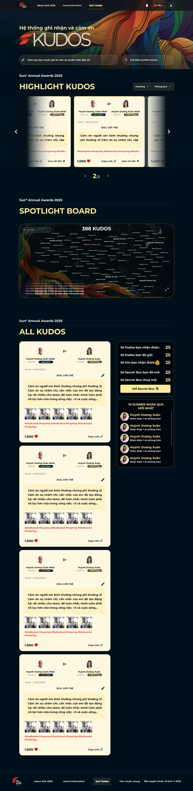

# Feature Specification: Sun* Kudos - Live Board

**Frame ID**: `MaZUn5xHXZ`
**Frame Name**: `Sun* Kudos - Live board`
**File Key**: `9ypp4enmFmdK3YAFJLIu6C`
**Created**: 2026-04-20
**Status**: Reviewed (3 passes — 2026-04-20)

---

## Overview

The **Sun* Kudos - Live Board** is the main kudos feed page of the SSA 2025 application. It serves as the central hub where Sun* employees can browse, interact with, and discover appreciation messages (Kudos) sent between colleagues during the Sun* Annual Awards 2025 event.

The page is composed of four major sections:
1. **KV Banner** (A) - Hero section with the event branding and a CTA to send a new Kudo
2. **Highlight Kudos** (B) - A carousel showcasing the top 5 most-liked Kudos, with hashtag and department filters
3. **Spotlight Board** (B.7) - An interactive word-cloud/diagram displaying all Kudo recipients with pan/zoom controls
4. **All Kudos** (C + D) - A two-column layout with an infinite-scroll feed of all Kudos (left) and a personal stats sidebar with leaderboards (right)

**Target Users**: Authenticated Sun* employees who want to browse, like, and share Kudos; view personal stats; and open Secret Boxes.

---

## User Scenarios & Testing *(mandatory)*

### User Story 1 - Browse All Kudos Feed (Priority: P1)

A Sun* employee wants to browse through all Kudos that have been sent across the organization, reading messages and seeing who recognized whom.

**Why this priority**: The All Kudos feed is the core content of the live board. Without it, users cannot discover or engage with Kudos.

**Independent Test**: Navigate to the Kudos page and scroll through the feed to see individual Kudo posts.

**Acceptance Scenarios**:

1. **Given** the user is authenticated and navigates to the Kudos Live Board, **When** the page loads, **Then** the "ALL KUDOS" section displays a list of Kudo cards sorted by newest first, each showing sender info, receiver info, timestamp, message content, hashtags, like count, and a "Copy Link" button.
2. **Given** the All Kudos feed is displayed, **When** the user scrolls to the bottom of the list, **Then** the next page of Kudos is loaded automatically via infinite scroll.
3. **Given** a Kudo card is displayed, **When** the message content exceeds 5 lines, **Then** the content is truncated with "..." and the user can click the card to navigate to the full Kudo detail view.
4. **Given** a Kudo card has attached images, **When** viewing the card, **Then** up to 5 thumbnail images are displayed in a horizontal row. Clicking a thumbnail opens the full-size image.
5. **Given** the Kudos list is empty, **When** viewing the section, **Then** a text message "Hien tai chua co Kudos nao." is displayed.

---

### User Story 2 - View Highlight Kudos Carousel (Priority: P1)

A Sun* employee wants to see the top-performing Kudos (most liked) displayed prominently.

**Why this priority**: Highlight Kudos showcase the most impactful recognition messages and drive engagement.

**Independent Test**: View the Highlight Kudos carousel, navigate between slides, and verify card content.

**Acceptance Scenarios**:

1. **Given** the user is on the Kudos Live Board, **When** viewing the Highlight Kudos section, **Then** a carousel displays the top 5 most-liked Kudos cards with the center card prominent and side cards dimmed/faded.
2. **Given** the carousel is displayed, **When** the user clicks the right arrow, **Then** the carousel slides to the next card and the page indicator updates (e.g., "2/5" becomes "3/5").
3. **Given** the carousel is on the first card (1/5), **When** viewing, **Then** the left arrow (back) button is disabled.
4. **Given** the carousel is on the last card (5/5), **When** viewing, **Then** the right arrow (forward) button is disabled.
5. **Given** the carousel has no Kudos, **When** viewing, **Then** a text message "Hien tai chua co Kudos nao." is displayed.
6. **Given** a Highlight Kudo card is displayed, **When** viewing its content, **Then** it shows sender info (avatar, name, star rating, title), receiver info, timestamp ("10:00 - 10/30/2025"), message (max 3 lines with "..."), hashtags (max 5 on one line with "..."), like count with heart icon, "Copy Link" button, and "Xem chi tiet" button.

---

### User Story 3 - Like/Unlike a Kudo (Priority: P1)

A Sun* employee wants to express appreciation for a Kudo by liking it.

**Why this priority**: Liking is the primary engagement mechanism that determines highlight ranking and contributes to the heart-based reward system.

**Independent Test**: Click the heart icon on a Kudo card and verify the count changes.

**Acceptance Scenarios**:

1. **Given** the user has not liked a Kudo, **When** viewing the heart button, **Then** the heart icon is displayed in grey (inactive state) with the current like count.
2. **Given** the heart icon is grey (not liked), **When** the user clicks it, **Then** the heart icon turns red (active state), the like count increments by 1, and the Kudo sender's account receives +1 heart (or +2 hearts if it's a special day configured by admin).
3. **Given** the heart icon is red (already liked), **When** the user clicks it, **Then** the heart icon turns grey, the like count decrements by 1, and the corresponding hearts are revoked from the sender's account (1 or 2 depending on when the like was originally given).
4. **Given** the user is the sender of a Kudo, **When** viewing their own Kudo's heart button, **Then** the heart button is disabled (users cannot like their own Kudos).
5. **Given** any user, **When** interacting with the heart button, **Then** each user can only have one like per Kudo (toggle behavior).

---

### User Story 4 - Filter Kudos by Hashtag and Department (Priority: P1)

A Sun* employee wants to filter Kudos by specific hashtags or departments.

**Why this priority**: Filters enable users to find relevant Kudos and are shared across both Highlight and All Kudos sections.

**Independent Test**: Click filter buttons, select options, and verify both sections update.

**Acceptance Scenarios**:

1. **Given** the user is viewing the Highlight Kudos section header, **When** they click the "Hashtag" dropdown button, **Then** a dropdown list of available hashtags (from database) is displayed.
2. **Given** the Hashtag dropdown is open, **When** the user selects a hashtag, **Then** both the Highlight Kudos carousel and the All Kudos feed are filtered to show only Kudos containing that hashtag. The carousel pagination resets to 1.
3. **Given** the user clicks the "Phong ban" (Department) dropdown, **When** they select a department, **Then** both sections filter to show Kudos from that department.
4. **Given** a Kudo card displays hashtags, **When** the user clicks any individual hashtag tag on a card, **Then** the Hashtag filter is set to that tag and both Highlight Kudos and All Kudos views update accordingly.
5. **Given** a filter is active, **When** viewing the filter button, **Then** the button shows active state with the selected option displayed.
6. **Given** a filter is active, **When** the user clicks the same filter button again and deselects the option (or selects a "clear/all" option), **Then** the filter is removed and both sections return to showing all Kudos.

---

### User Story 5 - Copy Kudo Link (Priority: P2)

A Sun* employee wants to share a specific Kudo via link.

**Why this priority**: Sharing deepens engagement but is secondary to browsing and liking.

**Independent Test**: Click "Copy Link" on a Kudo card and verify clipboard contents.

**Acceptance Scenarios**:

1. **Given** a Kudo card is displayed, **When** the user clicks "Copy Link", **Then** the Kudo's URL is copied to the clipboard and a toast notification "Link copied -- ready to share!" is displayed.

---

### User Story 6 - View Personal Stats and Open Secret Box (Priority: P1)

A Sun* employee wants to see their personal Kudo statistics and open available Secret Boxes.

**Why this priority**: The stats sidebar and Secret Box feature are primary engagement drivers that incentivize participation.

**Independent Test**: View the stats sidebar and click "Mo qua" to open a Secret Box.

**Acceptance Scenarios**:

1. **Given** the user is on the Kudos Live Board, **When** viewing the right sidebar, **Then** 5 statistics are displayed: "So Kudos ban nhan duoc" (received), "So Kudos ban da gui" (sent), "So tim ban nhan duoc" (hearts received), "So Secret Box ban da mo" (opened), "So Secret Box chua mo" (unopened).
2. **Given** the user has unopened Secret Boxes, **When** they click the "Mo Secret Box" button, **Then** a dialog opens for opening a Secret Box (linked to frame "Open secret box - chua mo").
3. **Given** the user has no unopened Secret Boxes, **When** viewing the "Mo Secret Box" button, **Then** the button may be disabled.

---

### User Story 7 - Interact with Spotlight Board (Priority: P2)

A Sun* employee wants to explore the interactive Spotlight Board showing Kudo recipients.

**Why this priority**: The Spotlight Board is a visual engagement feature but not essential for core Kudo functionality.

**Independent Test**: View the Spotlight Board, hover over names, and use pan/zoom controls.

**Acceptance Scenarios**:

1. **Given** the user is on the Kudos Live Board, **When** viewing the Spotlight Board section, **Then** an interactive word-cloud/diagram is displayed showing names of Kudo recipients, with a header displaying the total Kudos count (e.g., "388 KUDOS") queried from the database.
2. **Given** the Spotlight Board is displayed, **When** the user hovers over a name node, **Then** a tooltip appears showing the name and the time they received a Kudo.
3. **Given** the Spotlight Board is displayed, **When** the user clicks a name node, **Then** they are navigated to the detail of the corresponding Kudo.
4. **Given** the Spotlight Board, **When** the user clicks the "Pan/Zoom" button, **Then** the board toggles between pan and zoom modes. A tooltip "Pan/Zoom" appears on hover.
5. **Given** the Spotlight Board search field, **When** the user types a name (max 100 chars), **Then** matching results are highlighted or filtered in the board.

---

### User Story 8 - View Leaderboards (Priority: P2)

A Sun* employee wants to see which Sunners have recently received gifts.

**Why this priority**: Leaderboards add social proof and engagement but are not core functionality.

**Independent Test**: View the "10 SUNNER NHAN QUA MOI NHAT" list in the sidebar.

**Acceptance Scenarios**:

1. **Given** the user is viewing the right sidebar, **When** scrolling past the stats section, **Then** a "10 SUNNER NHAN QUA MOI NHAT" list is displayed with each entry showing an avatar (circle), name, and gift description.
2. **Given** a leaderboard entry, **When** the user clicks the avatar or name, **Then** the member's profile page opens.
3. **Given** a leaderboard entry, **When** the user hovers over the avatar or name, **Then** a profile preview popup appears.
4. **Given** the leaderboard list is empty, **When** viewing, **Then** a text "Chua co du lieu" is displayed.

---

### User Story 9 - Send a New Kudo and Search Sunner via KV CTAs (Priority: P1)

A Sun* employee wants to initiate sending a new Kudo or search for a colleague from the live board.

**Why this priority**: The CTAs to send Kudos and search Sunners are the primary actions on the page.

**Independent Test**: Click each CTA field in the hero banner and verify the correct action occurs.

**Acceptance Scenarios**:

1. **Given** the user is on the Kudos Live Board, **When** viewing the hero banner, **Then** two pill-shaped CTA buttons are displayed side by side: a recognition field (738px, placeholder "Hom nay, ban muon gui loi cam on va ghi nhan den ai?" with pen icon) and a search field (381px, placeholder "Tim kiem profile Sunner" with search icon).
2. **Given** the recognition CTA field is visible, **When** the user clicks it, **Then** the Write Kudo dialog modal opens (linked to the "Viet Kudo" screen).
3. **Given** the search Sunner CTA field is visible, **When** the user clicks it, **Then** a search interface opens allowing the user to find and navigate to a colleague's profile.

---

### User Story 10 - View User Profile from Kudo Cards (Priority: P2)

A Sun* employee wants to view profiles of Kudo senders/receivers.

**Why this priority**: Profile navigation supports user discovery but is secondary to core browsing.

**Independent Test**: Click or hover on a user's avatar/name in a Kudo card.

**Acceptance Scenarios**:

1. **Given** a Kudo card shows sender/receiver info, **When** the user clicks on the avatar or name, **Then** they are navigated to that person's profile page.
2. **Given** a Kudo card shows sender/receiver info, **When** the user hovers on the avatar or name, **Then** a preview profile popup is displayed.
3. **Given** user info on a card, **When** viewing the star rating (hoa thi), **Then** hovering the star shows a tooltip explaining the star level logic:
   - 1 star: Sunner received 10 Kudos
   - 2 stars: Sunner received 20 Kudos
   - 3 stars: Sunner received 50 Kudos

---

### User Story 11 - Search Sunner on Spotlight (Priority: P3)

A Sun* employee wants to search for a specific person on the Spotlight Board.

**Why this priority**: Search is a convenience feature for the Spotlight Board.

**Independent Test**: Type a name in the Spotlight search bar and verify results.

**Acceptance Scenarios**:

1. **Given** the Spotlight Board search field, **When** the user types a keyword, **Then** the board highlights or filters matching names.
2. **Given** the search input, **When** viewing, **Then** a placeholder "Tim kiem" and a magnifying glass icon are shown.

---

### Edge Cases

- **Empty state for all sections**: When there are no Kudos at all, both Highlight and All Kudos sections should display "Hien tai chua co Kudos nao." and the Spotlight Board shows empty state.
- **Network failure during infinite scroll**: Show an error message with retry option; previously loaded Kudos remain visible.
- **Special day heart multiplier**: Likes given on admin-configured special days award 2 hearts instead of 1. The UI does not change, but backend must track this for correct revocation.
- **Concurrent filter application**: When both Hashtag and Department filters are active, results should be AND-filtered (both conditions met).
- **Very long usernames**: Sender/receiver names should be truncated with ellipsis if they exceed the card width.
- **Sidebar scroll independence**: The right sidebar scrolls independently from the main content area.
- **Carousel with fewer than 5 Kudos**: Pagination and arrows should adapt to the actual number of highlight Kudos.
- **Image loading**: Kudo card images should show loading placeholders while images are being fetched.
- **Heart button debounce**: Rapid clicking of the heart button should be debounced to prevent race conditions.
- **Filter clear/reset**: Users must be able to clear active filters and return to the unfiltered view.
- **Toast auto-dismiss**: Toast notifications ("Link copied -- ready to share!") should auto-dismiss after 3 seconds.
- **Anonymous Kudo display**: When a Kudo was sent anonymously, the sender info should show the anonymous name (or "An danh") instead of the real sender's avatar/name.
- **Spotlight Board loading**: The Spotlight Board should show a loading skeleton while data is being fetched. If rendering takes too long, show a simplified fallback.

---

## State Management

| State | Type | Description |
|---|---|---|
| `highlightKudos` | Server (initial) + Client | Top 5 most-liked Kudos for carousel. Refetched when filters change. |
| `currentSlide` | Local (client) | Current active slide index in carousel (0-4). Resets to 0 on filter change. |
| `allKudos` | Server (initial) + Client | Paginated list of all Kudos. Appended on infinite scroll. Refetched on filter change. |
| `allKudosPage` | Local (client) | Current pagination cursor/offset for infinite scroll. |
| `hasMoreKudos` | Local (client) | Whether more pages exist for infinite scroll. |
| `isLoadingMore` | Local (client) | Loading state during infinite scroll fetch. |
| `activeFilters` | URL search params | Active hashtag and department filters. Managed as URL params for shareability. |
| `hashtagOptions` | Server (cached) | Available hashtags for filter dropdown. Cached after first fetch. |
| `departmentOptions` | Server (cached) | Available departments for filter dropdown. Cached after first fetch. |
| `userLikes` | Local (client) | Set of Kudo IDs the current user has liked. Used for heart icon state. |
| `userStats` | Server | Authenticated user's stats (Kudos received/sent, hearts, secret boxes). |
| `leaderboardData` | Server (cached) | Top 10 gift recipients. Cached with revalidation. |
| `spotlightData` | Server | All Kudo recipients for Spotlight Board rendering. |
| `spotlightSearchQuery` | Local (client) | Current search text in Spotlight Board. |
| `spotlightMode` | Local (client) | Current pan/zoom mode toggle state. |
| `toastMessage` | Local (client) | Active toast notification message (auto-dismisses after 3s). |

**Loading states**:
- Initial page load: Show skeleton UI for all sections
- Infinite scroll: Show spinner at bottom of feed
- Filter change: Show loading overlay on Highlight carousel and All Kudos feed
- Heart toggle: Optimistic update (immediate UI change, reconcile on server response)
- Copy Link: Immediate clipboard write, toast appears

**Error states**:
- API failure on page load: Show error boundary with retry button
- Infinite scroll failure: Show "Failed to load" message with retry, keep existing items
- Heart toggle failure: Revert optimistic update, show error toast
- Filter API failure: Show error toast, keep previous filter state

---

## Accessibility Requirements

- **Keyboard navigation**: Carousel must be navigable with arrow keys. Filter dropdowns must be operable with Enter/Space/Arrow keys. Tab order must follow visual order.
- **Screen reader**: Section headings must use semantic HTML (`<h2>` for section titles, `<h3>` for subsections). Kudo cards must use `<article>` with `aria-label`.
- **Carousel**: Must have `role="region"` with `aria-label="Highlight Kudos carousel"`. Arrow buttons must have `aria-label="Previous slide"` / `"Next slide"`. Page indicator must use `aria-live="polite"` to announce changes.
- **Heart button**: Must have `aria-label="Like"` / `"Unlike"` and `aria-pressed` for toggle state. When disabled (own Kudo), must have `aria-disabled="true"` and tooltip explanation.
- **Filter dropdowns**: Must follow ARIA combobox or listbox pattern. Selected option must be announced.
- **Infinite scroll**: New items loaded must be announced with `aria-live="polite"` region.
- **Toast notifications**: Must use `role="status"` or `aria-live="polite"` to be announced by screen readers.
- **Images**: Kudo card images must have `alt` text. Decorative icons (arrows, dividers) must have `aria-hidden="true"`.
- **Color contrast**: Gold #FFEA9E on dark #00101A = ~13:1 (AAA). White #FFF on dark #00101A = ~18:1 (AAA). Both pass WCAG AA and AAA.
- **Focus indicators**: All interactive elements must have visible focus indicators (2px solid #FFEA9E outline).
- **Skip navigation**: Page should have a skip link to jump past header to main content.

---

## UI/UX Requirements *(from Figma)*

### Screen Components

| Component | Node ID | Description | Interactions |
|---|---|---|---|
| Header | - | Shared header with nav: About SAA 2025, Award Information, Sun* Kudos (active), Language switch, Notifications, Profile | Nav clicks: Navigate, Notification: Badge count |
| KV Banner (A) | 2940:13437 | Hero section with event branding, title "He thong ghi nhan va cam on", SAA KUDOS logo | Display only |
| CTA Field (A.1) | 2940:13449 | Pill-shaped recognition CTA (738px) with placeholder and pen icon | Click: Open Write Kudo dialog |
| Search Sunner CTA | - | Pill-shaped search CTA (381px) with placeholder "Tim kiem profile Sunner" and search icon | Click: Open search interface |
| Highlight Header (B.1) | 2940:13452 | "Sun* Annual Awards 2025" subtitle + "HIGHLIGHT KUDOS" title + filter dropdowns | Display + filter interactions |
| Hashtag Filter (B.1.1) | 2940:13459 | Dropdown button "Hashtag" | Click: Open hashtag dropdown, Select: Filter both sections |
| Department Filter (B.1.2) | 2940:13460 | Dropdown button "Phong ban" | Click: Open department dropdown, Select: Filter both sections |
| Highlight Carousel (B.2) | 2940:13461 | Carousel of top 5 Kudo cards | Swipe/click arrows to navigate |
| Highlight Card (B.3) | 2940:13465 | Individual highlight Kudo card | Click: View detail, Like, Copy Link, Xem chi tiet |
| Carousel Back Arrow (B.2.1) | 2940:13470 | Left chevron circle button | Click: Previous slide, Disabled at slide 1 |
| Carousel Forward Arrow (B.2.2) | 2940:13468 | Right chevron circle button | Click: Next slide, Disabled at slide 5 |
| Page Indicator (B.5) | 2940:13471 | "2/5" with left/right arrow buttons | Click arrows: Navigate, Text updates with current position |
| Spotlight Header (B.6) | 2940:13476 | "Sun* Annual Awards 2025" + "SPOTLIGHT BOARD" | Display only |
| Spotlight Board (B.7) | 2940:14174 | Interactive word-cloud with Kudo recipient names | Hover: Tooltip, Click: Detail, Pan/Zoom: Toggle mode |
| Spotlight Count (B.7.1) | 3007:17482 | "388 KUDOS" count header | Display only (dynamic from DB) |
| Pan/Zoom Button (B.7.2) | 3007:17479 | Pan/Zoom toggle icon button | Click: Toggle mode, Hover: Tooltip |
| Spotlight Search (B.7.3) | 2940:14833 | Search input with magnifying glass | Type: Filter names, Enter: Execute search |
| All Kudos Header (C.1) | 2940:14221 | "Sun* Annual Awards 2025" + "ALL KUDOS" | Display only |
| Kudos Feed List (C.2) | 2940:13482 | Vertical list of Kudo post cards | Infinite scroll |
| Kudo Post Card (C.3) | 3127:21871 | Individual Kudo post with full content | Multiple interactions (see below) |
| Sender Info (C.3.1) | I3127:21871;256:4858 | Avatar, name, stars, title | Click: Profile, Hover: Preview |
| Receiver Info (C.3.3) | I3127:21871;256:4860 | Avatar, name, stars, title | Click: Profile, Hover: Preview |
| Timestamp (C.3.4) | I3127:21871;256:5229 | "10:00 - 10/30/2025" format | Display only |
| Message Content (C.3.5) | I3127:21871;256:5155 | Kudo message text, max 5 lines with "..." | Click: View detail |
| Attached Images (C.3.6) | I3127:21871;256:5176 | Horizontal thumbnail row (max 5) | Click: Full size view |
| Hashtags (C.3.7) | I3127:21871;256:5158 | Hashtag list, max 5 on one line | Click tag: Filter by that hashtag |
| Action Bar (C.4) | I3127:21871;256:5194 | Hearts count + Copy Link | Like and share actions |
| Heart Button (C.4.1) | I3127:21871;256:5175 | Heart icon + like count number | Click: Toggle like |
| Copy Link Button (C.4.2) | I3127:21871;256:5216 | "Copy Link" text with link icon | Click: Copy URL to clipboard |
| Stats Sidebar (D.1) | 2940:13489 | Personal Kudo stats overview | Display only |
| Kudos Received (D.1.2) | 2940:13491 | "So Kudos ban nhan duoc: 25" | Display only |
| Kudos Sent (D.1.3) | 2940:13492 | "So Kudos ban da gui: 25" | Display only |
| Hearts Received (D.1.4) | 3241:14882 | "So tim ban nhan duoc: 25" | Display only |
| Secret Boxes Opened (D.1.6) | 2940:13495 | "So Secret Box ban da mo: 25" | Display only |
| Secret Boxes Unopened (D.1.7) | 2940:13496 | "So Secret Box chua mo: 25" | Display only |
| Open Gift Button (D.1.8) | 2940:13497 | "Mo Secret Box" button | Click: Open Secret Box dialog |
| Gift Recipients List (D.3) | 2940:13510 | "10 SUNNER NHAN QUA MOI NHAT" list | Click name/avatar: Profile, Hover: Preview |
| Gift Recipient Item (D.3.2) | 2940:13516 | Avatar circle + name + gift description | Click: Profile, Hover: Preview |
| Footer | - | Links: About SAA 2025, Award Information, Sun* Kudos, Tieu chuan chung, Copyright | Click: Navigate |

### Navigation Flow

- **From**: Header navigation ("Sun* Kudos" active tab), direct URL
- **To (outbound)**:
  - Write Kudo dialog (A.1 click) -> Frame: Viet Kudo
  - Kudo detail page (card click / "Xem chi tiet") -> Kudo detail view
  - Hashtag dropdown (B.1.1 click) -> Frame: Dropdown list hashtag (1002:13013)
  - Department dropdown (B.1.2 click) -> Frame: Dropdown Phong ban (721:5684)
  - Open Secret Box dialog (D.1.8 click) -> Frame: Open secret box - chua mo (1466:7676)
  - User profile page (avatar/name click)
  - Profile preview popup (avatar/name hover) -> Frame: 721:5827
- **Internal**: Carousel navigation, filter state changes, infinite scroll pagination

### Visual Requirements

- **Page background**: Dark (#00101A)
- **Section pattern**: Each major section has a "Sun* Annual Awards 2025" subtitle above the section title
- **Highlight carousel**: Center card is prominent, side cards are faded/dimmed
- **Two-column layout**: All Kudos feed (left, wider) + Stats sidebar (right, narrower)
- **Responsive breakpoints**: Mobile (< 640px), Tablet (640px-1023px), Desktop (>= 1024px)
- **Animations**: Carousel slide transitions, heart icon toggle animation, toast notification
- **Accessibility**: WCAG AA compliance, keyboard navigation for carousel and filters, aria-labels on interactive elements

> **See `design-style.md` for complete visual specifications including colors, typography, spacing, and component dimensions.**

---

## Requirements *(mandatory)*

### Functional Requirements

- **FR-001**: System MUST display the KV Banner with event branding and a CTA text field that opens the Write Kudo dialog when clicked.
- **FR-002**: System MUST display the Highlight Kudos section as a carousel showing the top 5 most-liked Kudos across the event.
- **FR-003**: System MUST provide carousel navigation with forward/back arrows and a page indicator ("N/5"). Arrows MUST be disabled at the boundaries.
- **FR-004**: System MUST provide "Hashtag" and "Phong ban" (Department) filter dropdowns that filter BOTH the Highlight Kudos carousel AND the All Kudos feed simultaneously. Carousel pagination MUST reset to 1 when a filter is applied.
- **FR-005**: System MUST display the Spotlight Board as an interactive word-cloud/diagram of Kudo recipients with pan/zoom controls and a search field.
- **FR-006**: System MUST display the total Kudos count on the Spotlight Board header, queried from the database.
- **FR-007**: System MUST display the All Kudos feed as an infinite-scroll list of Kudo post cards, sorted by newest first.
- **FR-008**: Each Kudo card MUST display: sender info (avatar, name, star rating, title), receiver info, timestamp (HH:mm - MM/DD/YYYY), message content, attached images (if any), hashtags, like count with heart icon, and "Copy Link" button.
- **FR-009**: System MUST implement heart/like toggle functionality on each Kudo card with the following rules:
  - Each user can only like a Kudo once (toggle behavior).
  - The Kudo sender cannot like their own Kudo (heart button disabled).
  - Each like awards +1 heart to the sender's account (+2 on admin-configured special days).
  - Un-liking revokes the corresponding hearts (1 or 2).
- **FR-010**: System MUST implement "Copy Link" functionality that copies the Kudo URL to clipboard and shows a toast "Link copied -- ready to share!".
- **FR-011**: System MUST display the personal stats sidebar showing: Kudos received, Kudos sent, hearts received, Secret Boxes opened, Secret Boxes unopened.
- **FR-012**: System MUST provide a "Mo Secret Box" button that opens the Secret Box dialog (linked to Secret Box frame).
- **FR-013**: System MUST display the "10 SUNNER NHAN QUA MOI NHAT" leaderboard with avatar, name, and gift description per entry.
- **FR-014**: Clicking a hashtag on any Kudo card MUST set the Hashtag filter to that value and update both Highlight and All Kudos views.
- **FR-015**: Clicking any user avatar or name MUST navigate to that user's profile page. Hovering MUST show a profile preview popup.
- **FR-016**: Star rating (hoa thi) on user info MUST show a tooltip on hover explaining the rating logic (1 star = 10 Kudos, 2 stars = 20 Kudos, 3 stars = 50 Kudos).
- **FR-017**: Message content in All Kudos cards MUST be truncated at 5 lines with "...". In Highlight cards, truncation is at 3 lines.
- **FR-018**: Attached images MUST display as thumbnails (max 5, horizontal row) and open full-size on click.
- **FR-019**: Empty states MUST display appropriate messages ("Hien tai chua co Kudos nao." for empty lists, "Chua co du lieu" for empty leaderboards).
- **FR-020**: The sidebar MUST scroll independently from the main content area.

### Technical Requirements

- **TR-001**: Page MUST use a combination of Server Components (for initial data fetch and SEO) and Client Components (for interactive elements: carousel, filters, like buttons, infinite scroll).
- **TR-002**: Infinite scroll MUST be implemented using Intersection Observer API with pagination via cursor-based or offset-based queries to Supabase.
- **TR-003**: Carousel MUST support smooth slide transitions with CSS animations or a lightweight carousel library.
- **TR-004**: Spotlight Board MUST use a canvas-based or SVG-based rendering library (e.g., D3.js, react-force-graph) for the interactive word cloud with pan/zoom capabilities.
- **TR-005**: Filter state MUST be managed as URL search params to enable shareable filtered views and browser back/forward navigation.
- **TR-006**: Heart/like toggle MUST use optimistic UI updates with server reconciliation. Debounce rapid clicks (300ms).
- **TR-007**: Stats sidebar data MUST be fetched server-side for the authenticated user using Supabase with RLS.
- **TR-008**: Leaderboard data MUST be fetched server-side and cached with appropriate revalidation (e.g., ISR or SWR).
- **TR-009**: Search on Spotlight Board MUST debounce input (300ms) and support max 100 characters.
- **TR-010**: All user-generated content (Kudo messages, hashtags) MUST be sanitized before rendering to prevent XSS, per Constitution OWASP requirements.
- **TR-011**: Images in Kudo cards MUST use `next/image` for optimization, per Constitution requirements.

### Key Entities *(data structure)*

- **Kudo** (kudos table): Individual appreciation message
  - `id`: UUID (primary key)
  - `sender_id`: UUID (FK to users)
  - `recipient_id`: UUID (FK to users)
  - `title`: string (danh hieu)
  - `content`: text (rich text HTML)
  - `hashtags`: text[] (array of hashtag strings)
  - `images`: text[] (array of image URLs)
  - `is_anonymous`: boolean
  - `anonymous_name`: text | null
  - `like_count`: integer (denormalized count)
  - `created_at`: timestamptz
  - `updated_at`: timestamptz

- **KudoLike** (kudo_likes table): Like/heart on a Kudo
  - `id`: UUID
  - `kudo_id`: UUID (FK to kudos)
  - `user_id`: UUID (FK to users)
  - `is_special_day`: boolean (whether like was given on a special day)
  - `hearts_awarded`: integer (1 or 2)
  - `created_at`: timestamptz

- **User** (users table): Sun* employee
  - `id`: UUID
  - `name`: string
  - `email`: string
  - `avatar_url`: string
  - `department`: string
  - `star_rating`: integer (0-3, based on Kudos received)

- **SecretBox** (secret_boxes table): Gift/reward box
  - `id`: UUID
  - `user_id`: UUID (FK to users)
  - `is_opened`: boolean
  - `prize_id`: UUID | null
  - `opened_at`: timestamptz | null

- **Hashtag** (hashtags table): Available hashtags
  - `id`: UUID
  - `name`: string
  - `created_at`: timestamptz

- **Department** (departments table): Organization departments
  - `id`: UUID
  - `name`: string

---

## API Dependencies

| Endpoint | Method | Purpose | Status |
|---|---|---|---|
| /api/kudos | GET | Fetch paginated Kudos list (supports filters: hashtag, department; pagination: cursor/offset) | Predicted |
| /api/kudos/highlights | GET | Fetch top 5 most-liked Kudos (supports same filters) | Predicted |
| /api/kudos/[id]/like | POST | Toggle like on a Kudo (create or delete like) | Predicted |
| /api/kudos/count | GET | Get total Kudos count for Spotlight Board | Predicted |
| /api/hashtags | GET | Fetch available hashtags for filter dropdown | Predicted |
| /api/departments | GET | Fetch available departments for filter dropdown | Predicted |
| /api/users/me/stats | GET | Get authenticated user's Kudo stats (received, sent, hearts, secret boxes) | Predicted |
| /api/users/[id]/profile-preview | GET | Get user profile preview data for hover popup | Predicted |
| /api/leaderboards/gift-recipients | GET | Get top 10 recent gift recipients | Predicted |
| /api/secret-boxes/open | POST | Open a Secret Box for the authenticated user | Predicted |
| /api/spotlight | GET | Get Spotlight Board data (all recipients with metadata) | Predicted |

> **Note**: API endpoints are predicted based on the UI requirements. Actual implementation may use Supabase RPC functions, direct client queries, or Next.js server actions.

---

## Success Criteria *(mandatory)*

### Measurable Outcomes

- **SC-001**: All four major sections (KV Banner, Highlight Kudos, Spotlight Board, All Kudos + Sidebar) render correctly on initial page load.
- **SC-002**: Carousel navigation works smoothly with disabled states at boundaries and correct page indicator.
- **SC-003**: Heart/like toggle correctly updates count and respects all business rules (one like per user, no self-like, special day multiplier).
- **SC-004**: Filters apply to both Highlight and All Kudos sections simultaneously and reset carousel pagination.
- **SC-005**: Infinite scroll loads new pages without UI jank or duplicate entries.
- **SC-006**: Stats sidebar displays correct personalized data for the authenticated user.
- **SC-007**: Page is fully functional and usable across all breakpoints (mobile, tablet, desktop).
- **SC-008**: Copy Link correctly copies URLs and shows toast confirmation.
- **SC-009**: Empty states display appropriate messages for all sections.
- **SC-010**: Profile hover previews and click navigation work for all user references.

---

## Out of Scope

- Kudo creation (handled by Write Kudo modal - separate spec)
- Secret Box opening experience (handled by Secret Box dialog - separate spec)
- Dropdown component internals (Hashtag dropdown, Department dropdown - separate specs)
- Profile page (separate spec)
- Profile preview popup design (separate spec)
- Admin configuration of special days
- Real-time live updates (WebSocket/Realtime subscription for new Kudos appearing)
- Advanced search/sort options beyond hashtag and department filters

---

## Dependencies

- [x] Constitution document exists (`.momorph/constitution.md`)
- [x] Screen flow documented (`.momorph/SCREENFLOW.md`)
- [x] Design style documented (`.momorph/specs/MaZUn5xHXZ-sun-kudos-live-board/design-style.md`)
- [x] Write Kudo spec exists (`.momorph/specs/ihQ26W78P2-viet-kudo/spec.md`)
- [ ] Shared Header component implemented
- [ ] Shared Footer component implemented
- [ ] Hashtag dropdown component (Frame: 1002:13013)
- [ ] Department dropdown component (Frame: 721:5684)
- [ ] Secret Box dialog (Frame: 1466:7676)
- [ ] Profile preview popup (Frame: 721:5827)
- [ ] Kudos API endpoints available
- [ ] Supabase tables and RLS configured
- [ ] Spotlight Board rendering library selected

---

## Notes

- The page uses a **dark theme** (#00101A background) with gold (#FFEA9E) accents consistent with the SAA 2025 event branding.
- The Highlight Kudos carousel uses a **center-focused** layout where the active card is prominent and adjacent cards are dimmed/faded.
- The **Spotlight Board** is a complex interactive component that may require a dedicated rendering library (D3.js, react-force-graph, or similar). It shows names in varying sizes based on Kudos count.
- The **two-column layout** in the All Kudos section has the feed taking the wider left column and the stats/leaderboard sidebar on the right. The sidebar has independent scroll.
- Heart/like logic includes a **special day multiplier** (2x hearts on admin-configured days) which must be tracked for correct revocation.
- Star rating (hoa thi) levels: 1 star (10 Kudos received), 2 stars (20 Kudos), 3 stars (50 Kudos).
- Hashtag clicks on cards act as filter shortcuts — they update the global filter state.
- Frame image reference: 
- Frame image URL: https://momorph.ai/api/images/9ypp4enmFmdK3YAFJLIu6C/2940:13431/7c1bdfe017f253ebc155a2c8d0cd949c.png
