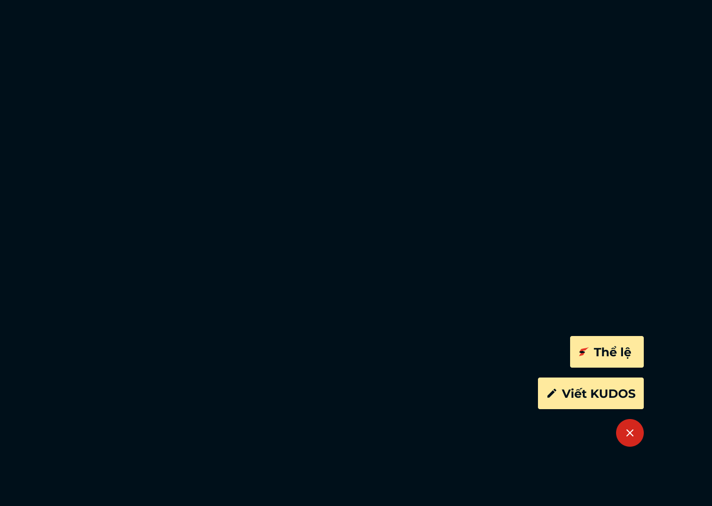

# Feature Specification: Floating Action Button (Expanded State)

**Frame ID**: `313:9139`
**Frame Name**: `Floating Action Button - phim nổi chức năng 2`
**File Key**: `9ypp4enmFmdK3YAFJLIu6C`
**Screen ID**: `Sv7DFwBw1h`
**Created**: 2026-04-20
**Status**: Draft
**Visual Reference**: 

---

## Overview

The Floating Action Button (FAB) expanded state is the action menu revealed after clicking the collapsed FAB (_hphd32jN2). It displays three vertically stacked buttons at the bottom-right corner:

1. **"Thể lệ"** — Opens the SAA rules/regulations page
2. **"Viết KUDOS"** — Opens the Write Kudo form/modal
3. **Close (X)** — Red circular button to collapse back to the initial FAB state

This screen represents the intermediate navigation state between the persistent FAB and the target actions.

---

## User Scenarios & Testing *(mandatory)*

### User Story 1 - Navigate to Write Kudos (Priority: P1)

As an authenticated user, I want to click "Viết KUDOS" from the FAB menu so that I can quickly start writing a kudo for a colleague without navigating to the Kudos Live board first.

**Why this priority**: Writing Kudos is the primary user action in the SAA 2025 platform. Providing quick access from any page maximizes engagement.

**Independent Test**: Open the expanded FAB. Click "Viết KUDOS". Verify the Viết Kudo modal (ihQ26W78P2) opens.

**Acceptance Scenarios**:

1. **Given** the FAB is in expanded state, **When** the user clicks the "Viết KUDOS" button, **Then** the Write Kudo modal opens (Figma linked frame: `520:11602`, route: Write Kudo / ihQ26W78P2).
2. **Given** the FAB is expanded and user clicks "Viết KUDOS", **When** the modal opens, **Then** the FAB closes/hides behind the modal overlay.
3. **Given** the user hovers over "Viết KUDOS", **When** hovering, **Then** the button shows a subtle shadow/brightness increase effect.

---

### User Story 2 - Navigate to Thể Lệ (Priority: P2)

As an authenticated user, I want to click "Thể lệ" from the FAB menu so that I can quickly access the SAA rules and regulations from any page.

**Why this priority**: Viewing rules is a secondary but important informational action. Users need easy access to understand SAA award criteria and Kudos mechanics.

**Independent Test**: Open the expanded FAB. Click "Thể lệ". Verify navigation to the Thể lệ UPDATE page (3204:6051).

**Acceptance Scenarios**:

1. **Given** the FAB is in expanded state, **When** the user clicks the "Thể lệ" button, **Then** the system navigates to the Thể lệ page (linked frame: 3204:6051).
2. **Given** the user is on any authenticated page with FAB expanded, **When** they click "Thể lệ", **Then** the FAB collapses and the rules page loads.

---

### User Story 3 - Close/Collapse the FAB Menu (Priority: P1)

As an authenticated user, I want to close the expanded FAB menu so that it returns to the compact collapsed state and does not obstruct the page content.

**Why this priority**: Users must be able to dismiss the menu easily. The close button is essential for usability.

**Independent Test**: With the FAB expanded, click the red close button. Verify the FAB returns to the collapsed pill state.

**Acceptance Scenarios**:

1. **Given** the FAB is in expanded state, **When** the user clicks the red close (X) button, **Then** the FAB collapses back to the pill-shaped state (_hphd32jN2).
2. **Given** the FAB is expanded, **When** the user clicks anywhere outside the FAB menu area, **Then** the FAB collapses back to the pill-shaped state.
3. **Given** the FAB is expanded, **When** the user presses the Escape key, **Then** the FAB collapses back to the pill-shaped state.

---

### Edge Cases

- What happens if the user rapidly clicks expand/collapse? The animation should complete or be cancellable without visual glitches.
- What happens when the page has a modal open and the FAB was already expanded? The FAB should collapse when a modal opens.
- How does the expanded FAB behave on narrow mobile screens? The buttons should remain fully visible and not overflow the viewport.
- What happens when the user navigates to another route while the FAB is expanded? The FAB should collapse back to pill state on route change.
- What if keyboard focus leaves the FAB area (e.g., Tab past the last button)? The FAB should collapse on focus-out.

---

## UI/UX Requirements *(from Figma)*

### Screen Components

| Component | Description | Interactions |
|-----------|-------------|--------------|
| A_Button thể lệ | Rectangular button with rules icon + "Thể lệ" label on golden background | Click → Navigate to Thể lệ page (3204:6051) |
| B_Button viết kudos | Rectangular button with pen icon + "Viết KUDOS" label on golden background | Click → Open Viết Kudo modal (520:11602) |
| C_Button huỷ | Red circular close button with white X icon | Click → Collapse FAB to initial state |

### Navigation Flow

- From: Collapsed FAB state (_hphd32jN2) — user clicked to expand
- To (Option A): Thể lệ UPDATE page (3204:6051) — via "Thể lệ" button
- To (Option B): Viết Kudo modal (520:11602) — via "Viết KUDOS" button
- To (Option C): Collapsed FAB state (_hphd32jN2) — via close button or outside click
- Triggers: Click on individual action buttons

### Visual Requirements

- Position: Fixed, bottom-right corner of viewport (same position as collapsed state)
- Layout: Three buttons stacked vertically with 20px gap, aligned to the right edge
- Responsive: Must fit within mobile viewport width
- Animations/Transitions: Slide-in/fade-in animation for buttons appearing from collapsed state
- Accessibility: Each button must be individually focusable, ARIA labels for each action, keyboard Tab navigation between buttons

> **See [design-style.md](./design-style.md) for complete visual specifications.**

---

## Requirements *(mandatory)*

### Functional Requirements

- **FR-001**: System MUST display three action buttons ("Thể lệ", "Viết KUDOS", "Close") in a vertical stack when FAB is expanded.
- **FR-002**: "Viết KUDOS" button MUST navigate to the Write Kudo form/modal (linked frame 520:11602).
- **FR-003**: "Thể lệ" button MUST navigate to the Thể lệ page (linked frame 3204:6051).
- **FR-004**: Close (X) button MUST collapse the FAB back to its initial pill state.
- **FR-005**: Clicking outside the expanded FAB area MUST collapse it (dismiss on outside click).
- **FR-006**: Pressing Escape key MUST collapse the expanded FAB.
- **FR-007**: System MUST apply hover effects on each button (subtle shadow/brightness increase).
- **FR-008**: Buttons MUST be right-aligned within the FAB container, matching Figma alignment (align-items: flex-end).
- **FR-009**: System MUST collapse the FAB back to pill state when the user navigates to a different route.
- **FR-010**: System MUST collapse the FAB when keyboard focus leaves the expanded menu area (focus-out).

### Technical Requirements

- **TR-001**: Expand/collapse animation MUST complete within 300ms.
- **TR-002**: FAB state (collapsed/expanded) MUST be managed in local component state (no global state needed).
- **TR-003**: FAB MUST trap focus within the expanded menu when open (keyboard accessibility).
- **TR-004**: FAB MUST use the same position: fixed base as the collapsed state.

### Key Entities *(if feature involves data)*

- No data entities — this is a pure UI navigation component.

---

## API Dependencies

| Endpoint | Method | Purpose | Status |
|----------|--------|---------|--------|
| None | - | FAB expanded state is a pure client-side UI component | - |

---

## Success Criteria *(mandatory)*

### Measurable Outcomes

- **SC-001**: "Viết KUDOS" button successfully opens the Write Kudo modal 100% of the time.
- **SC-002**: "Thể lệ" button successfully navigates to the rules page 100% of the time.
- **SC-003**: Close button returns to collapsed state within 300ms animation duration.
- **SC-004**: All three buttons are keyboard-accessible and meet WCAG AA standards.

---

## Out of Scope

- Collapsed FAB appearance/behavior (covered in _hphd32jN2 spec)
- Viết Kudo modal content and form logic (covered in ihQ26W78P2 spec)
- Thể lệ page content (covered in separate Thể lệ spec)
- Backend API for kudos submission

---

## Dependencies

- [x] Constitution document exists (`.momorph/constitution.md`)
- [ ] API specifications available (`.momorph/API.yml`)
- [ ] Database design completed (`.momorph/database.sql`)
- [x] Screen flow documented (`.momorph/SCREENFLOW.md`)
- [x] Collapsed FAB spec (`.momorph/specs/_hphd32jN2-floating-action-button/`)

---

## Notes

- The expanded FAB is a **variant** of the same component set `214:3916`, using variant `214:3909` for the expanded state.
- The "Viết KUDOS" button is the widest at 214px, while "Thể lệ" is 149px — both right-aligned. The close button is 56px centered at the bottom-right.
- The container uses `align-items: flex-end` to right-align all buttons.
- Related collapsed state: [_hphd32jN2 spec](../_hphd32jN2-floating-action-button/spec.md)
- Related Viết Kudo modal: [ihQ26W78P2 spec](../ihQ26W78P2-viet-kudo/spec.md) (if exists)
