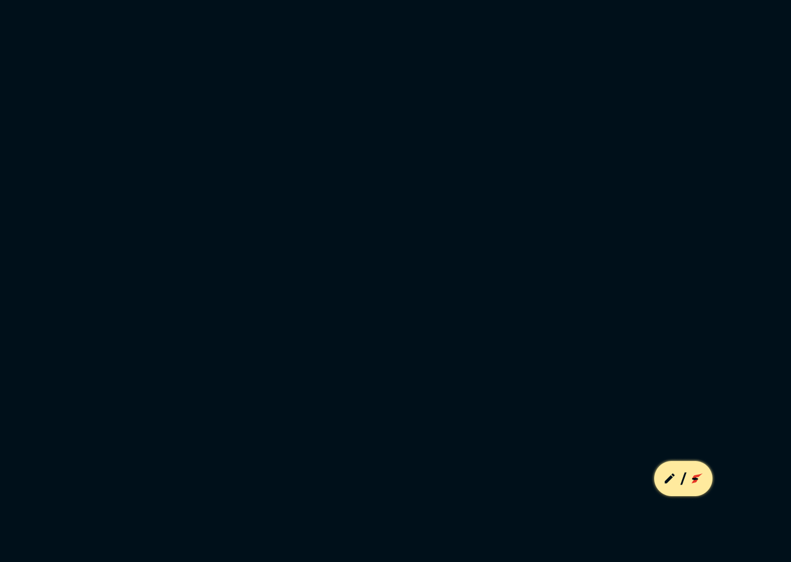

# Feature Specification: Floating Action Button (Collapsed State)

**Frame ID**: `313:9137`
**Frame Name**: `Floating Action Button - phim nổi chức năng`
**File Key**: `9ypp4enmFmdK3YAFJLIu6C`
**Screen ID**: `_hphd32jN2`
**Created**: 2026-04-20
**Status**: Draft
**Visual Reference**: 

---

## Overview

The Floating Action Button (FAB) is a persistent widget displayed on all authenticated pages. In its **collapsed state**, it appears as a compact pill-shaped button at the bottom-right corner of the screen. It contains two icons — a pen icon (Write Kudos) and a rules/logo icon (Thể lệ SAA) — separated by a "/" divider on a golden yellow background. Clicking the FAB expands it to reveal the full action menu (Screen 2: Sv7DFwBw1h).

This component serves as a quick-access shortcut for the two most common user actions: writing kudos and viewing SAA rules.

---

## User Scenarios & Testing *(mandatory)*

### User Story 1 - Open Quick Action Menu (Priority: P1)

As an authenticated user, I want to tap the floating action button so that I can quickly access kudos writing or SAA rules without navigating through the main menu.

**Why this priority**: The FAB is the primary quick-access entry point for the two most important user actions (writing kudos and viewing rules). It must be visible and functional on every page.

**Independent Test**: Display a page with the FAB visible. Click the FAB and verify it transitions to the expanded state (Screen Sv7DFwBw1h).

**Acceptance Scenarios**:

1. **Given** the user is on any authenticated page, **When** the page loads, **Then** the FAB is visible at the bottom-right corner of the viewport with the pen icon, "/" divider, and rules icon on a golden background.
2. **Given** the FAB is displayed in collapsed state, **When** the user clicks the FAB, **Then** the FAB transitions to the expanded state showing "Thể lệ", "Viết KUDOS", and close buttons.
3. **Given** the FAB is displayed, **When** the user hovers over the FAB, **Then** a subtle shadow/glow effect appears to indicate interactivity.

---

### User Story 2 - FAB Visibility Across Pages (Priority: P1)

As an authenticated user, I want the FAB to be consistently visible on all main pages so that I always have quick access to key actions regardless of where I am.

**Why this priority**: The FAB must persist across all authenticated routes — it is a global overlay component, not page-specific.

**Independent Test**: Navigate between Homepage, Awards Info, Kudos Live Board, and Profile pages. Verify the FAB is visible on each page in the same position.

**Acceptance Scenarios**:

1. **Given** the user navigates to the Homepage, **When** the page finishes loading, **Then** the FAB is visible at the bottom-right corner.
2. **Given** the user navigates from Homepage to Awards Information, **When** the transition completes, **Then** the FAB remains visible in the same position.
3. **Given** the user scrolls the page content, **When** the viewport scrolls, **Then** the FAB stays fixed in the bottom-right corner (position: fixed).

---

### Edge Cases

- What happens when the user is on a mobile viewport? The FAB should remain visible and meet the 44x44px minimum touch target size.
- How does the FAB behave when a modal is open (e.g., Write Kudo modal)? The FAB should be hidden or behind the modal overlay.
- What happens on the login/countdown pages? The FAB should NOT appear on unauthenticated pages.
- What happens when the user navigates to another page while the FAB is expanded? The FAB should collapse back to the pill state on route change.
- How does the FAB interact with notification panel or dropdown overlays? The FAB should remain visible but below the overlay z-index (z-index: 50 for FAB vs z-index: 60+ for overlays).

---

## UI/UX Requirements *(from Figma)*

### Screen Components

| Component | Description | Interactions |
|-----------|-------------|--------------|
| A_Widget Button | Pill-shaped floating button containing two icons and a divider | Click → expand to action menu (Sv7DFwBw1h) |
| A.1_icon viết kudos | Pen icon (24x24px) representing "Write Kudos" | Part of FAB composite button |
| "/" Divider | Text divider between icons (Montserrat Bold 24px, dark color) | Static display |
| A.2_icon thể lệ saa | Rules/logo icon (24x24px) representing "Thể lệ SAA" | Part of FAB composite button |

### Navigation Flow

- From: Any authenticated page (Homepage, Awards Info, Kudos Board, Profile, etc.)
- To: Floating Action Button expanded state (Sv7DFwBw1h)
- Triggers: Click on the FAB widget

### Visual Requirements

- Position: Fixed, bottom-right corner of viewport (right: 19px from edge, bottom: 120px from bottom based on Figma)
- Responsive: Must be visible on mobile, tablet, and desktop
- Animations/Transitions: Expand animation when transitioning to expanded state
- Accessibility: ARIA role="button", aria-label="Quick actions", keyboard accessible (Tab + Enter)
- Shadow: Golden glow effect (0 4px 4px rgba(0,0,0,0.25), 0 0 6px #FAE287)

> **See [design-style.md](./design-style.md) for complete visual specifications.**

---

## Requirements *(mandatory)*

### Functional Requirements

- **FR-001**: System MUST display the FAB on all authenticated pages as a fixed-position overlay.
- **FR-002**: System MUST hide the FAB on unauthenticated pages (Login, Countdown).
- **FR-003**: Users MUST be able to click the FAB to expand it to the action menu state.
- **FR-004**: System MUST apply hover effects (increased shadow/glow) when the cursor hovers over the FAB.
- **FR-005**: System MUST maintain the FAB position during page scroll (position: fixed).
- **FR-006**: System MUST hide or deprioritize the FAB (lower z-index) when a modal overlay is open.
- **FR-007**: FAB MUST be keyboard accessible — focusable via Tab and activatable via Enter/Space keys.
- **FR-008**: System MUST collapse the FAB back to pill state when the user navigates to a different route.

### Technical Requirements

- **TR-001**: FAB render time MUST be under 100ms as it is a persistent UI element.
- **TR-002**: FAB MUST use position: fixed to stay visible during scroll.
- **TR-003**: FAB MUST be implemented as a shared layout component in the `(main)` route group.
- **TR-004**: FAB state (collapsed/expanded) SHOULD be managed with local component state.

### Key Entities *(if feature involves data)*

- No data entities — this is a pure UI component with navigation behavior.

---

## API Dependencies

| Endpoint | Method | Purpose | Status |
|----------|--------|---------|--------|
| None | - | FAB is a pure client-side UI component | - |

---

## Success Criteria *(mandatory)*

### Measurable Outcomes

- **SC-001**: FAB is visible on 100% of authenticated page loads.
- **SC-002**: Click-to-expand interaction completes within 300ms (animation included).
- **SC-003**: FAB meets WCAG AA accessibility standards (keyboard navigable, proper ARIA labels).

---

## Out of Scope

- Expanded state behavior (covered in Sv7DFwBw1h spec)
- "Viết KUDOS" form functionality (covered in ihQ26W78P2 spec)
- "Thể lệ" page content (covered in b1Filzi9i6 spec)
- Admin-specific FAB variations

---

## Dependencies

- [x] Constitution document exists (`.momorph/constitution.md`)
- [ ] API specifications available (`.momorph/API.yml`)
- [ ] Database design completed (`.momorph/database.sql`)
- [x] Screen flow documented (`.momorph/SCREENFLOW.md`)

---

## Notes

- The FAB is a **composite component** from Figma component set `214:3916`, using variant `214:3908` for the collapsed state.
- Both icons inside the FAB (pen + rules) act as a single click target in collapsed state — individual icon click actions are only available in the expanded state.
- The golden glow shadow (box-shadow with #FAE287) is a distinctive brand element and should be preserved across all viewports.
- Related expanded state: [Sv7DFwBw1h spec](../Sv7DFwBw1h-floating-action-button-2/spec.md)
