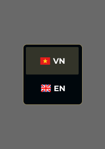

# Feature Specification: Language Dropdown & i18n Integration

**Frame ID**: `721:4942`
**Frame Name**: `Dropdown-ngôn ngữ`
**File Key**: `9ypp4enmFmdK3YAFJLIu6C`
**Screen ID**: `hUyaaugye2`
**Created**: 2026-04-17
**Updated**: 2026-04-17
**Status**: Draft

---

## Overview

A language selector dropdown component that allows users to switch the application's display language between Vietnamese (VN) and English (EN). The dropdown displays the currently selected language with its corresponding country flag icon and language code, and reveals a list of available language options when opened.

**Critical Requirement**: This feature MUST integrate with all existing pages (Login page and Homepage) so that switching language immediately translates all visible text content across the entire application. This requires building an i18n infrastructure (LanguageProvider + translation files) and retrofitting all existing components with translation keys.

**Visual Reference**: 

---

## User Scenarios & Testing *(mandatory)*

### User Story 1 - Switch Language via Dropdown (Priority: P1)

As a user, I want to switch the application language between Vietnamese and English so that I can use the application in my preferred language.

**Why this priority**: Language selection is the core and only functionality of this component. Without it, non-Vietnamese speakers cannot use the application effectively.

**Independent Test**: Render the dropdown, click to open, select "EN", verify the UI language changes and the dropdown displays the EN flag + "EN" label.

**Acceptance Scenarios**:

1. **Given** the dropdown is closed and showing the current language (e.g., VN), **When** the user clicks the dropdown trigger, **Then** the dropdown opens showing all available language options (VN and EN) with their respective flag icons.
2. **Given** the dropdown is open, **When** the user clicks on a different language option (e.g., EN), **Then** the selected language is applied, the dropdown closes, and the trigger displays the newly selected language's flag and code.
3. **Given** the dropdown is open, **When** the user clicks on the already-selected language, **Then** the dropdown closes without any language change.
4. **Given** the dropdown is open, **When** the user clicks outside the dropdown, **Then** the dropdown closes without changing the language.

---

### User Story 2 - Visual Feedback for Selected Language (Priority: P1)

As a user, I want to clearly see which language is currently selected so that I know which language the application is using.

**Why this priority**: Without clear visual distinction between selected and unselected states, users cannot quickly identify the active language, leading to confusion.

**Independent Test**: Open the dropdown and verify the selected language item has a distinct highlighted background (golden tint) while unselected items have the default dark background.

**Acceptance Scenarios**:

1. **Given** the dropdown is open, **When** I look at the language options, **Then** the currently selected language has a highlighted background (`rgba(255, 234, 158, 0.2)`) to distinguish it from other options.
2. **Given** the language is VN, **When** I open the dropdown, **Then** the VN option shows the selected state (golden highlight) and the EN option shows the default state (dark background).

---

### User Story 3 - Login Page Language Switching (Priority: P1)

As a user on the Login page, I want all text content to update immediately when I switch language so that I can understand the login process in my preferred language.

**Why this priority**: The Login page is the entry point to the application. Users who don't read Vietnamese cannot proceed without language support on this page.

**Independent Test**: On the Login page, switch from VN to EN, verify all translatable text updates without page reload.

**Acceptance Scenarios**:

1. **Given** the user is on the Login page with language set to VN, **When** they switch to EN, **Then** the following text updates immediately:
   - Hero text: "Bắt đầu hành trình của bạn cùng SAA 2025." → English equivalent
   - Hero text: "Đăng nhập để khám phá!" → English equivalent
   - Login button: "LOGIN With Google" (already English, remains the same)
   - Loading state: "Đang đăng nhập..." → "Logging in..."
   - Footer: "Bản quyền thuộc về Sun* © 2025" → "Copyright Sun* © 2025"
   - Error messages update to English equivalents
2. **Given** the Login page is in EN, **When** the user switches back to VN, **Then** all text reverts to Vietnamese.

**Translatable Strings — Login Page**:

| Component | Key | Vietnamese (VN) | English (EN) |
|-----------|-----|-----------------|--------------|
| `LoginHero` | `login.hero.line1` | Bắt đầu hành trình của bạn cùng SAA 2025. | Start your journey with SAA 2025. |
| `LoginHero` | `login.hero.line2` | Đăng nhập để khám phá! | Log in to explore! |
| `LoginButton` | `login.button.text` | LOGIN With Google | LOGIN With Google |
| `LoginButton` | `login.button.loading` | Đang đăng nhập... | Logging in... |
| `LoginButton` | `login.error.supabase` | Supabase chưa được cấu hình. Vui lòng kiểm tra file .env.local | Supabase is not configured. Please check .env.local file |
| `LoginButton` | `login.error.generic` | Đã xảy ra lỗi khi đăng nhập. Vui lòng thử lại. | An error occurred while logging in. Please try again. |
| `Footer` | `common.footer.copyright` | Bản quyền thuộc về Sun* © 2025 | Copyright Sun* © 2025 |

---

### User Story 4 - Homepage Language Switching (Priority: P1)

As a user on the Homepage, I want all text content to update immediately when I switch language so that I can understand the awards information and event details in my preferred language.

**Why this priority**: The Homepage contains critical event information (countdown, venue, awards, Kudos). Non-Vietnamese users must be able to read this content.

**Independent Test**: On the Homepage, switch from VN to EN, verify all translatable text updates across Hero, Awards, Kudos, and Footer sections.

**Acceptance Scenarios**:

1. **Given** the user is on the Homepage with language set to VN, **When** they switch to EN, **Then** all section text updates to English equivalents (see translation table below).
2. **Given** the Homepage is in EN, **When** the user navigates to another page and back, **Then** the EN language persists.

**Translatable Strings — Homepage Header & Navigation**:

| Component | Key | Vietnamese (VN) | English (EN) |
|-----------|-----|-----------------|--------------|
| `NavLinks` | `nav.about` | About SAA 2025 | About SAA 2025 |
| `NavLinks` | `nav.awards` | Award Information | Award Information |
| `NavLinks` | `nav.kudos` | Sun* Kudos | Sun* Kudos |
| `LanguageSelector` | `common.languageSelector.ariaLabel` | Chọn ngôn ngữ | Select language |
| `LanguageSelector` | `common.languageSelector.listAriaLabel` | Ngôn ngữ khả dụng | Available languages |
| `ProfileDropdown` | `profile.ariaLabel` | Menu người dùng | User menu |
| `ProfileDropdown` | `profile.profile` | Hồ sơ | Profile |
| `ProfileDropdown` | `profile.signOut` | Đăng xuất | Sign out |
| `ProfileDropdown` | `profile.adminDashboard` | Bảng điều khiển quản trị | Admin Dashboard |
| `NotificationBell` | `notification.ariaLabel` | Thông báo | Notifications |
| `NotificationBell` | `notification.unread` | ({count} chưa đọc) | ({count} unread) |
| `NotificationBell` | `notification.empty` | Không có thông báo | No notifications |

**Translatable Strings — Countdown Timer**:

> **Note**: The Figma design uses English labels ("Coming soon", "Days", "Hours", "Minutes") even in the Vietnamese context. **Clarify with design team** whether these should remain English in VN mode (branding choice) or be translated to Vietnamese. The table below assumes translation is desired.

| Component | Key | Vietnamese (VN) | English (EN) |
|-----------|-----|-----------------|--------------|
| `CountdownTimer` | `countdown.comingSoon` | Sắp diễn ra | Coming soon |
| `CountdownTimer` | `countdown.days` | Ngày | Days |
| `CountdownTimer` | `countdown.hours` | Giờ | Hours |
| `CountdownTimer` | `countdown.minutes` | Phút | Minutes |
| `CountdownTimer` | `countdown.ariaLabel` | {days} ngày, {hours} giờ, {minutes} phút cho đến sự kiện | {days} days, {hours} hours, {minutes} minutes until event |

**Translatable Strings — Event Info**:

| Component | Key | Vietnamese (VN) | English (EN) |
|-----------|-----|-----------------|--------------|
| `EventInfo` | `event.time` | Thời gian: | Time: |
| `EventInfo` | `event.venue` | Địa điểm: | Venue: |

**Translatable Strings — CTA Buttons**:

> **Note**: The Figma design uses English CTA labels ("ABOUT AWARDS", "ABOUT KUDOS") even in the Vietnamese context. **Clarify with design team** whether these should remain English (branding) or be translated. The table below assumes they remain English in both locales.

| Component | Key | Vietnamese (VN) | English (EN) |
|-----------|-----|-----------------|--------------|
| `CTAButtons` | `cta.aboutAwards` | ABOUT AWARDS | ABOUT AWARDS |
| `CTAButtons` | `cta.aboutKudos` | ABOUT KUDOS | ABOUT KUDOS |

**Translatable Strings — About Content**:

> **ACTION REQUIRED**: The About Content section contains 5 long Vietnamese paragraphs describing the "Root Further" theme. English translations are **NOT available from the Figma design** and MUST be provided by the content/marketing team before implementation. Use `[EN_PENDING]` placeholder markers during development until official translations are supplied.

| Component | Key | Vietnamese (VN) | English (EN) |
|-----------|-----|-----------------|--------------|
| `AboutContent` | `about.paragraph1` | Đứng trước bối cảnh thay đổi như vũ bão của thời đại AI và yêu cầu ngày càng cao từ khách hàng, Sun* lựa chọn chiến lược đa dạng hóa năng lực... | [EN_PENDING — content team to provide] |
| `AboutContent` | `about.paragraph2` | Lấy cảm hứng từ sự đa dạng năng lực, khả năng phát triển linh hoạt cùng tinh thần đào sâu để bứt phá trong kỷ nguyên AI... | [EN_PENDING — content team to provide] |
| `AboutContent` | `about.paragraph3` | Vượt xa khỏi nét nghĩa bề mặt, "Root Further" chính là hành trình chúng ta không ngừng vươn xa hơn... | [EN_PENDING — content team to provide] |
| `AboutContent` | `about.paragraph4` | Trước giông bão, chỉ những tán cây có bộ rễ đủ mạnh mới có thể trụ vững... | [EN_PENDING — content team to provide] |
| `AboutContent` | `about.paragraph5` | Không ai biết trước ẩn sâu trong "lòng đất" của ngành công nghệ và thị trường hiện đại... | [EN_PENDING — content team to provide] |
| `AboutContent` | `about.quote` | "A tree with deep roots fears no storm" | "A tree with deep roots fears no storm" |
| `AboutContent` | `about.quoteSubtitle` | (Cây sâu bền rễ, bão giông chẳng nề - Ngạn ngữ Anh) | (A tree with deep roots fears no storm - English proverb) |

**Translatable Strings — Awards Section**:

| Component | Key | Vietnamese (VN) | English (EN) |
|-----------|-----|-----------------|--------------|
| `AwardsSection` | `awards.caption` | Sun* annual awards 2025 | Sun* annual awards 2025 |
| `AwardsSection` | `awards.title` | Hệ thống giải thưởng | Award System |
| `AwardsSection` | `awards.description` | Các hạng mục sẽ được trao giải theo TOP những người xuất sắc nhất. | Categories will be awarded to the TOP most outstanding individuals. |
| `AwardsSection` | `awards.emptyState` | Các hạng mục giải thưởng sẽ sớm được công bố. | Award categories will be announced soon. |
| `AwardCard` | `awards.detail` | Chi tiết | Details |

**Translatable Strings — Award Category Data**:

| Award | Key | Vietnamese (VN) | English (EN) |
|-------|-----|-----------------|--------------|
| Top Talent | `awards.topTalent.description` | Vinh danh top cá nhân xuất sắc trên mọi phương diện | Honoring top outstanding individuals in all aspects |
| Top Project | `awards.topProject.description` | Vinh danh dự án xuất sắc trên mọi phương diện, dự án có doanh thu nổi | Honoring outstanding projects in all aspects with notable revenue |
| Top Project Leader | `awards.topProjectLeader.description` | Vinh danh người quản lý truyền cảm hứng và dẫn dắt dự án bứt phá | Honoring inspiring managers who lead breakthrough projects |
| Best Manager | `awards.bestManager.description` | Vinh danh người quản lý có năng lực quản lý tốt, dẫn dắt đội nhóm | Honoring managers with strong management skills, leading teams |
| Signature 2025 | `awards.signature2025.description` | Vinh danh người có năng lực quản lý tốt, dẫn dắt đội nhóm | Honoring individuals with strong management skills, leading teams |
| MVP | `awards.mvp.description` | Vinh danh người có năng lực quản lý tốt, dẫn dắt đội nhóm | Honoring individuals with strong management skills, leading teams |

**Translatable Strings — Sun* Kudos Section**:

| Component | Key | Vietnamese (VN) | English (EN) |
|-----------|-----|-----------------|--------------|
| `KudosSection` | `kudos.badge` | ĐIỂM MỚI CỦA SAA 2025 | NEW IN SAA 2025 |
| `KudosSection` | `kudos.subtitle` | Phong trào ghi nhận | Recognition Movement |
| `KudosSection` | `kudos.title` | Sun* Kudos | Sun* Kudos |
| `KudosSection` | `kudos.description` | Hoạt động ghi nhận và cảm ơn đồng nghiệp - lần đầu tiên được diễn ra dành cho tất cả Sunner. Hoạt động sẽ được triển khai vào tháng 11/2025, khuyến khích người Sun* chia sẻ những lời ghi nhận, cảm ơn đồng nghiệp trên hệ thống do BTC công bố. Đây sẽ là chất liệu để Hội đồng Heads tham khảo trong quá trình lựa chọn người đạt giải. | [EN_PENDING — content team to provide full English translation of Kudos description] |
| `KudosSection` | `kudos.detailButton` | Chi tiết | Details |

**Translatable Strings — Main Footer**:

| Component | Key | Vietnamese (VN) | English (EN) |
|-----------|-----|-----------------|--------------|
| `MainFooter` | `footer.about` | About SAA 2025 | About SAA 2025 |
| `MainFooter` | `footer.awards` | Award Information | Award Information |
| `MainFooter` | `footer.kudos` | Sun* Kudos | Sun* Kudos |
| `MainFooter` | `footer.standards` | Tiêu chuẩn chung | Community Standards |
| `MainFooter` | `common.footer.copyright` | Bản quyền thuộc về Sun* © 2025 | Copyright Sun* © 2025 |

---

### User Story 5 - Hover State for Language Options (Priority: P2)

As a user, I want to see visual feedback when hovering over language options so that I know which option I'm about to select.

**Why this priority**: Hover states improve usability by providing clear interactive feedback, but the component is still functional without them.

**Independent Test**: Hover over each language option and verify the background changes to indicate interactivity.

**Acceptance Scenarios**:

1. **Given** the dropdown is open, **When** the user hovers over a non-selected language option, **Then** the option displays a hover highlight effect.
2. **Given** the dropdown is open, **When** the user moves the mouse away from an option, **Then** the hover effect is removed.

---

### User Story 6 - Persist Language Selection (Priority: P2)

As a user, I want my language preference to be remembered so that I don't have to reselect it every time I visit the application.

**Why this priority**: Persistence improves user experience significantly but is not strictly required for the component to function within a session.

**Independent Test**: Select EN, refresh the page, verify the dropdown still shows EN as the selected language.

**Acceptance Scenarios**:

1. **Given** the user selects "EN" as their language, **When** they navigate to another page or refresh, **Then** the application remembers the EN selection and continues to display in English.
2. **Given** the user has not previously selected a language, **When** they first visit the application, **Then** the default language (VN) is selected.
3. **Given** the user selects EN on the Login page, **When** they log in and reach the Homepage, **Then** the Homepage displays in EN.

---

### User Story 7 - HTML lang Attribute Updates (Priority: P2)

As a user with a screen reader, I want the page's `lang` attribute to update when I switch language so that assistive technologies can correctly pronounce content.

**Why this priority**: Accessibility requirement per WCAG. Important for inclusivity but not blocking for core functionality.

**Independent Test**: Switch language to EN, inspect `<html>` element, verify `lang="en"`.

**Acceptance Scenarios**:

1. **Given** the language is VN, **When** the user switches to EN, **Then** the `<html>` element's `lang` attribute updates from `"vi"` to `"en"`.
2. **Given** the language is EN, **When** the user switches to VN, **Then** the `<html>` element's `lang` attribute updates from `"en"` to `"vi"`.

---

### Edge Cases

- What happens when the user rapidly clicks the dropdown trigger? The dropdown should toggle open/close without glitching.
- What happens if the language data fails to load? The dropdown should gracefully show the last known language or default to VN.
- What happens on keyboard navigation? The dropdown should be accessible via keyboard (Tab to focus, Enter/Space to open, Arrow keys to navigate, Enter to select, Escape to close).
- What happens if a translation key is missing? Fall back to the Vietnamese (VN) string rather than showing a raw key.
- What happens if the cookie/localStorage is cleared? Default to VN.

---

## UI/UX Requirements *(from Figma)*

### Screen Components

| Component | Node ID | Description | Interactions |
|-----------|---------|-------------|--------------|
| Dropdown Container | `525:11713` | Outer container with gold border, dark background, holds all language options | Click to toggle open/close |
| VN Language Item | `I525:11713;362:6085` | Vietnamese language option with VN flag + "VN" label | Click to select, hover for highlight |
| EN Language Item | `I525:11713;362:6128` | English language option with GB flag + "EN" label | Click to select, hover for highlight |
| Flag Icon (VN) | `I525:11713;362:6085;186:1821;186:1709` | Vietnam flag icon (24x24px) | Display only |
| Flag Icon (EN) | `I525:11713;362:6128;186:1903;186:1709` | UK/GB flag icon (24x24px) | Display only |
| Language Code Text | - | Bold text showing "VN" or "EN" | Display only |

### Navigation Flow

- From: Any screen in the application (dropdown is part of the global header)
- To: Same screen with updated language
- Triggers: Click on dropdown trigger, then click on language option

### Visual Requirements

- Responsive breakpoints: Component maintains fixed dimensions across breakpoints (compact dropdown)
- Animations/Transitions: Dropdown open/close should have a smooth fade + slide transition (~150ms ease-out)
- Accessibility: WCAG AA compliance - keyboard navigable, screen reader announces selected language and available options, sufficient color contrast

> **See `design-style.md` for complete visual specifications.**

---

## Requirements *(mandatory)*

### Functional Requirements

- **FR-001**: System MUST display a language dropdown in the application header (both Login header and Main header) showing the currently selected language (flag + code).
- **FR-002**: System MUST support exactly two languages: Vietnamese (VN) and English (EN).
- **FR-003**: Users MUST be able to open the dropdown by clicking the trigger area.
- **FR-004**: Users MUST be able to select a language by clicking on a language option in the dropdown.
- **FR-005**: System MUST visually distinguish the currently selected language from other options using a highlighted background.
- **FR-006**: System MUST close the dropdown after a language is selected.
- **FR-007**: System MUST close the dropdown when clicking outside of it.
- **FR-008**: System MUST update ALL translatable text across the current page immediately upon language selection — no page reload.
- **FR-009**: System MUST persist the selected language preference across page navigations and browser sessions (via cookie).
- **FR-010**: System MUST apply language switching to the **Login page** — translating hero text, button labels, error messages, and footer.
- **FR-011**: System MUST apply language switching to the **Homepage** — translating header navigation, countdown labels, event info labels, CTA buttons, about content, awards section, Kudos section, and footer.
- **FR-012**: System MUST update the `<html lang>` attribute when language changes (`"vi"` or `"en"`).
- **FR-013**: System MUST fall back to Vietnamese (VN) when a translation key is missing.

### Technical Requirements

- **TR-001**: Language switching MUST NOT cause a full page reload — use a React Context (`LanguageProvider`) wrapping the application.
- **TR-002**: Translations MUST be stored in static JSON or TS files under a `lib/i18n/` or `locales/` directory, organized by locale (`vi.ts`, `en.ts`).
- **TR-003**: A custom `useLanguage()` hook MUST provide `locale`, `t()` function, and `setLocale()` to all client components.
- **TR-004**: Dropdown MUST be keyboard accessible (Tab, Enter, Space, Arrow keys, Escape).
- **TR-005**: Dropdown MUST use `"use client"` directive as it requires browser event handlers and state.
- **TR-006**: Flag icons MUST be rendered as Icon Components per constitution, not as `` or inline SVG.
- **TR-007**: Component MUST follow the project's Tailwind CSS styling approach with design tokens.
- **TR-008**: The `LanguageProvider` MUST be placed in the root `app/layout.tsx` so both `(auth)` and `(main)` route groups share the same language state.
- **TR-009**: Server Components that render translatable text MUST be converted to Client Components or accept translated strings as props from a Client Component parent.

### Key Entities *(if feature involves data)*

- **Language**: Represents a supported language with properties: `code` (string: `"vi"` | `"en"`), `label` (string: `"VN"` | `"EN"`), `flagComponent` (React component).
- **Translations**: A nested object keyed by translation key, with values being the localized string. One file per locale.
- **LanguageContext**: React Context providing `{ locale, t, setLocale }` to the component tree.

---

## i18n Architecture

### File Structure

```
lib/
└── i18n/
    ├── index.ts              # LanguageProvider, useLanguage hook, t() function
    ├── locales/
    │   ├── vi.ts             # Vietnamese translations (default)
    │   └── en.ts             # English translations
    └── types.ts              # TranslationKeys type (auto-generated or manual)
```

### Components Requiring Modification

The following existing components contain hardcoded Vietnamese or translatable text and MUST be updated to use the `t()` function:

| Component | File | Changes Needed |
|-----------|------|----------------|
| `LoginHero` | `components/login/login-hero.tsx` | Replace hardcoded hero text with `t()` calls. Needs `"use client"` or accept translated props. |
| `LoginButton` | `components/login/login-button.tsx` | Replace loading text, error messages with `t()` calls. Already `"use client"`. |
| `Footer` | `components/ui/footer.tsx` | Replace copyright text with `t()`. Needs `"use client"` or accept translated props. |
| `CountdownTimer` | `components/homepage/countdown-timer.tsx` | Replace "Coming soon", unit labels, aria-label with `t()`. Already `"use client"`. |
| `EventInfo` | `components/homepage/event-info.tsx` | Replace "Thời gian:", "Địa điểm:" with `t()`. Needs `"use client"` or accept translated props. |
| `CTAButtons` | `components/homepage/cta-buttons.tsx` | Replace button labels with `t()`. Needs `"use client"` or accept translated props. |
| `AboutContent` | `components/homepage/about-content.tsx` | Replace paragraph content, quote with `t()`. Needs `"use client"` or accept translated props. |
| `AwardsSection` | `components/homepage/awards-section.tsx` | Replace section header text with `t()`. Needs `"use client"` or accept translated props. |
| `AwardCard` | `components/homepage/award-card.tsx` | Replace "Chi tiết" with `t()`. Award descriptions need localized variants. |
| `KudosSection` | `components/homepage/kudos-section.tsx` | Replace badge, subtitle, description, button text with `t()`. Needs `"use client"` or accept translated props. |
| `NavLinks` | `components/ui/nav-links.tsx` | Replace nav labels with `t()`. Already `"use client"`. |
| `MainFooter` | `components/ui/main-footer.tsx` | Replace link labels, copyright with `t()`. Needs `"use client"` or accept translated props. |
| `ProfileDropdown` | `components/ui/profile-dropdown.tsx` | Replace "Profile", "Sign out", "Admin Dashboard", aria-label with `t()`. Already `"use client"`. |
| `NotificationBell` | `components/ui/notification-bell.tsx` | Replace "No notifications", aria-label with `t()`. Already `"use client"`. |
| `LanguageSelector` | `components/ui/language-selector.tsx` | Replace aria-labels with `t()`. Update visual style to match Figma. Already `"use client"`. |
| `RootLayout` | `app/layout.tsx` | Wrap children with `LanguageProvider`. Update `<html lang>` dynamically. |

### Award Data Localization

Award category data in `lib/data/awards.ts` contains Vietnamese descriptions. Two approaches:

1. **Recommended**: Add `descriptionEn` field to `AwardCategory` type and static data. The `AwardCard` component uses the appropriate field based on locale.
2. **Alternative**: Move descriptions to translation files keyed by award slug.

---

## State Management

### Local Component State (`LanguageSelector`)

| State | Type | Default | Purpose |
|-------|------|---------|---------|
| `isOpen` | `boolean` | `false` | Controls dropdown panel visibility |

### Global State (`LanguageProvider` context)

| State | Type | Default | Purpose |
|-------|------|---------|---------|
| `locale` | `'vi' \| 'en'` | `'vi'` (or from cookie) | Currently active locale for the entire application |

### Derived Values (from context)

| Value | Type | Purpose |
|-------|------|---------|
| `t(key)` | `(key: string) => string` | Returns the translated string for the current locale. Falls back to VN string if key is missing in EN. |
| `setLocale(locale)` | `(locale: Locale) => void` | Updates locale in context, writes to cookie, updates `<html lang>`. |

### Initialization Flow

1. On app mount, `LanguageProvider` reads the `locale` cookie.
2. If cookie exists and value is `'vi'` or `'en'`, use that value.
3. If cookie is absent or invalid, default to `'vi'`.
4. Set `<html lang>` attribute to match the locale.

### Loading/Error States

- **Loading**: Not applicable — translations are bundled in static TS files, available synchronously.
- **Missing translation key**: Return the Vietnamese (VN) fallback string. Do NOT show raw keys like `"awards.title"` to the user.
- **Invalid cookie value**: Ignore and default to `'vi'`.

---

## API Dependencies

| Endpoint | Method | Purpose | Status |
|----------|--------|---------|--------|
| N/A | - | Language switching is client-side only; no API calls needed | - |

> **Note**: If server-side locale detection or preference storage via Supabase is needed in the future, an endpoint like `PATCH /api/user/preferences` could be added.

---

## Success Criteria *(mandatory)*

### Measurable Outcomes

- **SC-001**: Language switch completes in < 200ms with no visible layout shift on all pages.
- **SC-002**: Dropdown opens/closes smoothly with animation in all supported browsers.
- **SC-003**: Selected language persists correctly after page refresh and across Login → Homepage navigation (100% reliability).
- **SC-004**: Component passes WCAG AA accessibility audit (keyboard navigation, screen reader support, color contrast, `lang` attribute).
- **SC-005**: ALL hardcoded Vietnamese text in Login page and Homepage updates to English when EN is selected — zero untranslated strings visible.
- **SC-006**: Switching back to VN restores all original Vietnamese text correctly.

---

## Out of Scope

- Support for more than 2 languages (VN and EN only for now)
- Server-side language detection based on browser `Accept-Language` header
- Right-to-left (RTL) language support
- Dynamic translation content from API or CMS (static files only for now)
- Translation of image-based content (ROOT FURTHER logo, award badge images, KUDOS decorative text)
- Translation of future pages not yet built
- Page metadata translation (`<title>`, `<meta description>`) — these are set in Server Components via Next.js `metadata` export and cannot use client-side React Context. Address separately if needed via `generateMetadata()` reading the cookie.

---

## Dependencies

- [x] Constitution document exists (`.momorph/constitution.md`)
- [x] Screen flow documented (`.momorph/contexts/SCREENFLOW.md`)
- [x] Login page implemented (`app/(auth)/login/page.tsx`)
- [x] Homepage implemented (`app/(main)/page.tsx`)
- [x] Header components exist (`components/ui/header.tsx`, `components/ui/main-header.tsx`)
- [x] LanguageSelector component exists (`components/ui/language-selector.tsx`) — needs visual update to match Figma dropdown style
- [x] Flag icon components exist (`components/icons/flag-vn-icon.tsx`, `components/icons/flag-en-icon.tsx`)

---

## Notes

- The dropdown is a reusable component that sits in the application header on both Login and Homepage.
- The Figma design shows VN as the selected (highlighted) option and EN as the unselected option.
- The existing `LanguageSelector` component (`components/ui/language-selector.tsx`) already has basic dropdown behavior but its visual style does not match the Figma design — it needs to be updated to use the gold border (`#998C5F`), dark background (`#00070C`), and golden selection highlight (`rgba(255, 234, 158, 0.2)`).
- The existing `LanguageSelector` stores locale in a cookie but does NOT actually translate any text — it only changes its own display. The i18n infrastructure (LanguageProvider + translation files) needs to be built.
- Flag icons use Figma component instances referencing a flag icon library — the project already has `FlagVnIcon` and `FlagEnIcon` components.
- The `<html lang="vi">` in `app/layout.tsx` is currently hardcoded and needs to become dynamic.
- Some components are currently Server Components (e.g., `EventInfo`, `AboutContent`, `AwardsSection`). To use the `t()` hook, they either need `"use client"` or must accept pre-translated strings as props. Prefer the "accept props" pattern where possible to maintain Server Component benefits.
- The About Content section has ~5 long Vietnamese paragraphs that need English translations. These translations should be provided by the content/design team. Placeholder English text can be used initially.
- The golden border (`#998C5F`) and dark background (`#00070C`) match the overall application theme.
