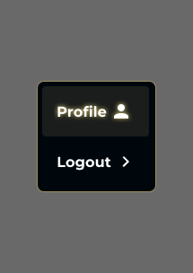

# Feature Specification: Profile Dropdown

**Frame ID**: `721:5223`
**Frame Name**: `Dropdown-profile`
**File Key**: `9ypp4enmFmdK3YAFJLIu6C`
**Screen ID**: `z4sCl3_Qtk`
**Created**: 2026-04-17
**Status**: Draft

---

## Overview

A profile dropdown menu accessible from the user avatar button in the application header. When clicked, it reveals two menu items: "Profile" (navigate to user profile page) and "Logout" (sign out). The "Profile" item features a golden glow effect and user icon; the "Logout" item has a chevron-right icon. The dropdown matches the application's dark theme with gold border styling consistent with the language dropdown.

**Visual Reference**: 

---

## User Scenarios & Testing *(mandatory)*

### User Story 1 - Open Profile Dropdown (Priority: P1)

As an authenticated user, I want to click my avatar to see a menu with Profile and Logout options so that I can navigate to my profile or sign out.

**Why this priority**: Core account management functionality — users need a way to sign out and access their profile.

**Independent Test**: Click the avatar button in the header, verify the dropdown opens with "Profile" and "Logout" items.

**Acceptance Scenarios**:

1. **Given** the user is on any authenticated page, **When** they click the avatar/profile button in the header, **Then** a dropdown menu appears with "Profile" and "Logout" items.
2. **Given** the dropdown is open, **When** the user clicks outside the dropdown, **Then** it closes without any action.
3. **Given** the dropdown is open, **When** the user clicks the avatar button again, **Then** the dropdown closes.

---

### User Story 2 - Navigate to Profile Page (Priority: P1)

As an authenticated user, I want to click "Profile" in the dropdown to navigate to my profile page.

**Why this priority**: Users need to access and manage their profile information.

**Independent Test**: Open dropdown, click "Profile", verify navigation to the profile page.

**Acceptance Scenarios**:

1. **Given** the dropdown is open, **When** the user clicks "Profile", **Then** the dropdown closes and the user navigates to `/profile`.
2. **Given** the user is an admin, **When** they open the dropdown, **Then** an additional "Admin Dashboard" option appears between "Profile" and "Logout".

---

### User Story 3 - Logout (Priority: P1)

As an authenticated user, I want to click "Logout" to sign out of the application.

**Why this priority**: Security requirement — users must be able to end their session.

**Independent Test**: Open dropdown, click "Logout", verify the user is signed out and redirected to the login page.

**Acceptance Scenarios**:

1. **Given** the dropdown is open, **When** the user clicks "Logout", **Then** the Supabase session is terminated, the dropdown closes, and the user is redirected to `/login`.

---

### User Story 4 - Visual Styling per Figma (Priority: P1)

As a user, I want the profile dropdown to match the Figma design with gold border, dark background, and glow effect on the "Profile" item.

**Why this priority**: Visual consistency with the application theme and other dropdowns (language selector).

**Independent Test**: Open the dropdown and verify the container has gold border (#998C5F), dark background (#00070C), "Profile" item has golden glow background, and "Logout" item has transparent background.

**Acceptance Scenarios**:

1. **Given** the dropdown is open, **When** I look at it, **Then** the container has a gold border (`#998C5F`), dark background (`#00070C`), and `8px` border radius.
2. **Given** the "Profile" item is visible, **When** I look at it, **Then** it has a subtle golden background (`rgba(255, 234, 158, 0.1)`) with text glow effect.
3. **Given** the "Profile" item has a user icon, **Then** the icon is positioned to the right of the text.
4. **Given** the "Logout" item has a chevron-right icon, **Then** the icon is positioned to the right of the text.

---

### User Story 5 - Keyboard Accessibility (Priority: P2)

As a keyboard user, I want to navigate the dropdown menu using keyboard controls.

**Why this priority**: Accessibility requirement per constitution.

**Independent Test**: Tab to avatar button, press Enter to open, Arrow keys to navigate, Enter to select, Escape to close.

**Acceptance Scenarios**:

1. **Given** the dropdown is open, **When** the user presses ArrowDown/ArrowUp, **Then** focus moves between menu items.
2. **Given** a menu item is focused, **When** the user presses Enter, **Then** that item's action is triggered.
3. **Given** the dropdown is open, **When** the user presses Escape, **Then** the dropdown closes and focus returns to the trigger button.

---

### User Story 6 - i18n Support (Priority: P2)

As a user, I want the Profile dropdown text to update when I switch language.

**Why this priority**: Consistent with the application's i18n system.

**Independent Test**: Switch language to EN, open dropdown, verify "Profile" and "Logout" labels match the current locale.

**Acceptance Scenarios**:

1. **Given** the language is VN, **When** the user opens the dropdown, **Then** items show "Hồ sơ" and "Đăng xuất".
2. **Given** the language is EN, **When** the user opens the dropdown, **Then** items show "Profile" and "Sign out".

**Translatable Strings**:

| Component | Key | Vietnamese (VN) | English (EN) |
|-----------|-----|-----------------|--------------|
| Profile item | `profile.profile` | Hồ sơ | Profile |
| Logout item | `profile.signOut` | Đăng xuất | Sign out |
| Admin item | `profile.adminDashboard` | Bảng điều khiển quản trị | Admin Dashboard |
| Trigger aria-label | `profile.ariaLabel` | Menu người dùng | User menu |

> **Note**: These translation keys already exist in the i18n system from the language dropdown feature.

---

### Edge Cases

- What happens when the user clicks "Logout" and the Supabase signOut fails? Show a generic error or retry silently.
- What happens when the dropdown is open and the user navigates via browser back/forward? Close the dropdown.

---

## UI/UX Requirements *(from Figma)*

### Screen Components

| Component | Node ID | Description | Interactions |
|-----------|---------|-------------|--------------|
| Dropdown Container | `666:9601` | Dark container with gold border, holds Profile and Logout items | Opens/closes on avatar click |
| Profile Item | `I666:9601;563:7844` | "Profile" text + user icon, golden glow background | Click → navigate to /profile |
| Profile Text | `I666:9601;563:7844;186:1497` | "Profile" label with text-shadow glow | Display, i18n |
| Profile Icon | `I666:9601;563:7844;186:1498` | User silhouette icon (24x24px) | Display only |
| Logout Item | `I666:9601;563:7868` | "Logout" text + chevron-right icon | Click → sign out |
| Logout Text | `I666:9601;563:7868;186:1439` | "Logout" label, white | Display, i18n |
| Logout Icon | `I666:9601;563:7868;186:1441` | Chevron-right icon (24x24px) | Display only |

### Navigation Flow

- From: Any authenticated page (dropdown is in the global header)
- To: `/profile` (Profile click) or `/login` (Logout click)
- Triggers: Click on avatar button in header

### Visual Requirements

- Dropdown matches the language dropdown's visual style (same border, background, padding, border-radius)
- "Profile" item has a distinct golden glow/highlight to indicate the primary action
- Animations/Transitions: Same open/close animation as language dropdown (~150ms ease-out)
- Accessibility: WCAG AA — keyboard navigable, `role="menu"`, `role="menuitem"`

> **See `design-style.md` for complete visual specifications.**

---

## Requirements *(mandatory)*

### Functional Requirements

- **FR-001**: System MUST display the profile dropdown when the avatar/profile button is clicked.
- **FR-002**: Dropdown MUST show "Profile" item with user icon and golden glow background.
- **FR-003**: Dropdown MUST show "Logout" item with chevron-right icon.
- **FR-004**: Clicking "Profile" MUST navigate to `/profile` and close the dropdown.
- **FR-005**: Clicking "Logout" MUST sign out via Supabase Auth and redirect to `/login`.
- **FR-006**: Dropdown MUST close when clicking outside.
- **FR-007**: Dropdown MUST match the Figma design: gold border (`#998C5F`), dark background (`#00070C`), `8px` border radius, `6px` padding.
- **FR-008**: Menu item text MUST be translatable using the i18n `t()` function.
- **FR-009**: If the user is an admin, an "Admin Dashboard" item MUST appear between "Profile" and "Logout".

### Technical Requirements

- **TR-001**: Component MUST use `"use client"` directive (already has it).
- **TR-002**: Component MUST use `useLanguage()` hook for i18n (already integrated).
- **TR-003**: Logout MUST call `supabase.auth.signOut()` and use `router.push('/login')`.
- **TR-004**: Dropdown MUST be keyboard accessible (Tab, Enter, Space, Arrow keys, Escape).
- **TR-005**: Component styling MUST match `design-style.md` values exactly.

---

## API Dependencies

| Endpoint | Method | Purpose | Status |
|----------|--------|---------|--------|
| Supabase Auth `signOut()` | POST | End user session | Exists (Supabase built-in) |

---

## Success Criteria *(mandatory)*

### Measurable Outcomes

- **SC-001**: Dropdown opens/closes smoothly with animation in < 200ms.
- **SC-002**: "Profile" navigates to `/profile` correctly.
- **SC-003**: "Logout" terminates session and redirects to `/login`.
- **SC-004**: Dropdown visually matches Figma design (gold border, dark bg, glow on Profile).
- **SC-005**: All text switches when locale changes.

---

## Out of Scope

- User profile page content (separate spec)
- Profile editing functionality
- Avatar upload

---

## Dependencies

- [x] Constitution document exists (`.momorph/constitution.md`)
- [x] `ProfileDropdown` component exists (`components/ui/profile-dropdown.tsx`) — needs visual update to match Figma
- [x] i18n system exists with translation keys (`profile.profile`, `profile.signOut`, etc.)
- [x] Language dropdown already uses the same visual pattern (gold border, dark bg)

---

## Notes

- The existing `ProfileDropdown` component already has the core functionality (open/close, profile nav, logout, admin dashboard). The main work is **visual restyling** to match the Figma design.
- The Figma design shows "Profile" and "Logout" but the existing implementation uses "Sign out" instead of "Logout". The i18n key is `profile.signOut` — the Figma shows "Logout" for the English label. **Update the EN translation** to "Logout" to match Figma.
- The "Profile" item has a `text-shadow` glow effect: `0 4px 4px rgba(0, 0, 0, 0.25), 0 0 6px #FAE287` — this is the same glow used on the active nav link in the header.
- The dropdown container uses the same component (`A_Dropdown-List`) as the language dropdown — same border, background, padding, and radius.
